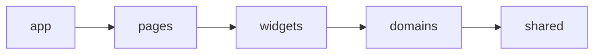

> **前端代码库：<https://github.com/Developer-kongyu/nexora-web.git>**
>
> 后端代码库：<https://github.com/Developer-kongyu/nexora-backend.git>

# Nexora Web：技术栈与启动指南

Nexora Web 是开放兴趣社交网络 Nexora 的正式前端工程，覆盖认证、新手引导、信息流、搜索、内容创作、个人主页、用户关系、收藏、社群、通知、浏览历史和设置等完整页面。工程通过统一 API Client 连接 Nexora Backend，并提供 Mock、单元测试、E2E、Storybook 和 Docker/Nginx 生产构建能力。

## 技术栈

| 技术                     | 当前版本 | 用途                           |
| ------------------------ | -------- | ------------------------------ |
| React                    | 19       | 页面、组件与交互               |
| TypeScript               | 5.9      | 严格类型与领域契约             |
| Vite                     | 8        | 开发服务器、代理与生产构建     |
| React Router             | 7        | 路由、懒加载和导航             |
| TanStack Query           | 5        | 服务端状态、缓存、刷新与写操作 |
| Zustand                  | 5        | 认证内存态和跨页面客户端状态   |
| React Hook Form          | 7        | 表单状态                       |
| Zod                      | 4        | 表单与环境变量校验             |
| CSS Modules              | —        | 页面级样式隔离                 |
| Lucide React             | 1.24     | 统一图标体系                   |
| MSW                      | 2        | 浏览器和测试接口模拟           |
| Vitest + Testing Library | 4 / 16   | 单元与组件测试                 |
| Playwright               | 1.61     | 端到端测试                     |
| Storybook                | 10       | 组件工作台                     |
| Nginx                    | 1.29     | 生产静态服务与 SPA 回退        |

## 工程组织

```text
src/
├─ app/          # Providers、Router、布局、错误边界和全局样式
├─ pages/        # 路由级页面与业务编排
├─ widgets/      # PostCard、ComposeEditor、AppShell 等复合组件
├─ domains/      # 按业务域拆分的 API、hooks、types 和局部状态
├─ shared/       # API Client、环境配置、工具函数和基础 UI
├─ mocks/        # MSW fixtures 与 handlers
└─ test/         # Vitest / Testing Library 测试初始化
```

依赖方向：



页面与组件通过 **shared/api/client.ts** 和 **domains/\*/api** 访问网络。TanStack Query 管理服务端事实，组件 state 管理页面临时交互，Zustand 只承载真正需要跨页面共享的客户端状态。

## 环境要求

- Node.js 22.12 或更高版本；
- npm 10 或更高版本；
- 连接真实功能时，需要已启动的 Nexora Backend；
- 使用 Docker 模式时，需要 Docker Desktop 或 Docker Engine + Compose v2。

确认环境：

```powershell
node --version
npm --version
```

## 最快启动

```powershell
git clone https://github.com/Developer-kongyu/nexora-web.git
Set-Location nexora-web
npm ci
npm run dev
```

开发服务器固定监听 **http://localhost:5173**。当前仓库的 .env.development 默认设置为 **VITE_ENABLE_MOCK=false**，因此会连接真实后端；请先确保后端运行在 http://localhost:3000。

常用入口：

- 登录：http://localhost:5173/auth/login
- 注册：http://localhost:5173/auth/register
- 首页：http://localhost:5173/home
- 发现：http://localhost:5173/explore
- 社群：http://localhost:5173/communities
- 通知：http://localhost:5173/notifications
- 设置：http://localhost:5173/settings

## 连接真实后端

### 1. 启动后端

按后端仓库的[完整部署指南](https://github.com/Developer-kongyu/nexora-backend/blob/main/docs/DEPLOYMENT_GUIDE.md)启动 API、PostgreSQL、MongoDB、Redis、Kafka 和需要的 Worker。

后端存活检查：

```powershell
Invoke-RestMethod http://localhost:3000/api
```

### 2. 创建本地环境文件

```powershell
Copy-Item .env.example .env.local
```

填写：

```dotenv
VITE_APP_ENV=local
VITE_API_BASE_URL=http://localhost:3000
VITE_SOCKET_URL=http://localhost:3000
VITE_GOOGLE_CLIENT_ID=你的-Google-Web-Client-ID
VITE_RELEASE=local
VITE_SENTRY_DSN=
VITE_ENABLE_MOCK=false
VITE_API_TIMEOUT_MS=15000
```

### 3. 启动前端

```powershell
npm run dev
```

Vite 配置会把 **/api** 和 **/socket.io** 代理到 VITE_DEV_PROXY_TARGET；未配置时默认目标为 http://localhost:3000。VITE_API_BASE_URL 为空时，也可以依赖该同源开发代理。

### 4. 检查浏览器请求

打开开发者工具的 Network 面板，确认：

- /api 请求返回 2xx 或预期业务错误；
- 请求目标是 localhost:3000 或 Vite 的 /api 代理；
- 登录成功后刷新接口可以携带 Cookie；
- 通知实时连接指向正确的 VITE_SOCKET_URL。

## 使用 Mock 模式

需要独立浏览页面、暂时不启动后端时，在 .env.local 设置：

```dotenv
VITE_ENABLE_MOCK=true
VITE_API_BASE_URL=
VITE_SOCKET_URL=
```

然后重新启动开发服务器：

```powershell
npm run dev
```

MSW 会加载 **src/mocks/browser.ts** 和 **src/mocks/handlers.ts**。Mock 用于界面开发和测试，不代表外部短信、Google 验签、数据库事务或真实异步 Worker 已运行。

切换回真实后端时把 VITE_ENABLE_MOCK 改回 false，并重启 Vite。

## 环境变量

| 变量                  | 示例                           | 说明                           |
| --------------------- | ------------------------------ | ------------------------------ |
| VITE_APP_ENV          | local / production             | 当前运行环境                   |
| VITE_API_BASE_URL     | http://localhost:3000          | API 根地址；留空可使用同源路径 |
| VITE_SOCKET_URL       | http://localhost:3000          | 实时通知地址                   |
| VITE_GOOGLE_CLIENT_ID | xxx.apps.googleusercontent.com | Google Web Client ID           |
| VITE_RELEASE          | local / Git SHA                | 发布版本标识                   |
| VITE_SENTRY_DSN       | 空或 DSN                       | 可选错误监控                   |
| VITE_ENABLE_MOCK      | false / true                   | 是否启用 MSW                   |
| VITE_API_TIMEOUT_MS   | 15000                          | API 超时毫秒数                 |
| VITE_DEV_PROXY_TARGET | http://localhost:3000          | Vite 开发代理目标              |

修改 VITE_ 开头的变量后需要重新启动开发服务器。

## Google 登录本地配置

Google Cloud Console 中的 Web OAuth Client 需要登记当前前端 Origin：

- http://localhost:5173
- 如果使用 127.0.0.1，则还需单独登记 http://127.0.0.1:5173

localhost 与 127.0.0.1、不同端口、HTTP 与 HTTPS 都属于不同 Origin。前端 VITE_GOOGLE_CLIENT_ID 必须与后端允许的 Client ID 一致。

## 常用命令

| 命令                    | 说明                                 |
| ----------------------- | ------------------------------------ |
| npm run dev             | 启动 Vite 开发服务器                 |
| npm run build           | TypeScript 构建并生成 dist           |
| npm run preview         | 本地预览生产构建                     |
| npm run typecheck       | TypeScript 工程检查                  |
| npm run lint            | ESLint 检查                          |
| npm run lint:css        | Stylelint 检查                       |
| npm run format          | Prettier 格式化                      |
| npm run format:check    | 检查格式                             |
| npm run test            | 运行 Vitest                          |
| npm run test:watch      | Vitest 监听模式                      |
| npm run test:e2e        | 运行 Playwright                      |
| npm run storybook       | 启动 Storybook                       |
| npm run storybook:build | 构建 Storybook                       |
| npm run reuse:check     | 检查重复定义与公共能力绕过           |
| npm run check           | 运行格式、类型、Lint、测试和构建检查 |

只运行一个测试：

```powershell
npm test -- --run src/pages/onboarding/FollowPage.test.tsx
```

首次运行 Playwright：

```powershell
npx playwright install chromium
npm run test:e2e
```

## 生产构建

```powershell
npm ci
npm run build
npm run preview
```

构建产物位于 **dist/**。部署到静态服务器时，所有未知前端路由都必须回退到 index.html，否则直接刷新 /auth/login、/profile 或 /settings 等路径会返回 404。

## Docker 启动

仓库包含多阶段 Dockerfile：第一阶段使用 Node 构建，第二阶段使用 Nginx 提供静态文件。

```powershell
docker compose up --build -d
```

访问：

- 应用：http://localhost:8080
- 健康检查：http://localhost:8080/healthz

查看日志：

```powershell
docker compose logs -f web
```

停止：

```powershell
docker compose down
```

当前 Nginx 配置包含：

- SPA 路由回退；
- JS、CSS、字体和图片的长期缓存；
- HTML no-cache；
- /healthz 存活检查。

生产构建会在镜像构建阶段读取环境变量。如果部署地址与示例不同，应在 CI 构建前准备正确的生产环境变量，或按部署平台的构建参数注入。

## 启动后常见问题

### 页面请求失败或显示 Network Error

1. 确认后端 3000 端口在监听；
2. 检查 VITE_API_BASE_URL；
3. 修改环境变量后重启 Vite；
4. 检查后端 AUTH_ALLOWED_ORIGINS；
5. 查看浏览器 Network 中的实际请求地址和响应。

### 5173 端口被占用

项目启用了 strictPort，不会自动换端口。查找监听进程：

```powershell
Get-NetTCPConnection -State Listen -LocalPort 5173
```

停止冲突进程后重新执行 npm run dev。

### 登录后页面又回到登录页

确认后端刷新 Cookie、CORS 和前端 API 地址属于同一套环境；同时检查浏览器是否阻止 Cookie，以及后端是否仍在运行。

### Google 提示 origin_mismatch

把浏览器地址栏的 Origin 原样加入 Google Cloud Console，并确认 VITE_GOOGLE_CLIENT_ID 与该 Web Client 对应。

### 修改代码后页面没有更新

先确认 Vite 终端没有编译错误；再执行浏览器强制刷新。依赖或环境变量变化时应停止并重新运行 npm run dev。

### Docker 页面可以打开但 API 不通

前端 Nginx 配置当前只提供静态文件，不会自动把 /api 代理到后端。生产构建应设置 VITE_API_BASE_URL 为公开 API 地址，或在外层反向代理统一配置 /api。

## 启动完成标准

- [ ] http://localhost:5173 可以打开
- [ ] 登录和注册页面正常渲染
- [ ] /api 请求到达预期后端或 Mock
- [ ] TypeScript 类型检查通过
- [ ] Vitest 测试通过
- [ ] npm run build 成功
- [ ] Docker 模式下 /healthz 返回 ok

更多产品与后端架构说明见：[Nexora 项目全景](https://github.com/Developer-kongyu/nexora-backend/blob/main/docs/PROJECT_OVERVIEW.md)。
