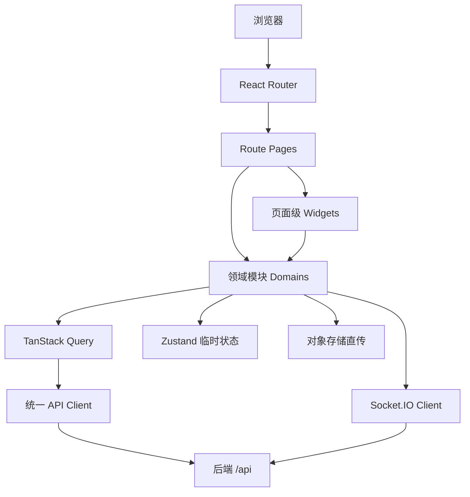
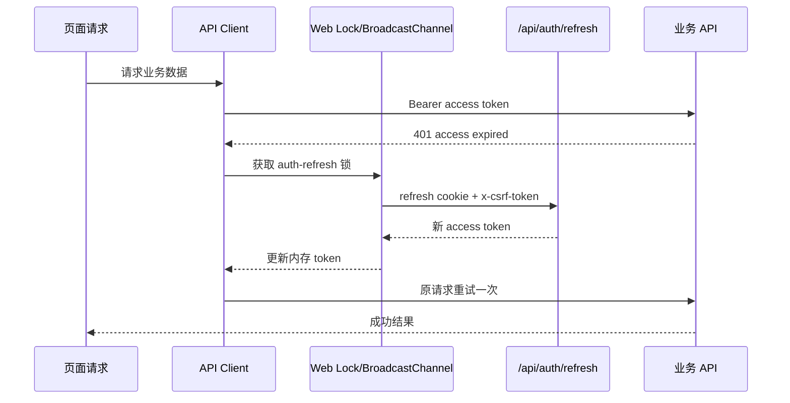

# LCT 前端工程架构构建方案（Vite + React）

> 文档版本：v1.0  
> 编制日期：2026-07-10  
> 适用阶段：MVP 首版至商业化前的前端工程建设  
> 输入依据：`后端模块设计文档.zip`、最新版 LCT 高保真 UI 设计包（全局排版校正版）

---

## 1. 方案结论

本项目建议采用 **Vite + React + TypeScript 的单页应用（SPA）**，以“**领域模块化 + 路由级页面编排 + 共享设计系统**”组织代码。首版不引入微前端，也不为已登录后的社交应用强行增加 SSR 复杂度；公开帖子、用户主页、社群详情若后续有 SEO 或站外分享抓取需求，再单独评估预渲染或 React Router Framework Mode。

核心决策如下：

1. **构建基线**：Node.js 22.22+、Vite 8.x、React 19.2.x、React Router 8.x、TypeScript 严格模式。
2. **服务端状态**：统一使用 TanStack Query；不把接口数据复制到 Zustand。
3. **客户端状态**：Zustand 只负责登录令牌内存态、应用壳状态、媒体上传队列、媒体查看器和实时连接等短生命周期状态。
4. **表单与校验**：React Hook Form + Zod；复杂发布、设置、注册表单均采用 schema 驱动。
5. **样式体系**：CSS Modules + CSS 自定义属性设计令牌；不直接把整张 Figma/SVG 当页面实现，也不依赖重型 UI 组件库覆盖高保真稿。
6. **接口层**：统一 `fetch` 客户端、OpenAPI 类型生成、领域 API 适配器、统一错误对象、单飞刷新令牌、幂等键和请求追踪。
7. **认证安全**：Access Token 仅保存在内存；Refresh Token 由后端通过 HttpOnly Cookie 管理；禁止写入 localStorage/sessionStorage。
8. **实时通知**：HTTP bootstrap + Socket.IO 增量推送 + reconnect delta 补拉。
9. **质量保障**：Vitest + Testing Library + MSW + Playwright + Storybook 视觉回归。
10. **统一帖子卡片**：所有出现帖子的位置复用同一个 `PostCard/PostActionBar`，彻底避免各页面各画一套导致横线、互动项重叠、间距不一致。

---

## 2. 项目范围与前提

### 2.1 首版范围

前端覆盖最新版 UI 中的真实页面与状态：

- 登录、注册、找回密码、Google 登录资料补全
- 三步欢迎引导
- 首页 Following / For You
- 发现、搜索
- 发布帖子、草稿箱、帖子详情、媒体查看器
- 用户主页、编辑资料、关注/粉丝
- 收藏夹、内容中心、浏览历史
- 社群发现、详情、创建、管理
- 通知中心
- 设置总览、账号、隐私、通知、偏好、安全
- 通用加载、空状态、无权限、错误、删除等状态

说明：

- 原 UI 第 15 页已经删除，不再创建独立路由或页面文件。
- 第 29 页应作为“系统状态与组件状态样例”，默认只进入 Storybook；可在开发环境开放 `/__dev/states`，生产环境不挂入口。
- 后端 B10 当前正式搜索入口为 `GET /api/search`；搜索建议、搜索历史、趋势、媒体搜索等接口在文档中明确为未注册或返回 404，MVP 前端不得依赖这些接口。

### 2.2 非首版范围

- 私聊、群聊、音视频通话
- 管理后台
- 微前端
- 离线优先 PWA
- 全站 SSR
- 复杂富文本编辑器
- 前端自行实现审核、推荐或权限判断真相

### 2.3 架构原则

- **后端 owner 优先**：权限、关系、账号、帖子、媒体、社群等事实，以对应后端模块返回为准；前端只做交互控制和展示，不复制业务裁决。
- **强写弱读适配**：写操作严格处理幂等、版本、冲突和回滚；列表读取使用 cursor、缓存和预取。
- **页面不直连接口**：页面只能调用领域 hooks/use-case；组件内禁止散落裸 `fetch`。
- **可替换而不重写**：接口类型、状态管理、设计系统、路由和测试均有明确边界。

---

## 3. 技术栈建议

| 分类 | 选型 | 用途与约束 |
|---|---|---|
| 运行时 | Node.js 22.22+ | 同时满足当前 React Router 8 和 Vite 8 的现代 ESM 基线 |
| 构建工具 | Vite 8.x | 开发服务器、构建、环境变量和资源处理；锁定 lockfile 中的精确版本 |
| UI 框架 | React 19.2.x | 组件与并发交互基础 |
| 路由 | React Router 8.x，Data Mode | 嵌套路由、loader、错误边界、路由级懒加载、滚动恢复 |
| 语言 | TypeScript 5.x，`strict: true` | 全量严格类型；禁止业务代码滥用 `any` |
| 服务端状态 | `@tanstack/react-query` 5.x | 请求缓存、cursor 列表、失效、乐观更新、预取 |
| 客户端状态 | Zustand | 仅保存非服务端真相的跨页面临时状态 |
| 表单 | React Hook Form | 表单性能、字段状态、复杂表单拆分 |
| 运行时校验 | Zod 4.x | 表单 schema、关键接口边界校验、环境变量校验 |
| 实时通信 | `socket.io-client` | B11 通知实时连接、心跳与重连 |
| 图标 | `lucide-react` | 统一图标来源；业务图标封装后使用 |
| 无样式基础组件 | Radix Primitives（按需） | Dialog、Popover、Dropdown、Tabs、Tooltip 等可访问性基础能力 |
| 日期 | `date-fns` 或同等轻量库 | 相对时间、时区与格式化；项目只保留一种日期库 |
| 样式 | CSS Modules + PostCSS + CSS Variables | 高保真、作用域、设计令牌、响应式与主题 |
| 单元/组件测试 | Vitest + React Testing Library | hooks、组件、领域逻辑和交互测试 |
| 接口模拟 | MSW | 开发模拟、组件测试、异常场景与契约样例 |
| E2E | Playwright | 登录、发帖、上传、互动、社群、通知等主链路 |
| 组件文档 | Storybook React + Vite | 设计系统、所有状态、视觉回归 |
| 代码规范 | ESLint + Prettier + Stylelint | TS/React/CSS 统一检查 |
| 接口类型 | `openapi-typescript` | 从后端 OpenAPI 生成类型；业务 hooks 仍手写以保证缓存语义清晰 |

### 3.1 暂不建议的选型

- **不建议把 Redux Toolkit 作为默认状态仓库**：本项目大部分数据是服务端状态，TanStack Query 已覆盖；再引入大而全的全局 store 容易形成双份真相。
- **不建议首版使用 Tailwind 重写高保真稿**：现有 UI 卡片、三栏布局、媒体控件和大量精确间距更适合设计令牌 + CSS Modules。团队若高度熟悉 Tailwind，可后续通过 ADR 替换，但不能 CSS Modules/Tailwind 混杂无规则增长。
- **不建议直接引入 Ant Design/MUI 完整视觉体系**：会与现有定制 UI 冲突。只采用无样式或低样式 primitives。
- **不建议首版启用 React Compiler**：先建立性能基线与测试，再在独立分支验证构建、第三方库和 source map 后启用。

---

## 4. 总体架构



### 4.1 代码依赖方向

```text
app -> pages -> widgets -> domains -> shared
```

约束：

- `shared` 不得依赖任何业务领域。
- `domains/*` 之间只能从对方公开的 `index.ts` 导入，禁止跨域读取内部文件。
- `widgets` 可以组合多个领域，例如帖子卡片组合帖子、用户、媒体和互动。
- `pages` 只负责路由参数、页面布局、多个 query 的编排、SEO 元数据和错误边界。
- `app` 只负责初始化、Providers、Router、全局样式、运行时配置和监控。
- 通过 ESLint boundaries 规则执行依赖方向，避免循环引用。

### 4.2 与后端模块的映射

| 前端领域 | 后端 owner | 主要内容 |
|---|---|---|
| `domains/auth` | B01 | 注册、登录、刷新、会话、密码、身份绑定、onboarding |
| `domains/users` | B02 | 用户资料、关注、粉丝、关注请求、静音、屏蔽 |
| `domains/permissions` | B03 | 隐私策略、互动权限预览、无权限状态 |
| `domains/posts` | B04 | 草稿、帖子、评论、回复、引用、转发、删除 |
| `domains/media` | B05 | 上传会话、确认上传、重试、媒体状态、链接预览 |
| `domains/engagement` | B06/B04 公共写口 | 点赞、计数、曝光；评论/引用/转发公共写链按 B04 owner 路由 |
| `domains/library` | B07 | 收藏夹、内容中心、历史 |
| `domains/communities` | B08 | 社群资料、成员、加入、规则、管理台 |
| `domains/feed` | B09 | Following、For You、Explore、刷新提示 |
| `domains/search` | B10 | 统一搜索与筛选 |
| `domains/notifications` | B11 | 通知列表、未读、目标解析、实时连接 |
| `domains/settings` | B12 + owner 聚合 | 通知、推荐、搜索、兴趣设置；账号/资料/隐私写入调用对应 owner |
| `shared/observability` | B13/基础设施 | requestId、日志、埋点、性能、错误监控 |

前端目录不需要机械复制后端 controller/service/repo 层，但要尊重 owner：例如“设置账号”页面可以同时调用 B01、B02、B03、B12，不应为了页面方便制造一个错误的“前端 settings 万能服务”。

---

## 5. 推荐目录结构

```text
lct-web/
├─ public/
├─ scripts/
│  ├─ generate-api.mjs
│  ├─ check-env.mjs
│  └─ visual-baseline.mjs
├─ src/
│  ├─ app/
│  │  ├─ main.tsx
│  │  ├─ providers/
│  │  │  ├─ AppProviders.tsx
│  │  │  ├─ QueryProvider.tsx
│  │  │  ├─ AuthBootstrap.tsx
│  │  │  ├─ RealtimeProvider.tsx
│  │  │  └─ ErrorMonitoringProvider.tsx
│  │  ├─ router/
│  │  │  ├─ router.tsx
│  │  │  ├─ guards.ts
│  │  │  ├─ routeIds.ts
│  │  │  └─ routePrefetch.ts
│  │  ├─ config/
│  │  │  ├─ env.ts
│  │  │  └─ featureFlags.ts
│  │  └─ styles/
│  │     ├─ reset.css
│  │     ├─ tokens.css
│  │     ├─ typography.css
│  │     └─ global.css
│  ├─ pages/
│  │  ├─ auth-login/
│  │  ├─ onboarding-interests/
│  │  ├─ home/
│  │  ├─ explore/
│  │  ├─ search/
│  │  ├─ compose/
│  │  ├─ post-detail/
│  │  ├─ profile/
│  │  ├─ bookmarks/
│  │  ├─ community-detail/
│  │  ├─ notifications/
│  │  └─ settings-*/
│  ├─ widgets/
│  │  ├─ app-shell/
│  │  ├─ top-search-bar/
│  │  ├─ post-card/
│  │  ├─ post-list/
│  │  ├─ user-card/
│  │  ├─ community-card/
│  │  ├─ media-grid/
│  │  ├─ compose-editor/
│  │  └─ settings-section/
│  ├─ domains/
│  │  ├─ auth/
│  │  ├─ users/
│  │  ├─ permissions/
│  │  ├─ posts/
│  │  ├─ media/
│  │  ├─ engagement/
│  │  ├─ library/
│  │  ├─ communities/
│  │  ├─ feed/
│  │  ├─ search/
│  │  ├─ notifications/
│  │  └─ settings/
│  └─ shared/
│     ├─ api/
│     │  ├─ client.ts
│     │  ├─ authRefresh.ts
│     │  ├─ csrf.ts
│     │  ├─ errors.ts
│     │  ├─ idempotency.ts
│     │  ├─ pagination.ts
│     │  └─ generated/
│     ├─ ui/
│     │  ├─ Button/
│     │  ├─ Card/
│     │  ├─ IconButton/
│     │  ├─ Input/
│     │  ├─ Select/
│     │  ├─ Tabs/
│     │  ├─ Dialog/
│     │  ├─ Skeleton/
│     │  ├─ EmptyState/
│     │  └─ ErrorState/
│     ├─ hooks/
│     ├─ lib/
│     ├─ types/
│     ├─ constants/
│     ├─ assets/
│     ├─ observability/
│     └─ test/
├─ tests/
│  ├─ e2e/
│  ├─ fixtures/
│  └─ visual/
├─ .storybook/
├─ vite.config.ts
├─ vitest.config.ts
├─ playwright.config.ts
├─ tsconfig.json
├─ eslint.config.js
├─ stylelint.config.mjs
├─ package.json
└─ pnpm-lock.yaml
```

每个领域内部采用相同结构：

```text
domains/posts/
├─ api/
│  ├─ postApi.ts
│  └─ post.contract.ts
├─ model/
│  ├─ post.types.ts
│  ├─ post.schemas.ts
│  ├─ post.queryKeys.ts
│  ├─ post.queries.ts
│  └─ post.mutations.ts
├─ lib/
│  ├─ postMapper.ts
│  └─ patchPostCaches.ts
├─ ui/
│  └─ PostDeletedBadge.tsx
└─ index.ts
```

---

## 6. 路由设计

### 6.1 布局路由

- `PublicLayout`：登录、注册、找回密码。
- `OnboardingLayout`：三步欢迎引导，禁止跳到已完成步骤之外的非法状态。
- `AppShellLayout`：左侧导航、顶部搜索框、主内容 Outlet；右侧栏由具体页面提供。
- `SettingsLayout`：设置左侧二级导航或主区标签。
- `ModalRouteLayer`：媒体查看器等可保留背景页面的模态路由。

### 6.2 页面与 URL 映射

| UI 页 | 建议 URL | 页面组件 | 主要后端模块 |
|---|---|---|---|
| 01 应用壳 | 布局，不单独作为业务页 | `AppShellLayout` | B01/B02/B11 |
| 02 登录 | `/auth/login` | `LoginPage` | B01 |
| 03 注册/重置/Google | `/auth/register`、`/auth/password/forgot`、`/auth/password/reset`、`/auth/google/complete` | 对应页面 | B01 |
| 04-01 兴趣 | `/onboarding/interests` | `OnboardingInterestsPage` | B01/B12 |
| 04-02 推荐关注 | `/onboarding/follow` | `OnboardingFollowPage` | B01/B02/B09 |
| 04-03 推荐社群 | `/onboarding/communities` | `OnboardingCommunitiesPage` | B01/B08/B09 |
| 05 首页 | `/home?tab=following|for-you` | `HomePage` | B09/B04/B06 |
| 06 发现 | `/explore?tab=hot|image|video` | `ExplorePage` | B09 |
| 07 搜索 | `/search?q=&tab=posts|users|communities&sort=` | `SearchPage` | B10 |
| 08 发布 | `/compose`、`/compose/:draftId` | `ComposePage` | B04/B05/B03 |
| 09 草稿箱 | `/content/drafts` | `DraftsPage` | B04/B07 |
| 10 帖子详情 | `/posts/:postId` | `PostDetailPage` | B04/B06 |
| 11 媒体查看器 | `/posts/:postId/media/:mediaIndex` | `MediaViewerRoute` | B04/B05 |
| 12 用户主页 | `/users/:handle` | `ProfilePage` | B02/B04 |
| 13 编辑资料 | `/settings/profile` | `ProfileEditPage` | B02/B01 |
| 14 关注/粉丝 | `/users/:handle/followers`、`/users/:handle/following` | `FollowListPage` | B02 |
| 15 | 已删除 | 不创建 | — |
| 16 收藏夹 | `/bookmarks`、`/bookmarks/:collectionId` | `BookmarksPage` | B07 |
| 17 内容中心 | `/content?tab=published|drafts|deleted` | `ContentCenterPage` | B07/B04 |
| 18 社群发现 | `/communities` | `CommunitiesDiscoverPage` | B08/B09 |
| 19 社群详情 | `/communities/:slug` | `CommunityDetailPage` | B08/B04 |
| 20 创建社群 | `/communities/new` | `CommunityCreatePage` | B08 |
| 21 社群管理 | `/communities/:communityId/manage/:section?` | `CommunityManagePage` | B08 |
| 22 通知 | `/notifications?tab=` | `NotificationsPage` | B11 |
| 23 设置总览 | `/settings` | `SettingsOverviewPage` | B12 + 各 owner |
| 24 账号 | `/settings/account` | `AccountSettingsPage` | B01 |
| 25 隐私 | `/settings/privacy` | `PrivacySettingsPage` | B03 |
| 26 通知设置 | `/settings/notifications` | `NotificationSettingsPage` | B12 |
| 27 偏好 | `/settings/preferences` | `PreferenceSettingsPage` | B12 |
| 28 安全/屏蔽 | `/settings/safety` | `SafetySettingsPage` | B02 |
| 29 系统状态 | 开发态 `/__dev/states` | `SystemStatesDevPage` | 无业务接口 |
| 30 浏览历史 | `/history` | `BrowsingHistoryPage` | B07 |

### 6.3 Router 实现策略

- 所有业务页使用路由级 `lazy`，首屏只加载应用壳和当前页面。
- loader 仅负责：认证守卫、必要的 query 预取、合法参数归一化；不在 loader 中创建第二套数据层。
- loader 通过 `queryClient.ensureQueryData()` 与页面共用 query 定义。
- 统一设置 `errorElement`，区分 404、无权限、内容已删除和系统错误。
- 标签、排序、筛选、搜索词使用 URL Search Params，刷新与分享链接后状态可恢复。
- `ScrollRestoration` 处理详情返回列表时的位置恢复；无限流同时保存 scroll anchor。

---

## 7. 状态管理边界

| 状态类型 | 存放位置 | 示例 |
|---|---|---|
| 路由状态 | URL / React Router | 搜索词、tab、排序、设置 section、媒体 index |
| 服务端状态 | TanStack Query | feed、帖子、用户、社群、通知、设置、收藏夹 |
| 表单状态 | React Hook Form | 注册、发帖、编辑资料、创建社群、设置表单 |
| 跨页面临时状态 | Zustand | Access Token 内存态、侧栏折叠、上传队列、查看器 UI、socket 状态 |
| 组件局部状态 | `useState/useReducer` | 菜单展开、悬停、当前弹窗 |
| 非敏感持久化偏好 | localStorage | 主题、侧栏折叠、最后使用的非敏感 UI 选项 |
| 临时本地恢复 | IndexedDB（可选） | 发布编辑器本地备份、未完成上传的展示元数据 |

禁止事项：

- Access Token、Refresh Token、CSRF Token 不写 localStorage。
- 不把 feed、帖子详情、用户资料等服务端数据复制进 Zustand。
- 不把后端权限结果转化为前端长期缓存的“自己算的权限”。
- 不用 Context 承载高频变化的大型状态树。

---

## 8. 接口层设计

### 8.1 统一响应与错误

后端成功响应约定为：

```ts
export interface ApiEnvelope<T> {
  code: string;
  message: string;
  data: T;
}
```

前端统一错误对象：

```ts
export interface ApiErrorShape {
  httpStatus: number;
  code: string;
  message: string;
  requestId?: string;
  fieldErrors?: Record<string, string[]>;
  retryAfterSeconds?: number;
  cause?: unknown;
}
```

页面和组件只判断稳定错误码，不判断中文 message。建议与后端补齐统一错误 envelope、响应头 `x-request-id` 和字段级错误格式。

### 8.2 API Client 能力

`shared/api/client.ts` 必须集中实现：

- `baseURL` 与 `/api` 前缀
- `credentials: 'include'`
- Authorization Bearer 注入
- `x-request-id` 自动生成与透传
- `x-csrf-token` 按路由元数据注入
- `Idempotency-Key` 注入
- JSON、204、文件/Blob 响应解析
- `AbortSignal` 与超时
- 401 单飞 refresh 后仅重试一次
- 429 的 `Retry-After`
- 统一 envelope 解包和 `ApiError` 转换
- 日志脱敏

调用接口的推荐形式：

```ts
const result = await apiClient.request<PostDetailDto>({
  method: 'GET',
  path: `/api/posts/${postId}`,
  signal,
});
```

组件中禁止：

```ts
fetch('/api/...');
```

### 8.3 OpenAPI 与 DTO 映射

建议后端 CI 发布 `openapi.json`，前端脚本生成：

```text
src/shared/api/generated/openapi.d.ts
```

生成类型不直接穿透到 UI：

```text
Backend DTO -> domain mapper -> frontend ViewModel -> UI
```

这样可以隔离：

- 后端字段重命名
- BigInt 的字符串表示
- UTC 日期解析
- nullable 与缺省值
- 权限 mask
- 媒体 variant 选择
- 用户/帖子卡片的展示兜底

### 8.4 Cursor 分页

统一定义：

```ts
export interface CursorPage<T> {
  list: T[];
  nextCursor: string | null;
  hasMore: boolean;
}
```

- cursor 视为不透明字符串，不自行解码。
- 使用 `useInfiniteQuery`。
- query key 中包含稳定筛选条件，不包含 `pageParam`。
- 合并列表时按实体 ID 去重，同时保留后端排序。
- 页面离开后由 Query cache 保留列表和滚动锚点。

### 8.5 幂等与版本控制

- 对后端要求 `Idempotency-Key` 的发布、评论、回复、引用、转发、草稿创建等写操作，由 `createIdempotencyKey(scope)` 生成。
- 同一次用户动作在网络重试期间必须复用同一个 key；只有用户重新发起动作才生成新 key。
- 草稿 autosave 透传 `draftVersion`，遇到版本冲突展示“云端已有新版本”，提供覆盖、重新加载或复制为新草稿，不静默覆盖。
- `clientUploadId` 使用 `crypto.randomUUID()`，文件重试仍复用原业务 ID，除非用户删除后重新添加。

---

## 9. 认证、会话与 CSRF

后端约定：

- Access Token 从响应体返回，默认短有效期，仅保存在前端内存。
- Refresh Token 位于 `auth_refresh_token` HttpOnly Cookie。
- 可读 CSRF Cookie 为 `auth_csrf_token`。
- refresh/logout/logout-all 等会话写操作发送 `x-csrf-token`。
- `AUTH_REFRESH_RELOGIN_REQUIRED`、`AUTH_REFRESH_REUSED` 必须清理前端登录态并要求重新登录。

### 9.1 前端认证状态机

```text
UNKNOWN -> REFRESHING -> AUTHENTICATED
                    -> ANONYMOUS
AUTHENTICATED -> REFRESHING -> AUTHENTICATED
                           -> EXPIRED/ANONYMOUS
```

Zustand 只保存：

```ts
{
  status: 'unknown' | 'refreshing' | 'authenticated' | 'anonymous';
  accessToken: string | null;
  sessionId: string | null;
  setSession(...): void;
  clearSession(): void;
}
```

不启用 persistence middleware。

### 9.2 单飞刷新



浏览器多个标签页共享 Refresh Cookie，后端又采用 refresh rotation，因此必须避免多个标签同时刷新：

1. 首选 Web Locks API：`navigator.locks.request('lct-auth-refresh', ...)`。
2. 用 `BroadcastChannel('lct-auth')` 广播 refresh 开始、成功、失败和 logout。
3. 不支持 Web Locks 时，用 BroadcastChannel 选主并设置短超时兜底。
4. 每个请求最多自动 refresh 一次，防止死循环。
5. logout-all、改密码、停用账号后向所有标签广播清理登录态。

### 9.3 路由守卫

- 公开路由不强制等待 auth bootstrap。
- 受保护路由在 token 缺失时执行一次 silent refresh。
- onboarding 守卫先读取 `/api/auth/onboarding/status`，按后端状态跳转。
- 无权限不是登录失效；403 跳到对应状态页，不触发 refresh 风暴。

---

## 10. TanStack Query 设计

### 10.1 Query Key 工厂

每个领域提供唯一 query key 工厂：

```ts
export const postKeys = {
  all: ['posts'] as const,
  detail: (postId: string) => [...postKeys.all, 'detail', postId] as const,
  author: (handle: string, filters: AuthorPostFilters) =>
    [...postKeys.all, 'author', handle, filters] as const,
  replies: (postId: string) => [...postKeys.detail(postId), 'replies'] as const,
};
```

建议 key 顶层：

- `auth`
- `users`
- `permissions`
- `posts`
- `media`
- `engagement`
- `library`
- `communities`
- `feeds`
- `search`
- `notifications`
- `settings`

### 10.2 缓存建议

| 数据 | 建议 staleTime | 说明 |
|---|---:|---|
| 当前用户与设置总览 | 1–5 分钟 | 修改后精确 patch/失效 |
| 用户公开卡 | 1 分钟 | 关系变化后失效 |
| 帖子详情 | 30 秒 | 互动可局部更新 |
| Following/For You | 15–30 秒 | 不因 socket 事件直接打乱当前列表 |
| Explore | 1 分钟 | 热门数据可稍旧 |
| 搜索 | 30 秒 | key 包含 q/tab/sort/filter |
| 通知列表 | 15 秒 | 实时事件插入或失效 |
| 静态选项/兴趣标签 | 10 分钟 | 后端版本变化后失效 |

这些是初始值，必须通过真实流量和后端缓存策略调整。

### 10.3 乐观更新边界

适合乐观更新：

- 点赞/取消点赞
- 收藏/取消收藏
- 关注/取关（私密账号请求状态需按返回校准）
- 加入/退出公开社群
- 通知标记已读

谨慎或不做完全乐观：

- 发布帖子
- 评论、回复、引用、转发
- 社群管理操作
- 隐私和权限修改
- 删除账号、删除社群

原因是这些写链涉及权限、幂等、派生内容、异步媒体或多 owner 事务。可显示本地 pending placeholder，但最终以服务端响应替换。

### 10.4 跨列表帖子更新

同一个帖子可能同时出现在首页、搜索、用户主页、收藏、内容中心、社群和详情中。提供统一工具：

```text
patchPostInKnownCaches(queryClient, postId, updater)
```

它只更新已知 PostCard 结构，不建立独立的全局实体仓库。无法安全 patch 时失效相关 query。

---

## 11. 领域功能实现方案

### 11.1 登录、注册与 onboarding

- 登录方式按后端支持拆分密码、短信验证码、Google ID Token。
- 登录成功先写 Access Token 内存态，再获取当前用户资料和 onboarding status。
- 三步 onboarding 每页均以服务端状态为准；本地选择只用于提交前交互。
- 推荐关注和推荐社群提交后，分别失效对应用户关系、社群成员和首页推荐 query。
- “跳过、下一步、完成、提交”按钮由步骤配置驱动，不在三个页面复制流程判断。

### 11.2 App Shell

`AppShellLayout` 包含：

- 左侧主导航
- 顶部全局搜索框
- 通知未读角标
- 当前用户入口
- 发布帖子主按钮
- 主内容 Outlet
- 可选右侧信息栏 slot

桌面布局建议：

```css
--sidebar-width: 240px;
--right-rail-width: 320px;
--page-gap: 24px;
--content-max: 760px;
```

右侧栏由页面传入，不在壳内写死，避免收藏、社群、设置等页面为删除卡片而留空。

### 11.3 首页、发现与搜索

首页：

- Following：`GET /api/feeds/following`
- 新帖提示：`GET /api/feeds/following/refresh-hint`
- For You：`GET /api/feeds/for-you`
- 新内容到达时显示“有 N 条新内容”，不直接重排用户正在阅读的列表。

发现：

- `GET /api/feeds/explore/posts`
- `GET /api/feeds/explore/topics`
- `GET /api/feeds/explore/communities`

搜索：

- `GET /api/search`
- 搜索词、tab、排序全部进入 URL。
- 输入防抖 300–400ms，取消上一个请求。
- 只有明确提交或停顿后查询，避免每个键盘事件创建请求。
- 当前后端未提供 suggest/trending/history 正式接口，UI 若需要历史可只保存在本机非敏感 localStorage，并明确标记为本地历史；也可首版隐藏该功能。

### 11.4 统一 PostCard 与互动栏

必须只维护一套帖子卡片组件：

```text
widgets/post-card/
├─ PostCard.tsx
├─ PostHeader.tsx
├─ PostBody.tsx
├─ PostMedia.tsx
├─ PostLinkPreview.tsx
├─ PostActionBar.tsx
├─ PostCard.module.css
├─ postCard.variants.ts
└─ PostCard.stories.tsx
```

支持变体：

- feed
- detail
- search
- profile
- bookmark
- content-center
- community
- pinned/announcement

互动栏固定顺序：

1. 评论
2. 点赞
3. 转发
4. 收藏
5. 分享
6. 浏览
7. 更多

所有项前使用统一图标。横线必须是互动区域容器的 `border-top`，禁止单独绝对定位一条 `<line>` 覆盖内容：

```css
.actionRegion {
  margin-top: 16px;
  padding-top: 12px;
  border-top: 1px solid var(--border-subtle);
}

.actionGrid {
  display: grid;
  grid-template-columns: repeat(7, minmax(0, 1fr));
  align-items: center;
  gap: 8px;
  min-width: 0;
}

.actionItem {
  min-width: 0;
  display: inline-flex;
  justify-content: center;
  align-items: center;
  gap: 6px;
  white-space: nowrap;
}
```

这样横线与互动项天然分处不同盒模型，不会重叠。还需要：

- 任何帖子卡片禁止用固定绝对 `y` 坐标放互动栏。
- 卡片内容高度由文档流撑开。
- 低于指定宽度时只显示图标 + 数量，文字通过可访问性标签保留。
- 每个 PostCard 变体在 Storybook 做长文、两行作者名、无媒体、多媒体、链接卡、无权限和超大计数视觉测试。

### 11.5 发布、草稿与媒体上传

#### 编辑器状态

`ComposeForm` 使用 React Hook Form，数据模型包括：

- 正文
- 话题与提及
- 链接
- 媒体槽位（最多 10）
- 社群归属
- 可见性
- 点赞、评论、转发、引用权限
- 引用/回复上下文
- 草稿 ID、版本和保存状态

#### 自动保存

- 用户停止输入 1.5–2 秒后 autosave。
- 同一时刻只有一个 autosave 在途；后续修改合并到下一次保存。
- 切换路由前尝试 flush，并把未落库快照备份到 IndexedDB。
- 页面恢复时比较服务端 `draftVersion` 与本地备份时间，不能静默覆盖服务端新版本。
- UI 显示：正在保存、已保存时间、保存失败、版本冲突。

#### 媒体上传状态机

```text
LOCAL -> CREATING_SESSION -> UPLOADING -> CONFIRMING -> PROCESSING -> READY
                       \-> FAILED -------------------------------> RETRY
```

流程：

1. 选择文件并做客户端 MIME、大小、数量预检。
2. 为每个文件生成稳定 `clientUploadId`。
3. `POST /api/media/upload-sessions`。
4. 根据 upload ticket 直传对象存储。
5. `POST .../confirm-uploaded`，只提交后端允许的字段，不提交 bucket/objectKey/publicUrl 真相。
6. 等待图片处理/视频转码状态。
7. 只有所有必需媒体 READY 后允许发布。
8. 取消上传使用 AbortController；删除媒体同时清理前端队列。

Zustand 只保存文件对象、上传进度、AbortController 和临时预览 URL；媒体资产服务端状态由 Query 管理。

### 11.6 帖子详情与媒体查看器

帖子详情：

- 主帖、回复、引用、转发分别使用 cursor query。
- 互动栏仍复用 `PostActionBar`。
- 删除、无权限、作者屏蔽使用不同状态，不用一律显示 404。

媒体查看器：

- 使用路由模态层，直接 URL 仍可独立打开。
- 右侧保留帖子摘要和当前媒体信息（标题、详细描述）。
- 左右翻页按钮位于媒体左右中部，键盘支持 Left/Right。
- 全屏按钮在媒体右上角，提供 `aria-label`。
- 视频播放三角以视频可视区域的几何中心定位，不以包含底部控制栏的总容器居中。
- 视频框与黑色控制栏是相邻两个盒子：视频上圆角、下直角；控制栏上直角、下圆角；两者 `gap: 0`。
- 支持 Space 播放暂停、M 静音、Esc 关闭、焦点锁定和字幕扩展位。

### 11.7 用户、关系与资料

- 用户主页根据 `/api/users/:handle` 获取。
- 关系状态单独 query，便于关注按钮局部刷新。
- 私密账号 follow 返回 `REQUESTED` 时展示待通过，不假设已关注。
- handle 修改调用 B01；昵称、简介、头像等资料调用 B02。
- 关注/粉丝列表支持 cursor，行组件复用 `UserCard`。
- 屏蔽成功后清理相关 profile、feed、search 和通知缓存，随后跳回安全页面。

### 11.8 收藏、内容中心与历史

- 收藏夹和收藏项分别建 query key，移动收藏项时同时更新源/目标列表。
- 收藏页面使用加宽主内容模式，不保留空右栏。
- 内容中心的已发布、草稿、已删除使用 URL tab。
- 浏览历史写入可批量/节流，避免滚动每出现一次就发送请求。
- 清空历史使用确认 Dialog 和幂等处理。

### 11.9 社群

- 社群 slug 只用于路由，后端 owner 解析；前端不缓存 slug 到 ID 的永久映射。
- 详情页组合社群资料、成员状态、置顶帖子和帖子流。
- 社群创建表单支持基本信息、规则、加入方式、发帖规则。
- 管理台采用嵌套路由：overview、members、requests、content、rules、settings、logs。
- 管理权限以每次接口返回为准；前端隐藏按钮只是体验优化，不是安全控制。
- 管理写操作成功后精确失效 overview、members、requests 或 pinned posts。

### 11.10 通知与实时连接

启动流程：

1. 登录成功后请求 `GET /api/notifications/realtime/bootstrap`。
2. 根据 bootstrap 建立 Socket.IO 连接。
3. 发送 client instance id，注册连接。
4. 按后端协议定期发送 `notifications:ping`。
5. 收到通知增量后更新未读数，必要时插入列表首页。
6. reconnect 后调用 `GET /api/notifications/delta` 补齐断线窗口。
7. 点击通知先调用 `GET /api/notifications/:notificationId/target`，由后端解析当前可见目标，再导航。

未读数字由一个 `notificationUnreadSummary` query 提供，左侧导航角标和通知页各 tab 订阅同一数据源，避免多份计数。

### 11.11 设置

设置页面是聚合 UI，写入仍调用 owner：

- 资料：B02
- handle、密码、设备、停用账号：B01
- 隐私策略与预览：B03
- 通知、搜索、推荐、兴趣：B12
- 社群通知覆盖：B12 包装入口
- 静音/屏蔽：B02

每张设置卡使用独立表单和 mutation，避免一个超大表单提交全部页面。危险操作使用二次确认、输入确认词和显式错误展示。

---

## 12. 设计系统与高保真实现

### 12.1 从 UI 文档落地的流程

1. 将 SVG/PNG 作为视觉基准，不作为最终 DOM。
2. 从全局稿提取颜色、字体、间距、阴影、圆角和布局宽度。
3. 建立 `tokens.css`。
4. 先完成 shared primitives，再完成复合组件，最后拼页面。
5. 每个页面用相同 viewport 生成 Storybook/Playwright 截图，与设计稿做视觉 diff。
6. UI 变更只改共享组件或 token，不在多个页面复制坐标补丁。

### 12.2 设计令牌示例

```css
:root {
  --color-brand-500: #6f5cff;
  --color-accent-cyan: #19c2e6;
  --color-text-primary: #172033;
  --color-text-secondary: #66758f;
  --color-bg-page: #f5f7fb;
  --color-surface: #ffffff;
  --color-border-subtle: #dce3ef;
  --color-danger: #ef4444;
  --color-success: #20b15a;

  --space-1: 4px;
  --space-2: 8px;
  --space-3: 12px;
  --space-4: 16px;
  --space-5: 20px;
  --space-6: 24px;
  --space-8: 32px;

  --radius-sm: 8px;
  --radius-md: 12px;
  --radius-lg: 18px;
  --radius-xl: 24px;

  --shadow-card: 0 8px 30px rgb(20 31 56 / 6%);
}
```

实际色值以最终 SVG 提取和设计确认结果为准。

### 12.3 响应式策略

| 宽度 | 布局 |
|---|---|
| ≥ 1280px | 左导航 + 主内容 + 可选右栏 |
| 960–1279px | 左导航缩窄；右栏折叠到主内容下方或 Drawer |
| 768–959px | 单主列；左导航为可展开侧栏 |
| < 768px | 移动单列；底部或抽屉导航；帖子互动栏降级为图标 + 数量 |

高保真稿主要是桌面版，但组件不得依赖绝对画布坐标。所有卡片使用内容流、grid/flex、`min-width: 0`、文本截断和容器查询，避免再次出现溢出与重叠。

### 12.4 可访问性

- 所有 IconButton 必须有可读 `aria-label`。
- Tab、Dialog、Menu、Popover、Tooltip 使用符合 WAI-ARIA 的 primitives。
- 键盘可完成登录、搜索、发帖、媒体查看、互动和设置操作。
- 焦点环不能因视觉要求被删除。
- 颜色选中态不能只依赖颜色；同时使用对号、图标、文本或 `aria-selected`。
- 图片使用媒体标题/描述生成 alt；纯装饰图使用空 alt。
- 视频准备字幕轨道和键盘控制扩展位。
- 页面标题和卡片标题使用语义化 heading 层级。

---

## 13. 错误、空状态与权限状态

建议统一状态组件：

- `PageLoadingState`
- `CardSkeleton`
- `EmptyState`
- `PermissionDeniedState`
- `ContentDeletedState`
- `AccountPrivateState`
- `RateLimitedState`
- `OfflineState`
- `PageErrorState`
- `InlineFieldError`
- `MutationErrorBanner`

错误处理策略：

| HTTP/错误 | 前端行为 |
|---|---|
| 400/422 | 映射到字段或表单顶部，保留用户输入 |
| 401 access expired | 单飞 refresh 后重试一次 |
| refresh fatal code | 清内存 token，跳登录并保留安全的 returnTo |
| 403 | 展示无权限状态；不自动登出 |
| 404 | 区分不存在、已删除、不可路由；按后端 code 展示 |
| 409 | 展示版本/幂等/状态冲突，并提供恢复动作 |
| 429 | 根据 Retry-After 禁用提交并倒计时 |
| 5xx | 展示 requestId、重试按钮，记录监控 |
| 网络中断 | 保留本地输入和上传队列，等待用户重试 |

第 29 页中的系统状态应转为 Storybook stories 和 Playwright 快照，用作全局状态规范。

---

## 14. 测试体系

### 14.1 测试金字塔

| 层级 | 工具 | 覆盖内容 |
|---|---|---|
| 纯函数单测 | Vitest | mapper、schema、query key、权限展示映射、计数格式化 |
| Hook/组件测试 | Vitest + Testing Library + MSW | 表单、PostActionBar、乐观更新、错误状态、上传状态机 |
| 组件视觉测试 | Storybook + 截图 | 卡片、长文、各断点、所有系统状态 |
| API 契约测试 | OpenAPI + schema fixtures | envelope、cursor、错误码、nullable、枚举 |
| E2E | Playwright | 关键业务链路 |
| 视觉回归 | Playwright screenshot | 31 张画布对应页面及核心弹窗 |

### 14.2 必测 E2E 主链路

1. 邮箱登录 → onboarding → 首页。
2. Access Token 过期 → 自动 refresh → 原请求成功。
3. 多标签同时过期 → 只发生一次有效 refresh。
4. 新建草稿 → 自动保存 → 刷新恢复 → 发布。
5. 图片/视频上传成功、失败重试、取消、处理中禁止发布。
6. 帖子点赞/收藏/转发，并在不同列表同步。
7. 私密账号关注请求。
8. 社群加入、发帖、管理成员和置顶。
9. 通知实时到达、角标变化、断线重连 delta 补齐。
10. 修改隐私后 feed/search/profile 的状态正确刷新。
11. PostActionBar 在所有页面无横线重叠、无溢出。
12. 媒体查看器播放按钮居中、视频控制栏贴合、键盘操作正常。

### 14.3 视觉回归验收

重点 viewport：

- 1440×1024：桌面基准
- 1280×800：紧凑桌面
- 1024×768：平板横向
- 390×844：移动端基础适配

视觉 diff 允许阈值由团队确定；文字抗锯齿差异可放宽，结构位置、溢出、遮挡、圆角和动作栏不可放宽。

---

## 15. 安全方案

1. **令牌**：Access Token 仅内存；Refresh Token 仅 HttpOnly Cookie。
2. **CSRF**：按后端合同从可读 cookie 获取并放入 `x-csrf-token`；前端不得生成伪 token。
3. **XSS**：默认 React 转义；禁止直接渲染未经清洗的 HTML。链接预览只渲染结构化字段。
4. **URL 安全**：只允许 `http/https` 等白名单协议，阻断 `javascript:` 和开放重定向。
5. **CSP**：生产配置 `default-src 'self'`，对 Google 登录、对象存储、图片/视频 CDN、Socket 地址做最小白名单。
6. **上传**：客户端校验只用于体验，后端仍为真相；不相信扩展名、publicUrl、对象 key。
7. **隐私**：错误监控、日志、埋点不记录 token、验证码、密码、完整正文或敏感个人信息。
8. **依赖供应链**：提交 lockfile，CI 使用 frozen lockfile，开启依赖安全扫描和自动更新 PR。
9. **source map**：生产 source map 上传到监控平台后不公开暴露，或使用 hidden source map。
10. **returnTo**：只允许站内相对路径，防止开放重定向。

---

## 16. 性能方案

- 路由级代码拆分；AppShell 与当前页优先加载。
- 头像、图片和视频缩略图使用后端/CDN variant，禁止列表加载原图。
- 图片 `loading="lazy"`、`decoding="async"`、明确宽高，避免布局抖动。
- 首屏关键头像和第一张媒体可提高优先级，其余延迟。
- Feed 使用 IntersectionObserver 加载下一页；避免滚动事件高频计算。
- 超长列表达到真实瓶颈后再引入虚拟化，首版先保证可访问性和滚动恢复。
- 搜索请求取消、去抖、结果缓存。
- socket 仅在已登录且页面可见时保持活跃；后台标签降低非关键刷新频率。
- 对大型媒体编辑、Storybook、开发工具做独立 chunk。
- 不过早手写 `manualChunks`；先使用 Vite 分析报告确认真实依赖大小。
- 建立 Web Vitals 与关键页面性能预算。

建议初始预算：

| 指标 | 目标 |
|---|---|
| 初始 JS（gzip，不含按需页） | ≤ 220 KB，按实际依赖校准 |
| LCP（75 分位，良好网络） | < 2.5s |
| CLS | < 0.1 |
| INP | < 200ms |
| 路由切换 | 有缓存时 < 300ms 可感知反馈 |

---

## 17. 可观测性

### 17.1 前端日志与错误

每次错误记录：

- release/version
- environment
- route id
- backend `requestId`
- stable error code
- user/session 的匿名散列标识
- 网络状态
- 浏览器与设备信息

不记录正文、密码、验证码、token、cookie 和完整上传 URL。

### 17.2 业务埋点

建议事件：

- 登录/注册 funnel
- onboarding 三步完成与跳过
- feed impression、refresh hint 点击
- search submit/result click
- compose autosave/publish/upload failure
- post engagement
- community join/create/manage
- notification receive/click
- settings change

事件名称、schemaVersion、requestId/correlationId 和隐私等级统一定义，禁止页面自由拼接事件名。

### 17.3 Feature Flags

对以下能力使用远端或构建时 flag：

- For You
- 视频上传
- Google 登录
- 实时通知
- 社群创建
- 本地草稿恢复
- React Compiler（实验）

Flag 默认值必须安全，且不能替代后端权限。

---

## 18. 环境、构建与部署

### 18.1 环境变量

```text
VITE_APP_ENV=local|test|staging|production
VITE_API_BASE_URL=
VITE_SOCKET_URL=
VITE_GOOGLE_CLIENT_ID=
VITE_RELEASE=
VITE_SENTRY_DSN=
VITE_ENABLE_MOCK=false
```

注意：所有 `VITE_*` 都会进入浏览器包，不能放密钥。

使用 Zod 在启动时校验 env：生产缺少 API URL、Socket URL 等必要配置应立即构建失败。

### 18.2 本地代理

```ts
// vite.config.ts（示意）
export default defineConfig({
  plugins: [react()],
  resolve: {
    alias: { '@': fileURLToPath(new URL('./src', import.meta.url)) },
  },
  server: {
    proxy: {
      '/api': {
        target: 'http://localhost:3000',
        changeOrigin: true,
      },
      '/socket.io': {
        target: 'http://localhost:3000',
        ws: true,
      },
    },
  },
});
```

生产环境推荐同域反向代理：

```text
https://app.example.com/          -> 静态前端
https://app.example.com/api/*     -> 后端 API
https://app.example.com/socket.io -> Socket.IO
```

这样可简化 Cookie、CORS 和 CSRF；若跨域部署，后端必须正确配置 credential CORS、SameSite、Secure 和允许的 Origin。

### 18.3 静态部署规则

- 所有未知前端路由回退到 `index.html`。
- `index.html`：`no-cache` 或极短缓存。
- 带 hash 的 JS/CSS/图片：`public, max-age=31536000, immutable`。
- 开启 Brotli/Gzip。
- 生产强制 HTTPS、HSTS 和安全响应头。
- 部署后执行 smoke test：登录页、静态资源、API、Socket、深链路刷新。

---

## 19. CI/CD 与工程质量门禁

推荐脚本：

```json
{
  "scripts": {
    "dev": "vite",
    "build": "tsc -b && vite build",
    "preview": "vite preview",
    "typecheck": "tsc -b --pretty false",
    "lint": "eslint . --max-warnings=0",
    "lint:css": "stylelint \"src/**/*.css\"",
    "format:check": "prettier --check .",
    "test": "vitest run",
    "test:watch": "vitest",
    "test:e2e": "playwright test",
    "test:visual": "playwright test tests/visual",
    "storybook": "storybook dev -p 6006",
    "storybook:build": "storybook build",
    "api:generate": "node scripts/generate-api.mjs"
  }
}
```

PR 流水线顺序：

1. 安装依赖（frozen lockfile）
2. API 类型生成并检查 git diff
3. format check
4. ESLint / Stylelint
5. TypeScript typecheck
6. Vitest
7. Vite production build
8. Storybook build
9. Playwright smoke/E2E
10. 视觉回归
11. bundle size / dependency audit

主分支部署：

- 构建一次，制品在各环境间提升，不重复构建不同代码。
- 通过运行时配置或明确的环境构建策略注入 API 地址。
- release 与后端版本写入监控。
- 支持上一版本静态制品快速回滚。

---

## 20. 初始化命令建议

```bash
corepack enable
pnpm create vite lct-web --template react-ts
cd lct-web

pnpm add \
  react-router \
  @tanstack/react-query \
  zustand \
  react-hook-form \
  @hookform/resolvers \
  zod \
  socket.io-client \
  lucide-react \
  clsx \
  date-fns

pnpm add -D \
  @tanstack/react-query-devtools \
  vitest \
  @vitest/coverage-v8 \
  @testing-library/react \
  @testing-library/user-event \
  @testing-library/jest-dom \
  jsdom \
  msw \
  @playwright/test \
  openapi-typescript \
  eslint \
  prettier \
  stylelint \
  stylelint-config-standard

pnpm dlx storybook@latest init
```

初始化后立即做：

- 在 `package.json` 写入 `packageManager`，由 Corepack 固定 pnpm 版本。
- 锁定 Node 版本：`.nvmrc`、`.node-version` 或 Volta。
- 开启 TypeScript strict、`noUncheckedIndexedAccess`、`exactOptionalPropertyTypes`。
- 配置路径别名 `@/*`。
- 配置 import boundary lint。
- 提交 lockfile。

---

## 21. 分阶段建设计划

以下工期按 **2 名前端工程师 + 1 名测试/产品协作** 的相对规模估算，具体以接口成熟度调整。

### Phase 0：接口和设计契约收口（3–5 个工作日）

- 后端提供 OpenAPI、错误码、Cookie/CSRF、Socket 事件、媒体 upload ticket 契约。
- UI 提取设计令牌和核心组件清单。
- 确认 31 张画布与路由映射。
- 确认 B10 当前不可用接口。
- 输出 ADR 和验收基线。

### Phase 1：工程底座（4–6 个工作日）

- Vite/React/TS 初始化
- Router、Providers、Query、API Client
- Auth 内存 store 与单飞 refresh
- AppShell、设计令牌、基础组件
- Vitest/MSW/Playwright/Storybook
- CI 门禁

### Phase 2：认证与 onboarding（1–1.5 周）

- 登录、注册、重置、Google
- 会话异常处理
- 三步 onboarding
- 路由守卫

### Phase 3：内容消费主链路（1.5–2 周）

- 首页、发现、搜索
- 统一 PostCard/PostActionBar
- 帖子详情、互动、分享
- 用户卡、社群卡、状态组件

### Phase 4：发布与媒体（1.5–2 周）

- 发布编辑器、草稿、自动保存
- 媒体上传状态机
- 链接预览
- 媒体查看器与视频控制

### Phase 5：用户与个人内容（1–1.5 周）

- 主页、编辑资料、关注/粉丝
- 收藏、内容中心、历史
- 屏蔽/静音

### Phase 6：社群（1.5–2 周）

- 社群发现、详情、加入
- 创建社群
- 管理台、成员、申请、置顶、日志

### Phase 7：通知与设置（1–1.5 周）

- 通知列表、角标、已读
- Socket.IO、心跳、重连 delta
- 设置总览与 24–28 页

### Phase 8：全局验收与优化（1–2 周）

- 31 张画布视觉回归
- 无障碍检查
- 性能与包体优化
- 安全检查
- 异常/弱网/多标签测试
- 发布与回滚演练

---

## 22. 前后端联调前必须确认的契约

### 22.1 通用

- OpenAPI 文件与生成发布方式
- 成功/失败 envelope
- 所有稳定错误码
- `x-request-id` 请求/响应规则
- UTC ISO 8601 日期格式
- BigInt 在 JSON 中统一为字符串
- cursor 列表统一形状
- 429 和 Retry-After
- CORS、Cookie domain、SameSite、Secure

### 22.2 认证

- Access Token 字段和过期时间
- refresh 成功与失败码
- CSRF cookie/header 的确切名称
- 哪些 endpoint 强制 CSRF
- 多标签 refresh rotation 的后端容错策略
- logout/logout-all/改密码后的 token 失效行为

### 22.3 帖子与草稿

- PostCard、PostDetail、Draft DTO
- `draftVersion` 冲突错误
- 哪些写口要求 `Idempotency-Key`
- 点赞/收藏等 no-op/replay 返回
- 权限 mask 与可展示原因
- 删除、不可见、已屏蔽的错误区分

### 22.4 媒体

- upload session ticket 字段
- 对象存储上传 method、headers、过期时间
- confirm endpoint
- 图片/视频处理状态枚举
- 失败重试和清理规则
- CDN variant、封面、尺寸、duration
- 媒体标题和详细描述字段

### 22.5 Socket.IO

- namespace/path
- 鉴权方式
- bootstrap 返回
- connect ack
- `notifications:ping` 周期
- server event 名称和 payload version
- reconnect/delta 的 `lastInboxSeq` 规则
- session 下线时 socket 行为

### 22.6 Search

- MVP 只依赖 `GET /api/search`。
- 若 UI 必须启用 suggest/history/trending，后端需先把当前未注册接口纳入 active contract，前端不得根据设计稿自行假定存在。

---

## 23. 验收标准

### 23.1 工程标准

- `pnpm build`、typecheck、lint、unit、E2E 全部通过。
- 无页面组件直接调用裸 `fetch`。
- 无 Access Token 持久化。
- 无跨领域内部路径导入。
- API 生成文件与 OpenAPI 一致。
- 生产静态深链路可刷新。

### 23.2 UI 标准

- 31 张当前有效画布均有对应页面或组件状态。
- 所有帖子卡片复用统一 PostCard。
- 互动栏横线与评论/点赞/转发/收藏/分享/浏览/更多无重叠。
- 卡片在目标断点无文字、按钮和互动项溢出。
- 媒体查看器播放图标准确位于视频可视框中心。
- 20、21、22 及设置页标题与搜索框、内容卡间距由统一 page header 组件控制。
- 长文、多语言、较大字体、超大计数均不破版。

### 23.3 业务标准

- token 过期可透明恢复；fatal refresh 正确回登录。
- 多标签不会造成 refresh reuse 风暴。
- 草稿不会因自动保存并发丢失。
- 媒体未 READY 不可发布。
- 乐观互动失败可回滚。
- 权限变化后旧缓存不会继续展示无权内容。
- 通知断线重连无明显丢失或重复。

### 23.4 非功能标准

- 核心流程满足 WCAG 2.1 AA 的基本键盘、焦点、对比度与语义要求。
- 关键页面达到团队确认的 Web Vitals 预算。
- 监控能通过 requestId 关联前后端故障。
- 支持上一版本快速回滚。

---

## 24. 主要风险与应对

| 风险 | 影响 | 应对 |
|---|---|---|
| 后端文档完整但缺少可执行 OpenAPI | 前端手写类型漂移 | Phase 0 强制产出 OpenAPI；CI 生成校验 |
| refresh rotation 多标签竞争 | 用户被误判重放而掉线 | Web Locks + BroadcastChannel + 单飞刷新 |
| 页面各自实现帖子卡 | 重叠、溢出、交互不一致反复出现 | 强制统一 PostCard/PostActionBar + 视觉测试 |
| 媒体上传异步状态复杂 | 发帖失败、重复上传、草稿丢媒体 | 明确状态机、clientUploadId、Abort/Retry、后台状态轮询/事件 |
| 权限规则在前端复制 | 数据泄露或显示错误 | 后端 B03 为真相；前端只展示返回能力和错误码 |
| B10 非 active 接口被 UI 依赖 | 联调阻塞 | MVP 隐藏或本地降级；后端激活后再开 feature flag |
| Socket 事件乱序/重复 | 通知计数错误 | event id/stream seq 去重，reconnect 后 delta 校准 |
| 高保真稿用绝对坐标实现 | 响应式破版 | 设计令牌、文档流、grid/flex、容器测试 |
| 设置页跨多个 owner | API 调用与缓存失效混乱 | 页面编排多个领域 mutation，不造万能 settings API 层 |
| 过早性能优化 | 架构复杂、难调试 | 先监测，再按 bundle/report 和真实指标优化 |

---

## 25. 建议的首批工程交付物

1. `lct-web` Git 仓库与 CI。
2. 可运行的 Vite + React + TS 骨架。
3. Router 与 31 张画布路由占位。
4. 设计令牌与 Storybook 基础组件。
5. AppShell、PageHeader、Card、PostCard、PostActionBar。
6. 统一 API Client、ApiError、Auth Store、单飞 refresh。
7. OpenAPI 生成脚本与 MSW 基础 handlers。
8. Query key 工厂与领域模板。
9. Playwright 登录 smoke test 和 PostCard 视觉回归。
10. 前后端契约缺口清单。

建议先做一个“纵向切片”验证架构：

```text
登录 -> 首页 Following -> 帖子卡片 -> 点赞 -> 帖子详情 -> token 过期刷新
```

这个切片能一次验证认证、路由、API Client、Query、设计系统、PostCard、乐观更新、错误处理、测试和部署。验证通过后，再并行扩展其余页面。

---

## 26. 官方技术参考

- Vite：<https://vite.dev/>
- Vite 8 发布说明：<https://vite.dev/blog/announcing-vite8>
- React：<https://react.dev/>
- React 19.2：<https://react.dev/blog/2025/10/01/react-19-2>
- React Router：<https://reactrouter.com/>
- TanStack Query：<https://tanstack.com/query/latest/docs/framework/react/overview>
- Zustand：<https://zustand.docs.pmnd.rs/>
- React Hook Form：<https://react-hook-form.com/>
- Zod：<https://zod.dev/>
- Vitest：<https://vitest.dev/>
- MSW：<https://mswjs.io/>
- Playwright：<https://playwright.dev/>
- Storybook React + Vite：<https://storybook.js.org/docs/get-started/frameworks/react-vite>

---

## 27. 最终建议

本项目的核心难点不是“把 31 张高保真图逐页写成 JSX”，而是让认证、权限、cursor 列表、统一帖子卡片、草稿 autosave、媒体异步上传、跨列表互动同步、社群管理和实时通知在一个长期可维护的工程里协同工作。

因此，实施顺序应坚持：

```text
契约先行
-> 工程底座
-> 共享设计系统
-> 统一帖子卡片
-> 认证与内容纵向切片
-> 按领域扩展页面
-> 全局视觉和异常验收
```

只要把 API 契约、状态边界、共享组件、认证刷新和测试门禁在第一阶段固定下来，后续页面扩展就能保持一致；反之，若先按设计稿逐页复制组件，之前反复出现的元素重叠、互动栏溢出和页面样式漂移会在代码层再次发生。
