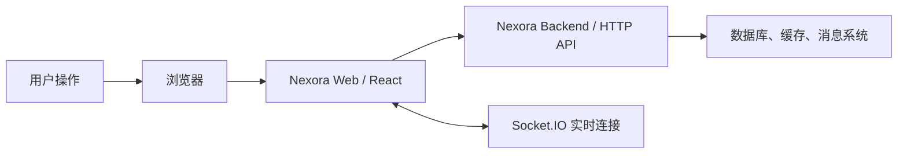
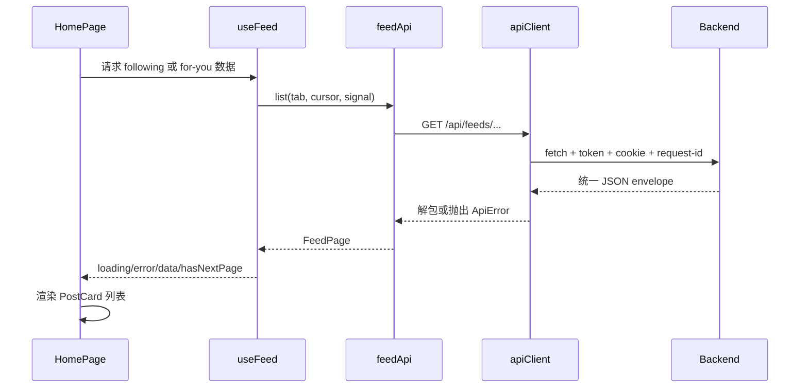

# 01. Web 与 Nexora Web 项目全景

## 1. 先建立一张地图

用户在浏览器输入 `http://localhost:5173/home` 时，表面上只是打开一个页面，背后却有多层系统协作：



前端不是数据库，也不应自己判断最终业务事实。它主要负责：

- 把服务器返回的数据展示成界面；
- 接收点击、输入、滚动等用户操作；
- 把操作转换成 HTTP 或实时请求；
- 管理加载、错误、空状态和短暂交互状态；
- 在不同 URL 与页面之间导航；
- 对输入做即时校验，但仍接受后端的最终校验结果。

## 2. 浏览器究竟做了什么

浏览器首先下载 HTML。本项目的入口 HTML 是 [`index.html`](../../index.html)，核心只有一个挂载点：

```html
<div id="root"></div>
<script type="module" src="/src/app/main.ts"></script>
```

可以把它理解为：

- `#root` 是一块空地；
- `main.ts` 是施工入口；
- React 根据组件树把按钮、表单和列表放进这块空地；
- CSS 决定这些元素怎样排列和显示；
- JavaScript 负责交互和请求。

浏览器中的三个基础层次仍然是：

| 基础                  | 作用               | 本项目中的例子                       |
| --------------------- | ------------------ | ------------------------------------ |
| HTML                  | 内容与语义结构     | `button`、`form`、`article`、`label` |
| CSS                   | 布局、颜色、响应式 | `*.module.css`、`tokens.css`         |
| JavaScript/TypeScript | 行为、状态、请求   | `useState`、`fetch`、路由、查询缓存  |

React 没有取代 HTML 和 CSS。JSX 最终仍会生成 DOM 元素，CSS 最终仍由浏览器执行。

## 3. 什么是 SPA

Nexora Web 是单页应用（Single Page Application，SPA）。这里的“单页”不是只有一个业务页面，而是服务器通常只返回一份 `index.html`，之后由前端路由根据 URL 切换组件。

例如：

- `/auth/login` 渲染登录页；
- `/home` 渲染首页；
- `/posts/:postId` 渲染指定帖子；
- `/settings/account` 渲染账号设置。

切换页面时，React Router 通常不会让浏览器重新下载整份 HTML，而是替换组件树。这使交互更流畅，也意味着生产服务器必须把未知路径回退到 `index.html`。本项目在 [`nginx.conf`](../../nginx.conf) 中用下面的规则完成回退：

```nginx
try_files $uri $uri/ /index.html;
```

## 4. React、Vite、TypeScript 分别是什么

### React

React 是 UI 库。它让我们用组件描述“状态为某个值时，界面应该长什么样”。例如首页在加载中显示骨架，失败显示重试按钮，成功显示帖子列表。

### TypeScript

TypeScript 是带静态类型的 JavaScript。它在代码运行前发现很多错误，例如把 `string` 当作 `number`、忘记处理 `null`、给组件传错属性。浏览器不直接运行 TypeScript；构建工具会把它转换为 JavaScript。

### Vite

Vite 是开发服务器与构建工具：

- 开发时启动 5173 端口；
- 支持模块热更新；
- 读取 `VITE_` 环境变量；
- 把 `/api` 代理到后端；
- 生产构建时拆分和压缩资源，输出 `dist/`。

配置位于 [`vite.config.ts`](../../vite.config.ts)。

## 5. 本项目解决哪些前端问题

Nexora Web 覆盖的不是一个演示计数器，而是完整社交产品：

- 登录、注册、验证码、Google 登录与账号恢复；
- 新手引导；
- 关注流、推荐流、发现与搜索；
- 帖子、评论、转发、引用、媒体和草稿；
- 用户主页、关注关系和社群；
- 通知、收藏、浏览历史与设置；
- 实时通知连接；
- Mock、单元测试、组件测试、E2E、Storybook 和生产部署。

因此仓库需要比小教程更清晰的边界。把所有代码都放在 `components/` 或一个巨大的 `App.tsx` 中，短期简单，长期会让接口、类型、状态和页面互相缠绕。

## 6. 一条请求的宏观旅程

以首页信息流为例：



每一层只做自己擅长的事：页面关心展示，Hook 关心缓存生命周期，领域 API 关心业务端点，通用 Client 关心协议和认证。

## 7. 前端可信边界

前端校验主要改善体验，不能替代后端安全：

- 用户可以绕过浏览器界面直接发 HTTP 请求；
- 浏览器里的 JavaScript 和环境变量可被查看；
- 前端隐藏按钮不代表用户没有权限；
- Token、Cookie、CSRF 与业务权限必须由后端验证。

所以 `VITE_` 变量绝不能保存数据库密码、短信 AccessKey 或服务端私钥。它们会被编译进浏览器可下载的 JavaScript。

## 8. 本章自测

1. React、Vite、TypeScript 各负责什么？
2. 为什么 SPA 有很多 URL，却仍称为单页应用？
3. 为什么生产服务器需要路由回退？
4. 前端表单校验为什么不能代替后端校验？
5. 在首页请求链路中，页面为什么不直接写 `fetch`？

下一章：[环境准备与首次启动](./02-environment-and-first-run.md)。
