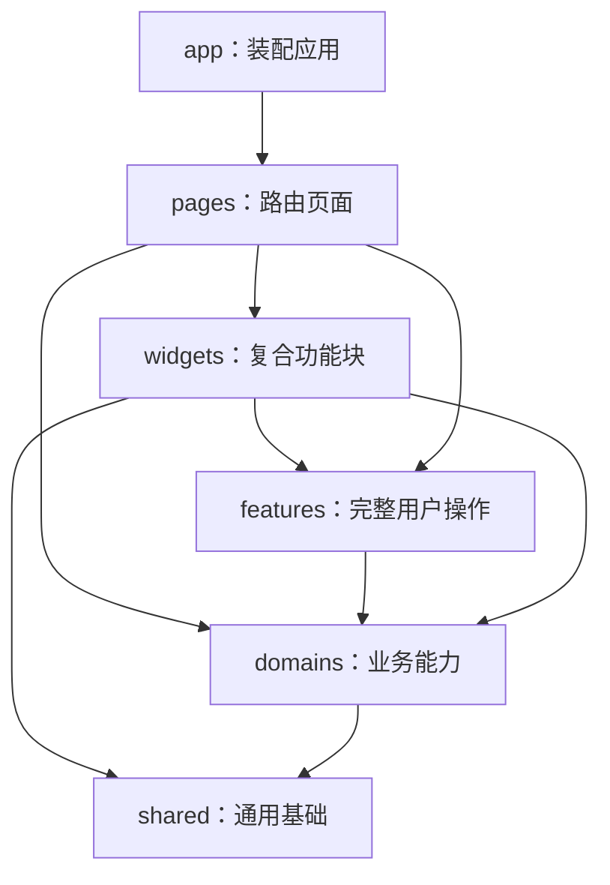

# 04. 目录与分层架构：为什么这样搭建

## 1. 为什么不用一个 `components` 文件夹装所有东西

小项目可以把组件和请求都写在几个文件里，但 Nexora 有认证、帖子、信息流、社群、通知、媒体等多个业务域。如果没有边界，常见后果是：

- 页面直接写请求地址和响应转换；
- 同一个用户类型被定义很多次；
- 一个组件既请求数据、又做权限判断、又画 UI；
- 修改认证逻辑时需要搜索几十个页面；
- 循环依赖越来越多；
- 测试只能启动整个应用，无法隔离。

本项目采用领域模块化 SPA，核心依赖方向是：



箭头表示“可以依赖”。`shared` 不应反过来导入某个页面；`domains/posts` 也不应依赖 `pages/compose`。`npm run boundaries:check` 会解析别名、相对导入与重导出，检查层级、公开入口、领域允许依赖和循环。

## 2. 根目录为什么有这么多配置

| 路径                       | 作用                         | 为什么在根目录          |
| -------------------------- | ---------------------------- | ----------------------- |
| `package.json`             | 依赖、Node 版本、npm scripts | npm 的项目入口          |
| `package-lock.json`        | 精确依赖树                   | 保证机器与 CI 一致      |
| `index.html`               | SPA HTML 壳                  | Vite 的浏览器入口       |
| `vite.config.ts`           | 开发服务器、代理、构建       | Vite 默认查找位置       |
| `tsconfig*.json`           | TypeScript 工程配置          | 编辑器与构建工具共享    |
| `eslint.config.js`         | TS/React 代码规则            | ESLint 默认入口         |
| `stylelint.config.mjs`     | CSS 规则                     | Stylelint 默认入口      |
| `vitest.config.ts`         | 单元/组件测试                | 与源码测试环境对应      |
| `playwright.config.ts`     | E2E 测试                     | 管理浏览器与预览服务器  |
| `Dockerfile`               | 两阶段生产镜像               | Docker 构建入口         |
| `nginx.conf`               | 静态服务、缓存、SPA 回退     | 生产运行配置            |
| `.github/workflows/ci.yml` | 自动验证流水线               | GitHub Actions 约定目录 |

这些文件不是业务代码，却决定业务代码如何被检查、运行、构建和部署。

## 3. `src/app`：应用装配层

`app` 回答“整个应用怎样启动和连接”：

- `main.ts`：最早执行的前端入口；
- `bootstrapApplication.ts`：寻找挂载节点并处理启动失败；
- `mountApplication.ts`：按环境启动 MSW，挂载 React；
- `ApplicationRoot.tsx`：组合 StrictMode、Provider 和 Router；
- `providers/`：查询缓存、Toast、会话恢复、实时连接；
- `router/`：URL、懒加载和访问守卫；
- `layouts/`：公共页、引导页、登录后应用壳；
- `styles/`：全局令牌、重置和排版。

为什么不把这些放进某个业务域？因为它们负责跨业务的应用装配，而不是“帖子”或“用户”自身能力。

## 4. `src/pages`：路由级页面

一个 `page` 通常对应一个可访问 URL，例如：

- `pages/home/HomePage.tsx` → `/home`；
- `pages/auth/LoginPage.tsx` → `/auth/login`；
- `pages/settings/AccountSettingsPage.tsx` → `/settings/account`。

页面负责：

- 读取路由参数和查询参数；
- 调用领域 Hook；
- 编排 Widget 和 UI；
- 决定加载、错误、空状态如何展示；
- 处理页面级导航。

页面不应该成为领域 API 的所有者。如果别的页面也需要帖子详情，能力应在 `domains/posts`。

## 5. `src/widgets`：可复用的复合功能块

Widget 比基础按钮复杂，但又不是完整路由页面：

- `post-card`：帖子正文、媒体、作者、互动条；
- `quick-compose`：读取当前用户并提供发帖导航入口；
- `app-shell`：侧边栏、顶栏、发布入口；
- `media-viewer`：媒体查看交互；
- `user-card`、`community-card`：领域对象展示块。

为什么需要 Widget 层？如果 `PostCard` 全写进首页，搜索页、个人主页、收藏页都会复制逻辑；如果塞进 `shared/ui`，通用层就会了解帖子业务。Widget 正好承载“可复用但有业务含义”的组合。

### 完整操作归 `src/features`

发帖和互动需要协调多个领域，现有两个 feature 分别是：

- [`features/compose-post`](../../src/features/compose-post/index.ts)：编辑器 UI、表单规则、上传协调、自动保存与发布；URL 参数和完成后的导航由 ComposePage 负责。
- [`features/post-interactions`](../../src/features/post-interactions/index.ts)：统一帖子与评论的互动目标、权限、防重复、乐观回滚、反馈和相关缓存失效；PostActionBar 与详情评论保留各自布局。

领域保留 API、合同和自身数据操作。跨领域写流程由 feature 调用领域公开入口；上层也可以直接调用简单领域查询，无需强制经过 feature。feature 不导入 widgets、pages 或 app。

## 6. `src/domains`：业务域层

每个领域尽量自己拥有一组能力：

```text
domains/posts/
├─ api/       # 后端端点调用
├─ hooks/     # 面向 React 的 Query/Mutation Hook
├─ lib/       # 纯业务转换与算法
├─ model/     # 类型、query keys、局部状态
├─ ui/        # 极少量领域专属 UI（若需要）
└─ index.ts   # 对外公开入口
```

这些子目录不是每个领域都必须凑齐。没有相应职责就不要创建空目录。

### `api`

知道具体 URL、请求输入和响应类型，例如 `feedApi.list()`。

### `hooks`

把 API 接入 React 与 TanStack Query，例如 `useFeed()`、`useLogin()`。

### `model`

放稳定领域概念：类型、查询键、Zustand Store、常量。

### `lib`

放不依赖 React 的纯转换，例如把后端 DTO 转换为帖子 ViewModel，或提取正文链接。纯函数最好测试。

### `index.ts`

这是领域的公共门面。外部从 `@/domains/posts` 或约定的 `model`、`api`、`lib` 专用入口导入，模块内部使用相对路径。显式导出稳定能力，避免深挖私有文件或通过 `export *` 无限制暴露实现。这样内部目录可调整，调用方不必全部修改。

## 7. `src/shared`：不属于特定业务的基础能力

`shared` 包括：

- `api/`：通用 HTTP Client、认证会话、分页、QueryClient；
- `config/`：环境变量、品牌、路径；
- `hooks/`：通用 Hook；
- `lib/`：数组、日期、URL、错误等纯工具；
- `model/`：跨领域基础类型；
- `ui/`：Button、Modal、TextField、Toast、Notice、LoadingRows、EmptyPanel、SideCard 等基础组件；`ui/layout` 放 PageLayout、Stack 和通用内容布局样式。SideCard 的导航链接由上层传入。

判断是否应放 shared 的问题是：“如果项目没有帖子、用户、社群这些业务，它仍然合理存在吗？”如果答案是否定的，它通常不属于 shared。

## 8. `src/mocks` 与 `src/test`

`mocks` 定义模拟服务器能力：

- `fixtures.ts`：静态样本的稳定导出入口，具体数据和工厂放在 `fixtures/`；
- `handlers.ts`：按确定顺序组装 `handlers/*.handlers.ts`，保留静态路由与参数路由匹配次序；
- `state/`：各领域可变模拟状态，`resetMockState()` 显式恢复初值；
- `browser.ts`：开发浏览器中的 MSW；
- `server.ts`：Node 测试环境中的 MSW。

`test` 放所有测试共享的初始化与帮助函数。`setup.ts` 在每个用例后同时调用 `server.resetHandlers()` 与 `resetMockState()`，分别恢复处理器覆盖和业务数据。它不是业务模块，生产构建也不应依赖它。

## 9. `public`、`dist`、`docs`、`tests`

- `public/`：原样复制的静态文件，使用 `/favicon.svg` 这类根路径访问；
- `dist/`：构建生成物，禁止手改；
- `docs/`：架构、教程、路线与维护文档；
- `tests/e2e/`：从用户视角驱动浏览器的端到端测试；
- 源码旁的 `*.test.ts(x)`：与实现靠近的单元或组件测试。

## 10. 新文件应该放哪里：决策表

| 问题                                           | 放置位置             |
| ---------------------------------------------- | -------------------- |
| 它是不是一个 URL 对应的完整页面？              | `pages`              |
| 它是不是多个页面复用的业务组合块？             | `widgets`            |
| 它是否协调一次完整用户操作或跨领域写流程？     | `features/<feature>` |
| 它是不是某个业务域的 API、类型、Hook 或转换？  | `domains/<domain>`   |
| 它是否完全不关心业务，可以普遍复用？           | `shared`             |
| 它是否负责全局装配、Provider、Router、Layout？ | `app`                |
| 它是否只用于模拟接口？                         | `mocks`              |
| 它是否只用于测试初始化？                       | `test`               |

## 11. 一个错误示例

假设要增加“收藏帖子”按钮，下面的做法不好：

```tsx
// pages/home/HomePage.tsx 中直接写
await fetch(`/api/posts/${id}/bookmark`, { method: 'POST' });
```

问题：认证头、CSRF、错误 envelope、缓存失效、其他页面复用全被绕过。

更合理的分工：

```text
domains/library/api       定义收藏端点
features/post-interactions 统一 Mutation、权限、回滚和跨页面缓存刷新
widgets/post-card         调用 Hook 并展示按钮状态
pages/home                只组合帖子卡片
```

## 12. 本章自测

1. `pages` 与 `widgets` 的边界是什么？
2. `domains/posts` 为什么不能依赖 `pages/compose`？
3. 一个格式化日期的纯函数应放哪里？
4. 一个帖子 API 响应类型应放哪里？
5. 为什么 `index.ts` 可以降低领域内部重构成本？

上一章：[TypeScript 与 React 基础](./03-typescript-and-react-basics.md)；下一章：[启动、路由与 Provider](./05-bootstrap-routing-and-providers.md)。
