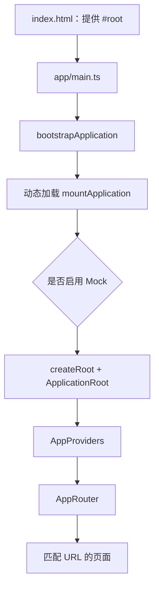

# 05. 应用启动、路由与 Provider

## 1. 从 HTML 到 React 页面

应用启动链路如下：



### 为什么拆这么多文件

初学项目常在 `main.tsx` 里直接 `createRoot(...).render(<App />)`。本项目多拆几层，是为了：

- 单独测试缺少 `#root` 和动态导入失败；
- 在 React 挂载前等待 MSW 准备好，避免首个请求漏过 Mock；
- 让最小启动失败页不依赖整套应用成功加载；
- 把装配职责与业务页面分开。

## 2. `main.ts` 为什么使用动态导入

[`src/app/main.ts`](../../src/app/main.ts) 把 `mountApplication` 写成动态导入：

```ts
const application = await import('@/app/mountApplication');
```

动态导入返回 Promise，可形成独立代码块。若主应用模块加载失败，`bootstrapApplication` 仍有机会渲染一个轻量失败界面，而不是留下白屏。

## 3. Provider 是什么

React Context Provider 把某种能力提供给后代组件，避免每层都传 Props。本项目的 [`AppProviders.tsx`](../../src/app/providers/AppProviders.tsx) 按顺序组合：

```text
QueryClientProvider
└─ ToastProvider
   └─ AuthBootstrap
      └─ RealtimeProvider
         └─ 页面与路由
```

### QueryClientProvider

让任何领域 Hook 可以访问统一查询缓存。

### ToastProvider

让页面通过 `useToast()` 显示全局反馈，而不必自己管理浮层容器。

### AuthBootstrap

应用打开时尝试用后端 Refresh Cookie 恢复会话，并把 Access Token 与用户摘要写入认证状态。

### RealtimeProvider

认证成功后建立通知 Socket；收到事件时使通知 Query 失效，从后端重新拉取权威数据。

Provider 顺序有意义。例如认证恢复会调用 API，而 API 与页面都需要 Query/Toast 等上层环境。

## 4. 路由树如何阅读

路由位于 [`src/app/router/router.tsx`](../../src/app/router/router.tsx)，使用 `createBrowserRouter`。

一个典型节点：

```tsx
{
  path: 'posts/:postId',
  lazy: async () => ({
    Component: (await import('@/pages/post-detail/PostDetailPage')).PostDetailPage,
  }),
}
```

- `path` 是 URL 模式；
- `:postId` 是动态参数；
- `lazy` 在进入该页面时才下载对应模块；
- 页面内部可用 `useParams()` 读取参数。

## 5. 嵌套路由与 Layout

React Router 的父路由可渲染 Layout，子页面通过 `<Outlet />` 出现在 Layout 的指定位置。

本项目有三类布局：

- `PublicLayout`：登录、注册、找回密码；
- `OnboardingLayout`：新手引导步骤；
- `AppShellLayout`：登录后的侧栏、顶栏与主内容区。

好处是所有登录后页面不需要重复写导航栏。

## 6. 路由守卫不是后端权限

[`guards.tsx`](../../src/app/router/guards.tsx) 根据认证状态决定：

- `bootstrapping`：显示会话恢复 Spinner；
- `anonymous`：跳转登录页；
- 未完成引导：跳转当前引导步骤；
- 已完成引导：允许进入正式应用。

守卫提升体验，但不能充当安全边界。用户可以手工请求 API，所以后端仍必须检查 Token、角色和资源权限。

## 7. 为什么有三态认证而不是一个布尔值

如果只有 `isLoggedIn: false`，应用刚打开、还没完成 Refresh 请求时会被误判为游客，先跳登录页再跳回首页，形成闪烁。

三态更准确：

```text
bootstrapping → authenticated
             ↘ anonymous
```

路由在 `bootstrapping` 期间等待，避免错误跳转。

## 8. 懒加载与代码分割

路由页面使用 `import()` 懒加载，Vite 构建时生成多个 JS Chunk。用户进入登录页时，不必立刻下载社群管理和媒体查看器的全部代码。

优点：首屏更小。代价：

- 第一次进入新页面需要下载 Chunk；
- Chunk 加载失败需要错误边界；
- 不能把所有页面又通过某个总入口静态导入，否则会破坏分割。

## 9. Error Boundary 与请求错误的区别

根错误边界处理渲染过程中的未捕获异常，例如组件访问不存在属性。普通 API 失败应由 Query/Mutation 状态在页面内友好展示，不应该故意抛给根错误边界。

可以这样区分：

- “信息流接口 503” → 页面显示“加载失败，重试”；
- “组件代码本身抛异常” → RootErrorBoundary 兜底；
- “应用模块根本加载失败” → bootstrap failure 兜底。

## 10. 新增路由的步骤

假设增加 `/about`：

1. 创建 `src/pages/about/AboutPage.tsx`；
2. 在 `router.tsx` 合适布局下新增懒加载节点；
3. 在 `shared/config/paths.ts` 增加集中路径函数（若业务会复用）；
4. 添加导航入口；
5. 测试直接访问与刷新；
6. 确认生产 Nginx 回退正常。

不要在多个组件硬编码同一动态 URL，集中路径函数能减少拼写错误。

## 11. 本章自测

1. 为什么 MSW 要在 React 挂载前启动？
2. Provider 顺序为什么可能影响功能？
3. `<Outlet />` 有什么作用？
4. 路由守卫为什么不能代替后端鉴权？
5. `bootstrapping` 状态解决了什么界面问题？

上一章：[目录与分层架构](./04-directory-architecture.md)；下一章：[组件、CSS 与设计系统](./06-components-css-and-design-system.md)。
