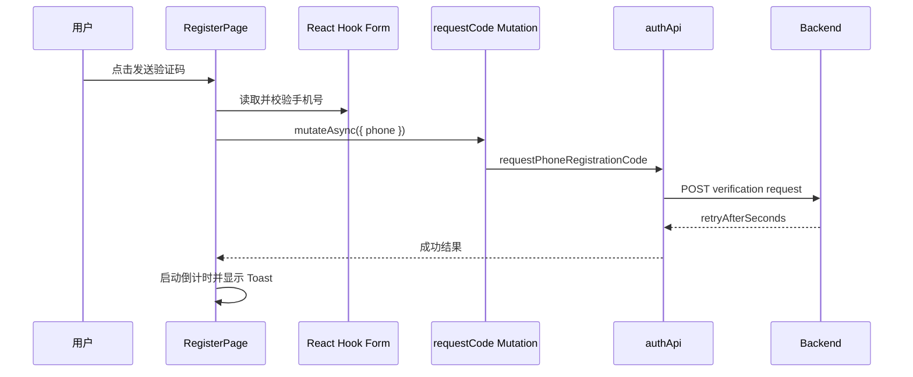

# 09. 真实功能链路追踪

这一章把前面的概念放回真实代码。阅读时请在 VS Code 同时打开提到的文件。

## 案例一：首页信息流

### 1. 路由选择页面

访问 `/home?tab=following`，[`router.tsx`](../../src/app/router/router.tsx) 在 `RequireCompletedOnboarding + AppShellLayout` 下懒加载 [`HomePage.tsx`](../../src/pages/home/HomePage.tsx)。

这说明：用户必须已认证且完成引导；页面自动获得应用侧栏和顶栏。

### 2. URL 决定当前 Tab

首页使用：

```ts
const [params] = useSearchParams();
const tab = params.get('tab') === 'for-you' ? 'for-you' : 'following';
```

为什么放 URL：

- 刷新不会丢；
- 可复制链接；
- 浏览器前进后退正常；
- 不需要全局 Store。

### 3. 页面调用领域 Hook

```ts
const feed = useFeed(tab);
```

[`useFeed.ts`](../../src/domains/feed/hooks/useFeed.ts) 使用 `useInfiniteQuery`，负责：

- 用 `feedKeys.list(tab)` 标识缓存；
- 把 Cursor 交给 API；
- 接收 AbortSignal；
- 计算下一页参数；
- 提供加载更多；
- 提供独立刷新 Mutation。

### 4. 领域 API 选择端点

[`feedApi.ts`](../../src/domains/feed/api/feedApi.ts) 根据 Tab 选择：

```text
following → /api/feeds/following
for-you   → /api/feeds/for-you
```

它用 `appendQuery` 添加 `cursor`、`pageSize` 和刷新模式，再调用通用 `apiClient`。

### 5. 响应转换成 UI 模型

后端 DTO 不一定等于组件最适合的数据形状。`feedResponseToPage` 和 `hydrateFeedReposts`：

- 转换字段；
- 为转发补充原帖详情；
- 原帖不可用时生成明确不可用内容；
- 返回稳定 `FeedPage`。

这让 `PostCard` 不需要了解多个后端响应结构。

### 6. 页面渲染完整状态

首页分别处理：

- `isLoading` → LoadingRows；
- `isError` → 错误 Notice + 重新加载；
- 有数据 → PostCard 列表；
- 空数据 → 空状态提示；
- `hasNextPage` → 加载更多；
- 没有下一页 → 已查看全部。

这比“`data?.map()`，没有就空白”更符合正式产品。

### 7. PostCard 继续组合业务

[`PostCard.tsx`](../../src/widgets/post-card/PostCard.tsx) 负责：

- 曝光记录 Hook；
- 作者是否可用；
- 转发/回复关系；
- 富文本、媒体、链接卡片；
- 点击卡片进入详情；
- 内部按钮/链接阻止卡片导航；
- 互动操作条。

注意事件边界：点击卡片空白区域进入详情，但点击内部链接或按钮不应触发外层跳转，因此代码检查 `closest('a, button, ...')`。

### 8. 手动刷新为什么不是简单 refetch

信息流刷新使用 `FIRST_PAGE_REBUILD`，成功后调用 `mergeRefreshedFeed`：

- 新内容插到顶部；
- 重复内容更新而非重复显示；
- 保留用户已经加载的旧内容；
- 刷新结果为空时保留当前列表。

这是领域规则，所以放在 `domains/feed/lib` 并有纯函数测试。

## 案例二：手机号注册

### 1. 页面模式

[`RegisterPage.tsx`](../../src/pages/auth/RegisterPage.tsx) 用 `mode: 'email' | 'phone'` 控制不同字段和 Schema 分支。

### 2. 请求验证码

用户点击“发送验证码”：



页面不发送短信；它请求后端，后端再通过异步通知链路发送。

### 3. 提交注册

`handleSubmit` 先运行 Zod。通过后，根据模式组装判别联合类型：

```ts
{
  mode: ('email', email, handle, password);
}
```

或：

```ts
{
  mode: ('phone', phone, code, handle, password);
}
```

`useRegister()` 最终调用 `authApi.register()`，成功后把会话写入认证 Store。

### 4. 成功后为什么去引导页

后端会返回引导状态。页面使用 `onboardingPathForStatus()` 选择正确步骤，而不是永远硬编码 `/onboarding/interests`。这样用户中途退出后可从后端记录的真实进度继续。

### 5. 这个功能怎样被测试

[`RegisterPage.test.tsx`](../../src/pages/auth/RegisterPage.test.tsx)：

1. 创建独立 QueryClient；
2. 用 MemoryRouter 和 ToastProvider 渲染页面；
3. MSW 临时覆盖验证码接口；
4. 点击手机号注册；
5. 输入号码并点击发送；
6. 断言请求体；
7. 断言倒计时按钮禁用；
8. 断言成功 Toast。

测试关注用户可见行为与网络契约，不读取组件内部 State。

## 案例三：发布帖子后的缓存更新

[`ComposePage`](../../src/pages/compose/ComposePage.tsx) 读取 `draftId`、`community` 和 `quotePostId`，通过 props 装配 [`ComposeEditor`](../../src/features/compose-post/ui/ComposeEditor.tsx)，并在保存、发布回调中决定导航。编辑器无需读取 Router 上下文。

[`useComposer`](../../src/features/compose-post/model/useComposer.ts) 协调表单、[`useDraftAutosave`](../../src/features/compose-post/model/useDraftAutosave.ts) 和 [`useComposeUploads`](../../src/features/compose-post/model/useComposeUploads.ts)。媒体领域继续负责上传与 READY 判断，帖子领域继续提供草稿合同和请求。

[`features/compose-post/model/usePublishPost.ts`](../../src/features/compose-post/model/usePublishPost.ts) 用一个 mutation 处理直接发布与草稿发布，成功后使：

```ts
feedKeys.all;
postKeys.drafts;
```

失效；发布已有草稿时还会失效 `postKeys.draftDetail(draftId)`。原因是新帖可能影响首页，已发布草稿也应从草稿列表消失。posts 的保存 mutation 只更新自身草稿缓存，发布时的 feed 联动由 feature 负责。

## 案例四：帖子互动与跨页面缓存

[`PostActionBar`](../../src/widgets/post-card/PostActionBar.tsx) 使用 [`usePostInteractions`](../../src/features/post-interactions/model/usePostInteractions.ts)，详情评论使用同一模块的 `useCommentLike`。转发卡片操作源帖，回复操作回复帖，评论点赞使用评论的帖子 ID。

feature 统一检查权限、共享同一目标的等待状态和提交锁，先更新当前按钮与计数；请求失败立即回滚并显示提示。[`interactionCache.ts`](../../src/features/post-interactions/model/interactionCache.ts) 在请求结束后统一失效首页、详情、评论、搜索、收藏等相关缓存：已挂载查询重新读取，未挂载缓存标为过期。不同 Query Key 下同一帖子的副本不会自动同步，需要这份明确策略。

## 如何自己追踪任意功能

按以下顺序搜索：

1. 从 URL 在 `router.tsx` 找页面；
2. 看页面调用哪些 Hook/Widget；
3. 从 Hook 找 Query Key 与领域 API；
4. 从 API 找端点和输入输出类型；
5. 从 Adapter/Lib 找 DTO → ViewModel 转换；
6. 从组件找加载/错误/空/权限状态；
7. 搜索同名 `*.test.ts(x)`；
8. 对照 `BACKEND_MAPPING.md` 和浏览器 Network。

不要一开始从整个仓库搜索某个中文按钮文本然后盲改；先建立调用链。

## 本章自测

1. 首页 Tab 为什么写进查询参数？
2. `useFeed` 和 `feedApi` 各负责什么？
3. 为什么 DTO 要转换为 ViewModel？
4. 手机号注册成功后为什么不固定跳第一个引导页？
5. 发布成功后为什么要使 Query 失效？

上一章：[表单与校验](./08-forms-and-validation.md)；下一章：[Mock 与测试](./10-mocks-and-testing.md)。
