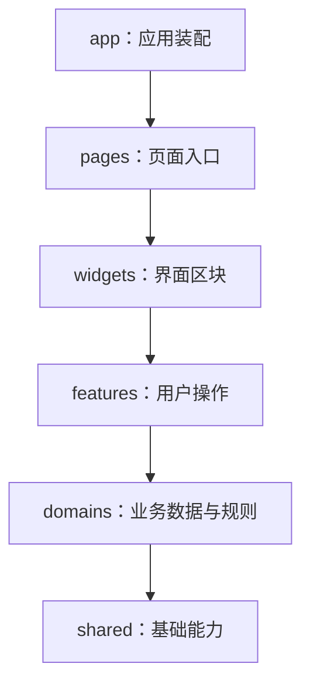

# Nexora Web 推荐项目目录与架构设计

> 实施状态（2026-09-18）：本文保留迁移前调查与设计依据；第一批迁移已按方案落地，当前目录、公开入口和验收记录请看 [架构迁移记录](./ARCHITECTURE_MIGRATION.md) 与 [完整项目目录](./PROJECT_TREE.md)。下文“当前/尚未实施”描述的是编写时的基线。

编写日期：2026-09-10。适用项目：`C:\Users\lct_f\Desktop\X项目\twitter-clone-web`。

本文根据当前源码、架构说明和工程配置提出目录调整建议。它是一份设计与迁移文档，文中的目标目录尚未实施；本次没有移动业务源码或改变应用行为。

**推荐保留现有的领域模块化结构，在 `widgets` 与 `domains` 之间按需增加 `features`，并收紧公共代码、缓存策略和模块入口的边界。** 数据层继续以 TanStack Query 为主，React Router 的 loader/action 按具体页面需求接入。

这样选择，是因为项目已经具备较好的领域 API、Query Key、类型和通用组件基础。当前更明显的问题是复杂业务流程分散在页面、复合组件和领域 Hook 中，以及少数公共文件承担了过多职责。

## 1. 当前目录有哪些基础，哪些地方值得调整

当前 `src` 的主要结构是：

```text
src/
├── app/          应用启动、路由、Provider、全局布局和样式
├── pages/        页面，以及部分表单与业务流程
├── widgets/      帖子卡片、编辑器、导航栏等复合组件
├── domains/      auth、posts、feed 等业务领域
├── shared/       HTTP、通用组件、工具和基础类型
├── mocks/        MSW 入口、接口处理器和模拟数据
└── test/         单元测试的环境初始化和辅助工具
```

现有 [架构决策](C:/Users/lct_f/Desktop/X项目/twitter-clone-web/docs/adr/0001-domain-modular-spa.md:12) 已确定使用领域模块化 SPA，[架构说明](C:/Users/lct_f/Desktop/X项目/twitter-clone-web/docs/ARCHITECTURE.md:17) 也明确了各层责任。建议沿着这些已有约定演进。

| 当前证据                                                                                                                                                                                                                                 | 说明了什么                                     | 建议方向                                             |
| ---------------------------------------------------------------------------------------------------------------------------------------------------------------------------------------------------------------------------------------- | ---------------------------------------------- | ---------------------------------------------------- |
| [useFeed](C:/Users/lct_f/Desktop/X项目/twitter-clone-web/src/domains/feed/hooks/useFeed.ts:7) 封装分页和首屏刷新                                                                                                                         | 领域查询已有明确复用价值                       | 保留领域查询，逐步提取可复用的查询配置               |
| [ComposeEditor](C:/Users/lct_f/Desktop/X项目/twitter-clone-web/src/widgets/compose-editor/ComposeEditor.tsx:25) 同时处理路由、上传、草稿和发布，当前约 812 行                                                                            | 一个文件承载了完整发帖流程                     | 将流程迁入 `features/compose-post`，按状态和行为拆分 |
| [PostActionBar](C:/Users/lct_f/Desktop/X项目/twitter-clone-web/src/widgets/post-card/PostActionBar.tsx:91) 与 [帖子详情页](C:/Users/lct_f/Desktop/X项目/twitter-clone-web/src/pages/post-detail/PostDetailPage.tsx:126) 分别实现点赞处理 | 请求、等待状态和更新策略有多个落点             | 统一底层互动行为，保留各自展示差异                   |
| [usePost](C:/Users/lct_f/Desktop/X项目/twitter-clone-web/src/domains/posts/hooks/usePost.ts:2) 引入 feed key，[feedApi](C:/Users/lct_f/Desktop/X项目/twitter-clone-web/src/domains/feed/api/feedApi.ts:1) 又调用 posts API               | posts 与 feed 在领域层相互依赖                 | 将发布后的跨领域刷新上移到发布流程                   |
| [PageParts](C:/Users/lct_f/Desktop/X项目/twitter-clone-web/src/pages/_shared/PageParts.tsx:18) 混合通用容器、加载占位、提示和快速发帖入口                                                                                                | `_shared` 的归属标准不清楚                     | 按基础 UI、业务组件、页面私有内容分别归位            |
| [Mock handlers](C:/Users/lct_f/Desktop/X项目/twitter-clone-web/src/mocks/handlers.ts) 当前约 4,277 行                                                                                                                                    | 多个领域接口、模拟状态和匹配顺序集中在一个文件 | 按领域拆分，保留统一组装与重置入口                   |
| [ESLint 配置](C:/Users/lct_f/Desktop/X项目/twitter-clone-web/eslint.config.js:48) 当前主要检查类型和 React 使用规则                                                                                                                      | 目录边界主要依赖人工约定                       | 增加能够解析真实导入路径的边界检查                   |
| [CI 工作流](C:/Users/lct_f/Desktop/X项目/twitter-clone-web/.github/workflows/ci.yml:18) 逐项运行检查，但未执行 `reuse:check`                                                                                                             | 文档中的复用门禁尚未完整接入 CI                | 将复用与新增边界检查纳入实际工作流                   |

行数只是帮助定位复杂区域。是否拆分，应看一个文件是否同时负责多个独立变化的规则，而不是达到固定行数就拆。

这里的双向领域依赖也不等于已经发生运行时故障；它意味着修改一个领域时更容易牵动另一个领域，需要明确依赖方向。

## 2. 更推荐的目标目录

下面是一份目标结构示意。保留现有领域名称、构建入口、生成文件路径和测试入口；新增目录只在有对应代码时创建。树中未展开的现有文件继续保留。

```text
twitter-clone-web/
├── src/
│   ├── app/
│   │   ├── main.ts
│   │   ├── mountApplication.ts
│   │   ├── bootstrapApplication.ts
│   │   ├── bootstrapFailure.ts
│   │   ├── ApplicationRoot.tsx
│   │   ├── router/
│   │   │   ├── router.tsx              根路由组装，保留页面 lazy
│   │   │   ├── guards.tsx              当前组件式守卫
│   │   │   └── routes/                路由表较长时再按区域拆分
│   │   ├── providers/                 Query、认证、Toast、实时连接装配
│   │   ├── layouts/                   公共壳、引导壳、主应用壳
│   │   ├── error/                     全局错误边界
│   │   └── styles/                    reset、tokens、typography、global
│   │
│   ├── pages/
│   │   ├── home/
│   │   │   ├── HomePage.tsx
│   │   │   └── HomePage.module.css
│   │   ├── post-detail/
│   │   │   ├── PostDetailPage.tsx
│   │   │   ├── PostDetailPage.module.css
│   │   │   ├── loader.ts              可选：仅在采用路由预加载时增加
│   │   │   ├── ui/                    只用于此页面的区块
│   │   │   └── model/                 只用于此页面的选择、展开等状态
│   │   ├── compose/
│   │   │   └── ComposePage.tsx        读取 URL，装配发帖功能
│   │   ├── auth/                     登录等页面入口；流程按需下沉
│   │   ├── settings/                 各设置页；独立面板可在内部拆分
│   │   └── ...                       其他现有页面继续按 URL 场景组织
│   │
│   ├── widgets/
│   │   ├── post-card/
│   │   │   ├── PostCard.tsx
│   │   │   ├── PostActionBar.tsx       组合互动能力，保留动作栏布局
│   │   │   ├── PostCard.module.css
│   │   │   └── index.ts
│   │   ├── user-card/
│   │   ├── community-card/
│   │   ├── quick-compose/            从 PageParts 拆出的快速发帖入口
│   │   ├── media-viewer/
│   │   └── app-shell/                侧栏、顶栏等业务导航区块
│   │
│   ├── features/                     新增：完整用户操作及跨领域编排
│   │   ├── compose-post/             第一批：编辑、草稿、上传协调、发布
│   │   ├── post-interactions/        第一批：点赞、转发、收藏的行为协调
│   │   ├── authentication/           后续按复杂度提取登录和验证码流程
│   │   ├── edit-profile/             后续按需提取资料表单与媒体协调
│   │   └── create-community/         后续按需提取社群创建流程
│   │
│   ├── domains/
│   │   ├── auth/
│   │   ├── users/
│   │   ├── permissions/
│   │   ├── posts/
│   │   ├── media/
│   │   ├── engagement/
│   │   ├── library/
│   │   ├── communities/
│   │   ├── feed/
│   │   ├── search/
│   │   ├── notifications/
│   │   └── settings/
│   │
│   ├── shared/
│   │   ├── api/
│   │   │   ├── client.ts              HTTP、超时、错误解析、认证桥接
│   │   │   ├── authSession.ts         Token 与刷新接口，不导入业务页面
│   │   │   ├── queryClient.ts         保留现有唯一 QueryClient 实例
│   │   │   ├── errors.ts
│   │   │   ├── pagination.ts
│   │   │   └── generated/
│   │   │       └── openapi.d.ts       生成目标；获得 schema 后生成
│   │   ├── ui/
│   │   │   ├── Button/
│   │   │   ├── Modal/
│   │   │   ├── Notice/
│   │   │   ├── LoadingRows/
│   │   │   └── layout/               PageLayout、Stack 等无业务布局
│   │   ├── hooks/                    无领域含义的通用 React 逻辑
│   │   ├── lib/                      日期、文本、集合等纯工具
│   │   ├── model/                    具有稳定共同语义的基础类型
│   │   └── config/                   环境、品牌、纯 URL 构造等配置
│   │
│   ├── mocks/
│   │   ├── browser.ts                浏览器 MSW 入口
│   │   ├── server.ts                 Node 测试 MSW 入口
│   │   ├── handlers.ts               按确定顺序组装各领域 handler
│   │   ├── handlers/
│   │   │   ├── auth.handlers.ts
│   │   │   ├── users.handlers.ts
│   │   │   ├── posts.handlers.ts
│   │   │   └── ...
│   │   ├── fixtures/                 按领域拆分的静态数据和工厂
│   │   ├── state/                    模拟可变状态及明确的重置函数
│   │   └── scenarios/                多接口协作的测试场景，按需增加
│   │
│   ├── test/
│   │   ├── setup.ts                  测试生命周期与统一清理
│   │   ├── http.ts
│   │   └── render.tsx                需要时提供隔离的测试 Provider
│   └── vite-env.d.ts
│
├── tests/e2e/                        登录、发布等完整用户链路
├── public/                           必须保持固定 URL 的静态资源
├── scripts/                          API 生成、环境与复用检查
├── docs/                             架构、开发、接口映射和操作文档
├── design-reference/                 设计参考资料
├── .storybook/
├── .github/
├── package.json
├── vite.config.ts
├── vitest.config.ts
├── playwright.config.ts
└── ...                               现有 TypeScript、部署等配置
```

`node_modules`、`dist`、coverage 和测试报告是依赖或产物，不属于业务模块。已有设计导入包可暂时保留，后续需要统一归档时再单独处理文件与引用。

不建议为了视觉上整齐，把 Vite、TypeScript、ESLint 等入口全部搬入新建的 `config/`。保留工具惯用位置，可以减少命令参数、IDE 配置和 CI 路径调整。

## 3. 每层为什么这样划分

目录的价值在于让开发者判断“修改这项需求，应该去哪里”，而不只是给文件分类。

| 层         | 它回答的问题                     | 应放内容                                                  | 不应承担的内容                                   |
| ---------- | -------------------------------- | --------------------------------------------------------- | ------------------------------------------------ |
| `app`      | 应用怎样启动和连接起来？         | Provider、路由表、全局布局、启动与连接生命周期            | 登录表单字段规则、发帖编辑过程                   |
| `pages`    | 这个 URL 显示哪些内容？          | 路由参数、页面布局、页面私有区块、可选 loader/action 适配 | 可复用的跨领域提交流程、重复声明接口 DTO         |
| `widgets`  | 这个页面区域由什么组成？         | 帖子卡片、导航栏、用户卡片等有独立界面意义的组合          | 同一业务操作的另一套请求、回滚与缓存规则         |
| `features` | 用户要完成什么操作？             | 发布帖子、登录、编辑资料等流程及其表单 UI                 | 重新定义底层接口合同、复制通用上传实现           |
| `domains`  | 这个业务领域提供哪些数据和能力？ | API、类型、Query Key、查询、自身数据更新、适配器          | 页面跳转、导入上层组件、任意联动其他领域的写流程 |
| `shared`   | 哪些基础能力可供各层使用？       | HTTP、基础 UI、工具、基础类型和项目基础配置               | 编排发帖、关注、社群审批等业务规则               |

允许的主要依赖方向如下；上层可以跳过中间层，直接使用下层公开能力。



例如首页直接调用 `domains/feed` 的查询 Hook 完全合理，无需为了经过全部层级再包一层 feature。这个图表示依赖方向，不表示每次调用必须经过六层。

同层模块遵循以下约定：

1. 一个页面不导入另一个页面的私有文件；真正共享的内容移到合适的下层。
2. 一个 feature 原则上不调用另一个 feature 的内部流程。多个操作的组合放在页面或 widget，共同规则放回领域层。
3. `domains` 之间确有读模型组装需求时，可以通过批准的公开 API 或模型入口单向依赖。例如 feed 需要补充转发原帖详情，可以保留 feed → posts。
4. 跨领域读取依赖需要记录方向并检查循环；发布后同时刷新 posts 与 feed 的写流程放在上层 feature，避免 posts → feed 反向依赖。
5. `shared` 不导入 `domains`。当前 `authSession` 通过注册刷新处理器连接上层，是可以保留的方向控制方式。

这是一套适应本项目的分层约定，并非要求全面采用某个目录规范。合理的单向领域读取，比为了消除每一个跨领域 import 而制造大量空壳模块更易维护。

## 4. 为什么增加 features，而不是继续把流程放在页面里

现有发帖编辑器需要同时处理正文、媒体上传、草稿版本、自动保存、发布状态和成功跳转。这些行为会一起随着“发帖需求”变化，却分别涉及 posts、media、communities、auth 多个领域。

给它一个明确的业务流程目录，可以让开发者在一个位置理解完整操作，同时继续复用下层领域能力。

以第一批推荐迁移的发帖功能为例：

```text
features/compose-post/
├── ui/
│   ├── ComposeEditor.tsx             表单和工具栏组合
│   ├── ComposeEditor.module.css
│   └── MediaQueue.tsx                有独立 UI 和事件边界时再拆
├── model/
│   ├── compose.schema.ts            编辑器表单校验和表单值类型
│   ├── composeForm.ts               表单初始值和编辑值转换
│   ├── useComposer.ts               协调编辑、保存和发布状态
│   ├── useDraftAutosave.ts          防抖、版本冲突、保存生命周期
│   ├── useComposeUploads.ts         协调发帖场景与媒体领域能力
│   └── usePublishPost.ts            发布并刷新相关领域缓存
└── index.ts                         显式导出编辑器等稳定公共接口
```

页面传入 `draftId`、初始社群和引用目标等参数；编辑器通过完成回调通知页面。页面决定成功后的跳转位置。这样编辑器以后放进弹窗，也可以复用同一流程。

分工需要具体到规则：

- 上传会话、对象存储直传、确认和 READY 判断仍归 `domains/media`，`useComposeUploads` 只协调发帖场景，不复制上传状态机。
- `PostComposeInput`、发布 DTO、草稿版本合同仍归 `domains/posts`，表单中临时的空字符串和选择状态归 feature。
- 单纯保存草稿并更新 posts 自身缓存的能力可以保留在 posts；发布后联动 feed 的流程由 feature 负责。
- 同一个发布动作只保留一个提交状态机和一处跨领域缓存更新策略，避免领域 mutation 与外层 mutation 重复请求或重复失效。
- `useComposer` 不应成为把 812 行代码原样移过去的新大文件，应按上传、自动保存、发布这几个不同生命周期拆分。

增加 features 的收益是流程归属明确、行为更易复用、页面更容易阅读。代价是多了一层边界和若干公开接口。因此第一批只提取发帖和帖子互动；其余流程随实际修改逐步提取。

只有一次简单查询或两行状态处理的功能，可以留在页面。普通领域查询也继续留在 domains。

## 5. domains 内部怎样组织，才能兼容领域 Hook 与路由 API

建议在确实需要时，把查询配置与 React Hook 分开。一个逐步整理后的 posts 领域可以是：

```text
domains/posts/
├── api/
│   ├── postsApi.ts                  唯一的帖子 HTTP 接口实现
│   └── postsApi.test.ts
├── model/
│   ├── types.ts                     帖子、发布、草稿等合同
│   ├── queryKeys.ts                 纯 Query Key 工厂
│   └── index.ts                     模型专用公开入口
├── queries/
│   ├── postQueries.ts               可供 Hook、预取和 loader 使用的配置
│   ├── usePost.ts                   React 查询订阅
│   ├── usePostDraft.ts
│   └── index.ts                     查询专用公开入口
├── mutations/
│   └── useSavePostDraft.ts          只涉及本领域的写入与刷新
├── lib/
│   ├── compose.ts                   领域输入构造与校验
│   ├── postCardAdapter.ts           领域数据到展示模型的转换
│   └── postText.ts
└── index.ts                         显式导出稳定能力
```

`queries` 和 `mutations` 都是按需建立。一个很小的领域保留 `api`、`model` 和少量文件即可；不要求十二个领域拥有完全相同的子目录。

### 查询配置与 Hook 分开的理由

当前 [usePost](C:/Users/lct_f/Desktop/X项目/twitter-clone-web/src/domains/posts/hooks/usePost.ts:11) 在 Hook 内定义 Query Key 和请求函数。以后如果 loader 也要获取相同帖子，应复用同一份查询配置，避免重新拼出另一份缓存键或请求参数。

下面是建议写法示例，文件位置属于目标结构，并非已经落地的代码：

```ts
// domains/posts/queries/postQueries.ts
import { queryOptions } from '@tanstack/react-query';
import { postsApi } from '../api/postsApi';
import { postKeys } from '../model/queryKeys';

export const postDetailQuery = (postId: string) =>
  queryOptions({
    queryKey: postKeys.detail(postId),
    queryFn: ({ signal }) => postsApi.detail(postId, signal),
  });
```

```ts
// domains/posts/queries/usePost.ts
import { useQuery } from '@tanstack/react-query';
import { postDetailQuery } from './postQueries';

export function usePost(postId: string) {
  return useQuery({
    ...postDetailQuery(postId),
    enabled: Boolean(postId),
  });
}
```

这种拆分让配置可用于组件内订阅，也可由普通函数使用 `queryClient` 提前获取数据。`queryOptions` 用于集中查询配置与类型推导，是 TanStack Query 提供的能力；这里的目录位置则是本项目的设计建议。[官方 Query Options 文档](https://tanstack.com/query/latest/docs/framework/react/guides/query-options)

领域 Hook 复用的是业务调用逻辑。不同调用方是否看到同一份服务端数据，取决于是否使用同一 QueryClient 和同一 Query Key；不同 Query Key 中包含同一帖子，并不会自动形成实体级同步。普通自定义 Hook 也不会天然共享内部 state。[React 自定义 Hook 说明](https://react.dev/learn/reusing-logic-with-custom-hooks)

### loader/action 应该放在哪里

本项目可以继续采用以下分工：

| 内容                                | 推荐归属                                          | 原因                                  |
| ----------------------------------- | ------------------------------------------------- | ------------------------------------- |
| URL 路径、父子路由、布局、页面 lazy | `app/router`                                      | 由应用统一装配                        |
| 某页面的 loader/action 适配         | `pages/<page>/loader.ts` 或 `action.ts`，按需增加 | 与页面的数据进入和提交语义一起维护    |
| 查询配置、HTTP 实现                 | `domains/<domain>`                                | 页面 Hook 与 loader 复用相同能力      |
| 跨领域写流程                        | `features/<feature>` 的普通函数或 Hook            | 避免把业务搬进路由表                  |
| 唯一 QueryClient                    | 保留现有 `shared/api/queryClient.ts`              | Hook 和路由获取同一缓存，减少迁移范围 |

页面组件文件和 loader/action 文件分开，可以避免页面入口混杂组件与普通导出；根路由只引用必要的轻量适配文件，页面组件继续动态导入。不要新建一个汇总所有页面组件的 `pages/index.ts` 并从根路由静态导入。

接入 loader 时还有四个需要实际处理的边界：

1. 当前 [AuthBootstrap](C:/Users/lct_f/Desktop/X项目/twitter-clone-web/src/app/providers/AuthBootstrap.tsx:11) 在 effect 中配置并恢复会话。新增受保护 loader 前，要提供可等待的会话就绪机制；组件式守卫不能阻止 loader 提前发请求。
2. loader 只能调用普通函数、查询配置或 `queryClient`，不能调用 `usePost` 等 React Hook。
3. 路由只提前获取页面所必需的数据。相关推荐等非关键请求可由组件独立加载，避免把所有慢请求都变成导航等待。
4. 明确缓存新鲜度和请求取消策略；路由的 `request.signal` 与 Query 的取消信号不是自动等价的。不要因一个页面离开，就误取消仍被其他组件共享的查询。

action 也可以调用共享业务函数，但 action 的重新验证不会自动更新任意 Query 缓存。提交成功后的 Query 失效或更新仍要由同一份策略负责。对于已经有完整 mutation 流程的页面，不需要为了目录统一再增加 action。[React Router 路由对象说明](https://reactrouter.com/start/data/route-object)

## 6. 公共代码、类型、样式和测试如何归位

### 6.1 清理 pages/_shared 的归属

现有 `pages/_shared` 同时包含基础 UI 和业务 UI，建议按实际依赖逐项迁移：

| 现有内容                     | 建议归属                                                     | 判断依据                                             |
| ---------------------------- | ------------------------------------------------------------ | ---------------------------------------------------- |
| `LoadingRows`、`Notice`      | `shared/ui`                                                  | 不需要用户、帖子或社群等领域数据                     |
| `QuickCompose`               | `widgets/quick-compose`                                      | 使用当前用户，提供发帖导航入口                       |
| `SideCard`                   | 拆成 `shared/ui` 容器，链接由上层传入                        | 将现有 `Link` 导航行为与基础容器分开                 |
| `SettingsPage`               | 保留在设置页面内部；确有跨模块复用时再提取                   | “多个设置页使用”不等于“整个应用通用”                 |
| `useMediaImagePairSelection` | 先判断是否纯媒体选择；纯能力归 media，具体流程归对应 feature | 依据输入、状态和清理责任决定，而不是按 Hook 名称决定 |
| `PageTitle`                  | 逐步直接使用现有 `PageHeader`                                | 它已经是别名，无需再创造第二个实现                   |

已有 [PageLayout 与 Stack](C:/Users/lct_f/Desktop/X项目/twitter-clone-web/src/widgets/layout/PageLayout.tsx:1) 只依赖基础类型、样式和工具，可归入 `shared/ui/layout`。与此不同，Sidebar、Topbar、PostCard 具有业务结构，继续保留在 widgets。

### 6.2 类型与状态有明确的所有者

| 内容                         | 放置位置                                 | 原因                           |
| ---------------------------- | ---------------------------------------- | ------------------------------ |
| 帖子 DTO、草稿版本、发布状态 | `domains/posts/model`                    | 跟随帖子合同变化               |
| 用户关系快照                 | `domains/users/model`                    | 由用户关系领域解释             |
| 编辑器临时表单值             | `features/compose-post/model`            | 它的生命周期属于编辑过程       |
| 服务端查询结果               | TanStack Query 缓存                      | 支持复用、重新获取和分页       |
| Access Token、上传队列等     | 保留现有认证桥接、Zustand 或相应领域状态 | 各自生命周期与服务端列表不同   |
| 搜索词、Tab、可分享筛选条件  | URL                                      | 刷新、复制链接和历史导航可恢复 |
| 展开状态、一次性的确认弹窗   | 使用它的页面或组件                       | 无需提升为全局状态             |

`shared/model` 只接收具有稳定共同语义的基础类型。两个业务字段碰巧都是同一组字符串，不足以证明它们应合并。继续遵守现有 [复用规范](C:/Users/lct_f/Desktop/X项目/twitter-clone-web/docs/REUSE_GUIDELINES.md) 的领域归属原则。

OpenAPI 生成结果保留在 `src/shared/api/generated/openapi.d.ts`，与当前生成脚本、检查排除规则一致。获得正式 schema 后优先复用生成类型；展示模型和表单模型有不同语义时再显式转换。这个目录是生成目标，不代表目前已经存在完整可用的生成合同。

### 6.3 样式跟随组件，全局样式维持集中入口

全局 reset、设计变量、基础排版继续放在 `app/styles` 并从应用入口加载。组件专用 CSS Module 与组件同目录迁移。

当前 `pages/_shared/ProductPages.module.css` 约 651 行。建议随组件职责调整逐步拆分：占位和提示样式随基础 UI，快速发帖样式随 QuickCompose，各页面独有样式留在页面。先识别共同规则，再决定是否放进设计变量或基础布局组件。

这能降低修改一条共享 class 后影响多个无关页面的概率。代价是需要一起更新 import，并检查组件原有样式、布局和状态表现；不能只移动 TSX 文件。

### 6.4 测试与实现相邻，测试基础设施保持集中

```text
domains/posts/api/postsApi.test.ts           接口路径、参数和响应处理
domains/posts/lib/compose.test.ts            领域输入构造等纯逻辑
features/compose-post/model/*.test.tsx       保存、发布和失败处理的流程
widgets/post-card/PostCard.test.tsx          用户可见的组件行为
src/test/setup.ts                           MSW 生命周期、全局清理
tests/e2e/                                 完整用户链路
```

这种组织已与当前 [Vitest](C:/Users/lct_f/Desktop/X项目/twitter-clone-web/vitest.config.ts:11) 和 [Playwright](C:/Users/lct_f/Desktop/X项目/twitter-clone-web/playwright.config.ts:6) 的入口一致，因此没有必要仅为目录统一而搬动测试根目录。

Mock 按领域拆分时，保留 `mocks/handlers.ts` 作为稳定组装入口。静态路由与动态参数路由的匹配顺序必须保持，例如 `/api/users/me` 与 `/api/users/:handle` 不能因文件排序发生语义变化。

模拟数据优先引用领域的纯模型入口，避免导入包含 React Hook、HTTP client 或全局状态的总出口。可变 Mock 状态应提供显式重置函数；MSW 的 `resetHandlers()` 重置 handler 覆盖，并不自动清空 handler 闭包或模块里的业务数据。QueryClient 和其他状态也要按测试需要隔离。

## 7. 如何让目录边界真正生效

### 7.1 显式公开入口，避免所有内容都被导出

模块外部应使用约定入口，例如：

```ts
import { ComposeEditor } from '@/features/compose-post';
import { postDetailQuery } from '@/domains/posts/queries';
import type { PostComposeInput } from '@/domains/posts/model';
```

上面是目标结构的示例。`queries/index.ts`、`model/index.ts` 都需要在对应迁移中建立。

模块内部使用相对路径；外部不直接进入另一个模块的私有 `ui`、`lib` 或具体实现文件。确有复用价值的 adapter，应由所属领域通过明确的入口导出。

优先使用显式导出，避免根 `index.ts` 无限制地 `export *`。需要同时支持纯模型、非 React 查询和 UI 时，可分别设置这些专用入口；不要求每个目录都有 index 文件。

公开入口不会自动保证代码拆包，也不会自动消除循环。它的作用是缩小外部依赖面，让内部调整更容易控制。

### 7.2 为现有检查补充依赖约束

当前 [ESLint](C:/Users/lct_f/Desktop/X项目/twitter-clone-web/eslint.config.js) 没有完整的分层导入约束；[复用检查脚本](C:/Users/lct_f/Desktop/X项目/twitter-clone-web/scripts/check-reuse.mjs) 主要检查重复和公共能力绕过。两者职责不同。

迁移时建议增加以下检查，先覆盖改动模块，再逐步扩大范围：

- 禁止 shared 导入任何业务层。
- 禁止 domains 导入 features、widgets、pages、app。
- 禁止 features 导入 widgets、pages、app，以及其他 feature 的私有实现。
- 禁止 widgets 导入 pages、app，禁止页面之间导入私有实现。
- 限制领域深层导入，并为必要的单向跨领域读取建立允许列表。
- 同时解析 `@/` 别名、相对路径和重导出，检测循环；只匹配字符串前缀不足以执行这些约束。
- 禁止业务模块导入测试和 Mock 实现。测试、Stories 和应用明确受开发/测试条件控制的 MSW 动态入口保留必要例外；不从领域生产出口导出 Mock。

实现可以从 ESLint 限制导入规则起步，对需要解析模块路径和依赖图的规则使用适当的边界检查工具或专门脚本。先证明规则确实能发现违规样例，再把它加入 `check`；本文没有新增检查依赖或修改现有规则。

还需要把检查接入实际 CI。当前 `package.json` 的本地 `check` 已包含 `reuse:check`，但 `.github/workflows/ci.yml` 仍逐项执行其他命令，并未调用它。迁移时应明确增加复用与边界检查，或者使用已涵盖它们的统一检查命令，同时保留现有 Storybook 和 E2E 验证；不能仅更新文档中的检查清单。

复用扫描用于提示重复结构，不能替代业务语义判断。如果不同领域的类型碰巧具有相同字段，应通过说明明确的例外机制处理，而不是为了通过扫描把它们强行合并到 shared。

### 7.3 目录变化需要同步哪些配置

| 调整                            | 必须关注的现有入口                                                                                   |
| ------------------------------- | ---------------------------------------------------------------------------------------------------- |
| 页面文件或路由适配移动          | `src/app/router/router.tsx` 的动态导入，相关路由测试                                                 |
| TSX、CSS、模型一起移动          | 消费方 import、相邻测试、Storybook 引用和文档链接                                                    |
| 拆分 mocks                      | `mocks/handlers.ts` 的匹配顺序、`browser.ts`、`server.ts`、`src/test/setup.ts` 的状态清理            |
| 新增 features                   | 导入边界和复用检查的覆盖情况；当前 Vitest、TypeScript 的 src 扫描通常已能覆盖                        |
| 调整领域 API 目录或公共工具位置 | `scripts/check-reuse.mjs` 对 `src/domains/.../api/...`、剪贴板工具、Query Key 和测试帮助器的路径约定 |
| 调整任何生成文件路径            | `scripts/generate-api.mjs`、ESLint ignores、Prettier ignores、覆盖率排除规则                         |
| 更改 test/mocks 根目录          | Vitest、ESLint 测试规则、Storybook、应用 Mock 启动入口等；本方案优先保留这些根目录                   |
| 全局样式或质量命令改变          | 应用入口与 `.storybook/preview.ts` 的样式引用，`.github/workflows/ci.yml` 的实际执行命令             |

保留现有 `@` → `src` 别名，不为每一层再添加一个新别名。目录职责已经足够表达层次。

## 8. 这套目录的优缺点，以及为什么选它

| 选择                                             | 优点                                               | 缺点                                                              | 对本项目的判断                               |
| ------------------------------------------------ | -------------------------------------------------- | ----------------------------------------------------------------- | -------------------------------------------- |
| 完全保留当前五层结构                             | 无迁移成本，团队已熟悉                             | 复杂操作仍容易分散在页面、widget、领域 Hook 中                    | 可以短期维持，但应处理已经出现的流程归属问题 |
| 保留 domains，按需增加 features                  | 保留后端领域映射；完整用户操作有归属；可以逐步迁移 | 多一层边界，提取过度会出现空壳 Hook                               | 推荐，先处理发帖和互动这些已有复杂度的功能   |
| 全部按技术类型归类，如 components/hooks/services | 初期目录少，按文件类型容易找                       | 同一业务的类型、接口、界面和规则分散，多个业务容易共用大文件      | 不适合已经有十二个领域的当前规模             |
| 所有内容放进各页面目录                           | 开发单页容易，页面代码集中                         | 帖子卡片、互动、上传、缓存规则容易重复，跨页面同步更难统一        | 不适合本项目大量跨页面复用的需求             |
| 采用更严格的多层目录规范并全面重命名             | 边界可以很统一，适合统一培训与治理                 | 改动面大，需要迁移大量 import、文档和测试；不一定改善现有业务问题 | 暂不推荐全面实施                             |

推荐方案带来的主要收益，是降低“同一业务规则在多个地方实现”的概率，让修改范围更容易预测。它不会自动让应用更快，也不会自动同步不同缓存中的同一个帖子。

增加 features 后，团队仍要判断某段逻辑属于领域原语还是完整用户操作。降低这项成本的方法，是用明确的现有业务做参照：`postsApi.publish` 是帖子能力，“等待上传、发布、刷新时间线、通知页面完成”是发帖流程。

同样，不按后端每一个接口建立一个 feature。后端领域划分适合帮助前端定位合同所有者，但用户完成一次操作可能跨越多个后端领域。

## 9. 如何从现有项目逐步迁移

### 9.1 具体文件迁移映射

| 当前文件或职责                                            | 建议位置                                        | 需要保持的行为                                           |
| --------------------------------------------------------- | ----------------------------------------------- | -------------------------------------------------------- |
| `widgets/compose-editor/ComposeEditor.tsx` 中编辑器与流程 | `features/compose-post/ui`、`model`             | 自动保存、防抖、草稿版本、上传等待、失败回滚和取消       |
| 编辑器内部 URL 解析与成功跳转                             | `pages/compose/ComposePage.tsx`                 | 原有 draftId、社群、引用目标及导航语义                   |
| `domains/posts/hooks/usePost.ts` 中发布后跨领域失效       | `features/compose-post/model/usePublishPost.ts` | feed、草稿列表与草稿详情的正确刷新                       |
| `PostActionBar` 与详情页内的重复互动行为                  | `features/post-interactions/model`              | 正确的目标帖子 ID、权限、等待状态、乐观更新与失败反馈    |
| `pages/auth/LoginPage.tsx` 中复杂登录流程                 | 后续提取至 `features/authentication`            | 多种登录方式、验证码、会话建立及资料补全；导航由页面决定 |
| `pages/_shared/PageParts.tsx`                             | 依第 6 节拆到 shared、widgets 或对应页面        | 原有 UI、操作入口与样式                                  |
| `widgets/layout/PageLayout.tsx`                           | `shared/ui/layout`                              | 原有布局 API 和响应式样式                                |
| 领域 Hook 内可复用查询配置                                | `domains/<domain>/queries`                      | Query Key、分页参数、enabled、错误和取消行为             |
| `mocks/handlers.ts` 中具体接口实现                        | `mocks/handlers/<domain>.handlers.ts`           | 匹配顺序、模拟合同、场景状态和重置行为                   |

这些是需要迁移的职责，不是简单的文件剪切清单。原文件经常需要拆分；迁移后不应留下两套拥有相同规则的实现。

### 9.2 推荐迁移顺序

**第一步：建立边界和小范围示范。** 记录公开入口、跨领域依赖允许列表和第一批目标。先提取 `Notice`、`LoadingRows`、基础布局等职责明确的组件，样式和测试一起调整。确认新的目录规则能被检查，并接入 CI。

**第二步：统一帖子互动和缓存策略。** 提取重复的点赞等操作，区分帖子与评论目标；明确首页、详情、搜索、收藏等缓存应更新或失效哪些内容。统一行为不等于强制所有 UI 使用同一种局部状态结构。

**第三步：提取发帖流程。** 将路由参数和导航留在 ComposePage，逐步拆分上传协调、自动保存和发布。上移跨领域失效，保留 media 的上传原语与 posts 的合同，避免一次改动同时重写业务行为。

**第四步：整理查询配置与 Mock。** 查询配置在有多个消费方时提取；Mock 按领域分批拆分并保持顺序和状态清理。登录、资料编辑等流程随后按真实修改需求迁移。

**第五步：有性能需求时接入 loader。** 先完成会话就绪协调，再挑一个详情页验证首次导航的数据等待是否改善。时间线分页与页面局部互动继续使用 Query，避免为目录对称把所有提交迁到 action。

每一步保持可运行。若需要短暂兼容旧路径，可以在旧路径显式重导出新实现，并在迁移任务中记录删除条件；不复制一份旧实现长期并存。

### 9.3 迁移完成如何验收

实际实施迁移时，根据改动运行相关检查；本次只新增本文，没有运行业务迁移测试。

| 验收项                 | 要确认的结果                                                   |
| ---------------------- | -------------------------------------------------------------- |
| 类型、边界和复用       | 新 import 可解析，没有上层反向依赖或重复业务实现               |
| 原有相关单元与组件测试 | 请求合同、用户交互和失败状态没有改变                           |
| 发帖链路               | 草稿恢复、自动保存、冲突、媒体上传、发布后导航仍正确           |
| 互动链路               | 不重复提交，失败能恢复，相关页面不会因遗漏更新而长期显示旧状态 |
| Mock 与测试隔离        | 路由匹配顺序不变，单个测试的状态不会污染其他测试               |
| 页面和样式             | CSS Module、页面布局和交互状态随迁移保持一致                   |
| 构建与文档             | 页面 lazy 仍有效，深层 URL 可访问，目录说明和引用不指向旧路径  |

功能迁移可先执行相应测试和 `typecheck`、`lint`、`reuse:check`，整批集成时运行项目已有 `npm run check`；涉及 UI 组件或完整流程时再执行相应 Storybook 和 E2E 验证。
