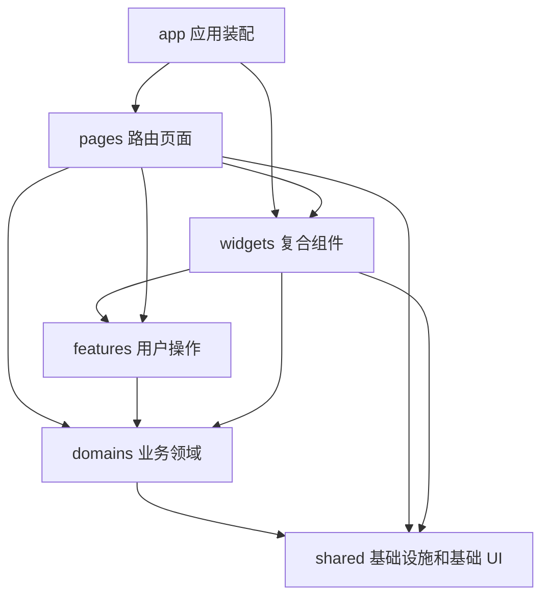

# Nexora Web 项目目录结构与文件职责详解

> 扫描日期：2026-09-05。项目路径：`C:\Users\lct_f\Desktop\X项目\twitter-clone-web`。本文依据本次扫描时的本地源码与配置编写；2026-09-18 已同步架构迁移后的关键路径与职责。数量统计保留为原始扫描快照，当前文件树见 [PROJECT_TREE.md](./PROJECT_TREE.md)。

## 阅读导航

- [扫描范围与项目概况](#scan)
- [目录总览与分层关系](#architecture)
- [顶层文件逐项说明](#root-files)
- [应用装配：src/app](#app)
- [路由与页面对应表](#routes)
- [页面：src/pages](#pages)
- [用户操作：src/features](#features)
- [业务领域：src/domains](#domains)
- [公共基础：src/shared](#shared)
- [复合组件：src/widgets](#widgets)
- [模拟数据与测试基础设施](#mocks-tests)
- [源码之外的目录与文件](#support)
- [按功能追踪代码](#reading)
- [完整自有文件目录附录](#inventory)

<a id="scan"></a>

## 扫描范围与项目概况

### 1. 扫描方式与数量

先枚举包括隐藏文件和被 Git 忽略文件在内的整个项目，再阅读项目维护的源码、配置、测试和脚本。`src` 和顶层文件逐项解释；文档按主题说明，图片、第三方依赖、Git 元数据和构建输出按资源或生成目录归类。正文结合导入关系、导出函数、页面交互、接口调用和测试断言说明用途。

初始扫描共 **29,081 个文件**。数量不包含本次新建文档与整理时的临时文件。

| 位置                                                      | 文件数 | 处理方式                                                  |
| --------------------------------------------------------- | -----: | --------------------------------------------------------- |
| `src/`                                                    |    356 | 逐文件解释；其中 69 个为 `.test.ts/.test.tsx` 测试文件    |
| 根目录直接放置的文件                                      |     28 | 全部逐项解释，包含隐藏配置与 lockfile                     |
| `.github/`                                                |      1 | 说明 CI 实际步骤                                          |
| `.storybook/`                                             |      2 | 说明组件工作台和预览配置                                  |
| `scripts/`                                                |      3 | 阅读环境检查、类型生成、复用检查脚本                      |
| `tests/`                                                  |      1 | 浏览器端到端测试；与 `src/test/` 区分                     |
| `public/`                                                 |      8 | 逐项说明直接发布的静态文件                                |
| `docs/`                                                   |     31 | 工程文档、ADR 与 15 章教程                                |
| `design-reference/`                                       |     33 | 2 份说明、31 张页面 PNG 参考图                            |
| `LCT_MVP_现代社交网络_高保真UI_Figma导入包_全局排版校正/` |     99 | 原始设计导入包，说明内部类型与对应页面                    |
| `dist/`                                                   |    297 | 现存构建产物，按 HTML、打包资源、Source Map、公共资源归类 |
| `node_modules/`                                           | 27,827 | 扫描清单与数量，按第三方依赖说明，不逐项解读依赖内部实现  |
| `.git/`                                                   |    395 | Git 版本管理元数据，扫描数量，不展开对象数据库内容        |

除 `node_modules`、`.git`、`dist` 外，共 **562 个项目文件与本地参考资源**，迁移后的当前目录在文末链接到统一维护的项目树。图片按用途说明，本次未进行逐像素设计验收；现存 `dist` 未重新构建，不据此声称它与当前源码完全同步。

### 2. 项目定位

目录名是 `twitter-clone-web`，实际包名为 **`nexora-web`**，界面品牌为 **Nexora**。这是开放兴趣社交网络的 React 单页应用，涵盖认证、新手引导、信息流、搜索、发帖与草稿、帖子详情、媒体查看、用户关系、收藏、内容中心、社群、通知、浏览历史和设置。

本目录提供浏览器 UI、接口适配与模拟服务。正式后端在独立工程中。`domains/*/api` 仍是前端请求封装；`src/mocks/server.ts` 是测试中的 MSW Node 拦截器，不是可部署的业务后端。

### 3. 技术栈

版本来自当前 `package.json`，不是对上游最新版本的判断。

| 技术                           | 声明版本          | 本项目职责                                       |
| ------------------------------ | ----------------- | ------------------------------------------------ |
| React / React DOM              | 19.2.7            | 组件、Hook、页面渲染和应用挂载                   |
| TypeScript                     | 5.9.3             | 严格类型检查、接口和业务模型声明                 |
| Vite                           | 8.1.4             | 开发服务器、代理、生产构建                       |
| React Router DOM               | 7.18.1            | 浏览器路由、嵌套布局、懒加载、导航、路由错误处理 |
| TanStack React Query           | 5.101.2           | 远端数据缓存、查询、分页、Mutation、失效刷新     |
| Zustand                        | 5.0.14            | 认证状态及上传队列等跨组件客户端状态             |
| React Hook Form / Zod          | 7.81.0 / 4.4.3    | 表单状态、输入规则、运行时环境校验               |
| CSS Modules / PostCSS          | CSS 文件 / 8.5.16 | 局部样式隔离和 Autoprefixer 处理                 |
| Lucide React                   | 1.24.0            | 页面与组件图标                                   |
| Socket.IO Client               | 4.8.3             | 通知实时连接                                     |
| MSW                            | 2.15.0            | 浏览器与测试中的 HTTP 模拟                       |
| Vitest / Testing Library React | 4.1.10 / 16.3.2   | 纯函数、API、Hook、组件行为测试                  |
| Playwright                     | 1.61.1            | Chromium 浏览器冒烟测试                          |
| Storybook                      | 10.4.6            | 独立预览组件；当前只有一个帖子卡片 Story 文件    |

<a id="architecture"></a>

## 目录总览与分层关系

### 1. 主要目录

```text
twitter-clone-web/
├── 顶层配置与入口文件           包管理、编译、校验、部署、环境配置
├── .github/workflows/          GitHub Actions
├── .storybook/                 组件工作台
├── src/
│   ├── app/                    启动、Provider、路由、布局、全局样式
│   ├── pages/                  路由页面及内部模型/组件/测试
│   ├── widgets/                帖子卡片、导航、快速发帖等复合组件
│   ├── features/               发帖、帖子互动等完整用户操作
│   ├── domains/                12 个业务领域
│   │   ├── auth/               认证、验证码、Google 登录、新手引导
│   │   ├── users/              用户资料、关注/静音/拉黑
│   │   ├── feed/               首页与发现信息流
│   │   ├── posts/              帖子、评论、转发、草稿和发布
│   │   ├── engagement/         点赞、曝光
│   │   ├── media/              文件选择、七牛上传、就绪确认
│   │   ├── library/            收藏、内容中心、浏览历史
│   │   ├── communities/        社群发现、创建、成员与管理
│   │   ├── notifications/      通知查询和实时连接
│   │   ├── search/             搜索接口和查询
│   │   ├── settings/           设置、兴趣、偏好
│   │   └── permissions/        隐私与权限策略
│   ├── shared/                 基础设施、类型、工具、基础 UI
│   ├── mocks/                  分域样本、处理器、可重置状态和测试
│   ├── test/                   Vitest 初始化与 HTTP 测试助手
│   └── vite-env.d.ts           Vite 环境变量类型
├── public/                     按原路径发布的静态文件
├── scripts/                    环境检查、类型生成、复用与边界检查
├── tests/e2e/                  浏览器级测试
├── docs/                       工程文档、架构决策、教程
├── design-reference/           精简设计参考
├── LCT_MVP_…/                  原始 Figma 导入资料（本地、被 Git 忽略）
├── dist/                       生成的部署文件
├── node_modules/               npm 安装的第三方包
└── .git/                       版本管理数据
```

### 2. 分层职责与依赖

| 层         | 回答的问题                                     | 典型文件                                        |
| ---------- | ---------------------------------------------- | ----------------------------------------------- |
| `app`      | 如何启动、装配哪些全局能力、URL 进入哪个页面？ | `main.ts`、`AppProviders.tsx`、`router.tsx`     |
| `pages`    | 完整页面如何组合数据、交互与 UI？              | `HomePage.tsx`、`CommunityManagePage.tsx`       |
| `widgets`  | 多个页面共用的复杂业务界面是什么？             | `PostCard.tsx`、`QuickCompose.tsx`              |
| `features` | 一次用户操作如何协调状态、请求和缓存？         | `useComposer.ts`、`usePostInteractions.ts`      |
| `domains`  | 业务数据结构、请求与可复用逻辑是什么？         | `postsApi.ts`、`authStore.ts`、`feedAdapter.ts` |
| `shared`   | 与具体页面无关的公共能力如何实现？             | `client.ts`、`Button.tsx`、`date.ts`            |

上层可直接使用较低层，页面不必通过 Widget 才能访问 API。下图说明主要组织方式。`boundaries:check` 解析别名、相对路径与重导出，检查层级、公开入口、领域依赖允许列表及循环；规则自测由 `boundaries:test` 执行。



### 3. 文件命名

| 命名                              | 含义与阅读重点                                               |
| --------------------------------- | ------------------------------------------------------------ |
| `XxxPage.tsx`                     | 路由页面，重点看 URL 参数、Query/Mutation、事件处理和 JSX    |
| `Xxx.tsx`                         | React 组件；业务粒度由目录决定                               |
| `xxxApi.ts`                       | 领域请求封装，查看 URL、HTTP 方法、入参、返回类型            |
| `useXxx.ts`                       | Hook；可能是查询，也可能只是交互状态                         |
| `types.ts`                        | 数据契约与类型定义；静态类型不会自动执行运行时数据校验       |
| `queryKeys.ts`                    | 集中生成 TanStack Query 缓存键                               |
| `*.model.ts`                      | 从页面/组件抽离的状态、表单转换、校验、统计等逻辑            |
| `*Adapter.ts` / `presentation.ts` | 后端结构到展示模型的转换，以及文案、排序、标记等展示逻辑     |
| `*.module.css`                    | 局部样式，在 TSX 中通过 `styles.xxx` 使用                    |
| `*.test.ts` / `*.test.tsx`        | 与实现同目录的测试；前者多测纯逻辑/API，后者多测 React 行为  |
| `*.stories.tsx`                   | Storybook 场景，不等于独立自动化测试                         |
| `index.ts`                        | 模块公开出口，集中重导出；不是浏览器入口，也不会自动注册路由 |
| `*.d.ts`                          | 仅提供类型声明，不包含运行逻辑                               |

<a id="root-files"></a>

## 顶层文件逐项说明

### 1. 入口、包管理、说明

| 文件                | 具体作用                                                                                                          | 查看或修改时机                         |
| ------------------- | ----------------------------------------------------------------------------------------------------------------- | -------------------------------------- |
| `package.json`      | 项目标识、ES Module 模式、private 标记、依赖版本、npm 脚本、Node/npm 要求，以及 MSW Worker 输出到 public 的配置。 | 启动项目、调整工具、添加依赖或命令。   |
| `package-lock.json` | npm 锁定依赖树，lockfileVersion 为 3，packages 有 527 条（含根包），记录精确解析版本及来源、完整性等信息。        | 通过 npm 更新；`npm ci` 按锁文件安装。 |
| `index.html`        | 中文 HTML 模板、viewport、主题色、Nexora 标题/描述、favicon 引用；提供 `#root` 并加载 `/src/app/main.ts`。        | 修改 HTML 元信息、图标或挂载点。       |
| `README.md`         | 技术栈、启动、真实后端/Mock 切换、Google 登录、环境变量、命令、部署与教程入口。                                   | 初次运行先读；实现细节以源码为准。     |
| `SECURITY.md`       | 凭证、浏览器配置、漏洞报告和上线校验约定；Access Token 内存保存、Refresh Token 由后端 Cookie 管理。               | 理解认证设计与配置边界。               |

**package.json 中的命令：**

| 命令                                            | 实际执行内容                                                                         |
| ----------------------------------------------- | ------------------------------------------------------------------------------------ |
| `npm run dev`                                   | `vite`，启动 5173 开发服务器。                                                       |
| `npm run build`                                 | `tsc -b && vite build`，TS 工程检查后生成 dist。                                     |
| `npm run build:test`                            | `tsc -b && vite build --mode test`，E2E 使用的 test 模式构建。                       |
| `npm run preview`                               | Vite 预览已有构建，Playwright 使用 4173 端口。                                       |
| `npm run typecheck`                             | `tsc -b --pretty false`，检查 app 与 node 两套工程。                                 |
| `npm run lint` / `lint:fix`                     | ESLint 检查 / 修复；lint 设置 max-warnings=0，警告也导致失败。                       |
| `npm run lint:css`                              | Stylelint 检查 src 下 CSS。                                                          |
| `npm run format` / `format:check`               | Prettier 全项目格式化 / 只检查。                                                     |
| `npm run test` / `test:watch` / `test:coverage` | Vitest 单次运行 / 监听 / V8 覆盖率。                                                 |
| `npm run test:e2e` / `test:e2e:list`            | 执行 / 列出 Playwright 用例。                                                        |
| `npm run storybook` / `storybook:build`         | 6006 启动工作台 / 构建静态工作台。                                                   |
| `npm run api:generate -- <文件或URL>`           | 执行类型生成脚本，默认 openapi.json；当前项目没有该 schema 文件。                    |
| `npm run env:check -- <env文件>`                | 环境文件非空校验，默认 .env.production；当前只有 production example。                |
| `npm run boundaries:test` / `boundaries:check`  | 检验边界规则的违规样例，再检查实际源码的分层、入口和循环依赖。                       |
| `npm run reuse:check`                           | 检查重复类型、常量、函数和绕过公共实现。                                             |
| `npm run check`                                 | 顺序执行边界规则自测、边界检查、复用、格式、类型、JS/TS Lint、CSS Lint、测试和构建。 |
| `npm run check:full`                            | check 之后追加 Storybook 构建和 E2E。                                                |

### 2. 环境与运行版本

| 文件                      | 具体作用与当前配置                                                                                                                 |
| ------------------------- | ---------------------------------------------------------------------------------------------------------------------------------- |
| `.env.example`            | 本地模板，API/Socket 留空、Mock 关闭、超时 15000ms；列出 Google Web Client ID、release、可选 Sentry DSN。                          |
| `.env.development`        | 开发模式，APP_ENV=local、RELEASE=dev、Mock=false；API/Socket 地址留空，可使用 Vite 同源代理。                                      |
| `.env.production.example` | 生产模板，以 https://api.example.com 示意 API/Socket 地址，release 需替换、Mock=false。example 不会自动当作 .env.production 加载。 |
| `.env.test`               | test 模式，APP_ENV=test、RELEASE=e2e、Mock=true、API/Socket 留空、超时 15000ms。                                                   |
| `.nvmrc`                  | 内容为 22，给 nvm 提示 Node 主版本；最低小版本依 package.json，为 22.12.0，npm 最低 10.0.0。                                       |

`src/shared/config/env.ts` 读取并解析环境配置；`vite.config.ts` 另外读取 `VITE_DEV_PROXY_TARGET`。Sentry DSN 是预留字段，当前没有因该字段而自动接入错误监控 SDK。

### 3. 编译与构建

| 文件                 | 具体职责与关键配置                                                                                                                                                                     |
| -------------------- | -------------------------------------------------------------------------------------------------------------------------------------------------------------------------------------- |
| `vite.config.ts`     | React 插件、@→src；5173 且 strictPort=true；/api 和 /socket.io 代理到 VITE_DEV_PROXY_TARGET，默认 http://localhost:3000，Socket 开启 ws；ES2022 构建、Source Map、chunk 警告阈值 700。 |
| `tsconfig.base.json` | @/_→src/_、strict=true、skipLibCheck=true，供其他 TS 配置继承。                                                                                                                        |
| `tsconfig.json`      | files 为空，references 指向 app/node 配置；tsc -b 的工程总入口。                                                                                                                       |
| `tsconfig.app.json`  | 覆盖 src、tests；ES2022、DOM、React JSX、Bundler 解析、noUncheckedIndexedAccess、noEmit；加载 Vite/Vitest/jest-dom 类型，增量缓存写 node_modules/.tmp。                                |
| `tsconfig.node.json` | 覆盖 Vite/Vitest/Playwright 等工具配置和 .storybook/**/*.ts；ES2023、Node 类型、noEmit，增量缓存也写 node_modules/.tmp。                                                               |
| `postcss.config.mjs` | 仅配置 Autoprefixer。当前工程不是 Tailwind 项目。                                                                                                                                      |

### 4. 代码质量、测试、编辑器

| 文件                   | 具体职责与当前规则                                                                                                                                                                                                                                      |
| ---------------------- | ------------------------------------------------------------------------------------------------------------------------------------------------------------------------------------------------------------------------------------------------------- |
| `eslint.config.js`     | Flat Config；JS 推荐规则、Node globals，Mock 七牛脚本额外浏览器 globals；TS/TSX 有类型检查、Hooks、Refresh、类型导入与未处理 Promise 规则。测试/Mock/Stories 放宽两条 unsafe 规则；忽略构建和生成声明。                                                 |
| `stylelint.config.mjs` | 基于 standard，放宽类名、变量名、空行、大小写、部分选择器规则；允许列出的 WebKit 属性以匹配现有 CSS Modules 风格。                                                                                                                                      |
| `.prettierrc.json`     | 分号、单引号、尾逗号、100 字符建议行宽、2 空格缩进。                                                                                                                                                                                                    |
| `.prettierignore`      | 排除依赖、构建、报告、自动生成 Worker 和 OpenAPI 声明。                                                                                                                                                                                                 |
| `.editorconfig`        | UTF-8、LF、末尾换行、2 空格、清理行尾空白；Markdown 保留行尾空格。                                                                                                                                                                                      |
| `vitest.config.ts`     | jsdom、全局测试 API、React 插件、@ alias、CSS、src/test/setup.ts；只发现 src/**/*.{test,spec}.{ts,tsx}。V8 覆盖率输出 text/html，排除 Stories、generated、Mock；未设最低覆盖率阈值。                                                                    |
| `playwright.config.ts` | tests/e2e、Chromium/Desktop Chrome、全并行；启动 build:test + preview，baseURL 为 localhost:4173；非 CI 且已有服务时可复用 4173 服务。list/html 报告、失败截图、首次重试 trace；可通过 PLAYWRIGHT_CHROMIUM_EXECUTABLE_PATH 指定浏览器。未另设重试次数。 |

### 5. Git 与部署

| 文件                 | 具体职责与边界                                                                                                                                                                        |
| -------------------- | ------------------------------------------------------------------------------------------------------------------------------------------------------------------------------------- |
| `.gitignore`         | 忽略依赖、构建、报告、日志、本地 env、大部分 VS Code 设置、.VSCodeCounter 与 LCT_MVP_*/。控制 Git 跟踪，不控制程序访问。                                                              |
| `.dockerignore`      | 排除依赖、构建、报告、Git/GitHub、日志和 .env*，再放行 .env.example；因此本机 .env.production 不会自动随 COPY 进入镜像构建。                                                          |
| `Dockerfile`         | 两阶段：node:22-alpine 中 npm ci + build；nginx:1.29-alpine 中复制配置与 dist；80 端口、/healthz 健康检查。当前没有额外构建变量注入指令。                                             |
| `docker-compose.yml` | 仅 web 服务，本目录 build，宿主机 8080→容器 80；未定义后端/数据库。                                                                                                                   |
| `nginx.conf`         | 静态目录 /usr/share/nginx/html；/healthz 返回 200 ok；JS/CSS/字体/图片按扩展名缓存一年，缺失静态文件 404；其他路径 no-cache 并回退 index.html 支持 SPA。没有 API 或 Socket 反向代理。 |

<a id="app"></a>

## 应用装配：src/app

本目录 28 个文件负责把整个前端接起来。新增路由、全局 Provider、布局或设计令牌时会进入这里。

### 1. 启动与启动失败回退

| 文件                                   | 具体作用                                                                                                                                                                            |
| -------------------------------------- | ----------------------------------------------------------------------------------------------------------------------------------------------------------------------------------- |
| `src/app/main.ts`                      | 最初 JS 入口，导入全局 CSS，调用 bootstrapApplication；动态 import mountApplication，把重试绑定为 window.location.reload，错误交 console.error。                                    |
| `src/app/bootstrapApplication.ts`      | 不依赖 React 的启动编排：查找默认 #root，加载挂载函数并等待完成；返回 mounted/failed/missing-root。缺 root 时只记录错误；加载或挂载抛错时绘制启动失败页。依赖由参数注入以方便测试。 |
| `src/app/bootstrapApplication.test.ts` | 验证正确节点挂载、动态加载失败回退并记录错误、缺少 root 时不调用加载函数。                                                                                                          |
| `src/app/bootstrapFailure.ts`          | 用 root.ownerDocument 创建纯 DOM 回退页，替换旧内容、设置 alert/aria、聚焦重试按钮；监听器只执行一次。React 未启动时仍可显示。                                                      |
| `src/app/bootstrapFailure.test.ts`     | 验证旧内容替换、无障碍属性、聚焦、单次重试，以及在独立 ownerDocument 内创建节点。                                                                                                   |
| `src/app/mountApplication.ts`          | 按环境可选启动 MSW，再 createRoot(root).render(ApplicationRoot)。Mock 要求开发或 test 模式且开关为真；test 未处理请求报错，开发 Mock 未处理请求放行。                               |
| `src/app/ApplicationRoot.tsx`          | 根组件，用 StrictMode 和 AppProviders 包住 AppRouter，自身不包含业务页面。                                                                                                          |

```text
index.html 的 #root
  → main.ts：全局 CSS + 动态启动
  → bootstrapApplication.ts：加载/挂载失败保护
  → mountApplication.ts：可选 MSW，然后创建 React Root
  → ApplicationRoot.tsx：StrictMode
  → AppProviders.tsx：全局能力
  → AppRouter：匹配守卫、布局、懒加载页面
```

### 2. 全局 Provider

| 文件                                          | 具体作用                                                                                                                                                                                                                               |
| --------------------------------------------- | -------------------------------------------------------------------------------------------------------------------------------------------------------------------------------------------------------------------------------------- |
| `src/app/providers/AppProviders.tsx`          | 按 QueryClientProvider → ToastProvider → AuthBootstrap → RealtimeProvider → children 嵌套全局能力；开发模式额外显示 React Query Devtools。                                                                                             |
| `src/app/providers/AuthBootstrap.tsx`         | 注册 authSession 刷新处理器并恢复会话。先 authApi.refresh，确认上下文仍有效后提交 token/用户/引导状态，再 usersApi.getCurrentUserCard 补齐用户卡。刷新失败或用户卡 401 转匿名；用户卡非 401 错误保留已恢复会话。卸载注销自己的处理器。 |
| `src/app/providers/AuthBootstrap.test.tsx`    | 验证先存 token 再带 Bearer 读用户卡、资料 503 保留认证、资料 401 注销且不递归刷新、刷新失败不再读用户卡。                                                                                                                              |
| `src/app/providers/RealtimeProvider.tsx`      | 登录后建立通知连接；回调使 notificationKeys.all 失效。管理异步清理，卸载后才完成的连接也立即断开；有效挂载期间记录连接失败。                                                                                                           |
| `src/app/providers/RealtimeProvider.test.tsx` | 验证匿名不连接、卸载断开、迟到连接清理、失败记录，以及卸载后的迟到失败被消费且不再打印。                                                                                                                                               |

### 3. 路由与守卫

| 文件                               | 具体作用                                                                                                                                                                                                |
| ---------------------------------- | ------------------------------------------------------------------------------------------------------------------------------------------------------------------------------------------------------- |
| `src/app/router/router.tsx`        | createBrowserRouter 定义所有页面；/→/home；认证、引导、业务外壳分组；叶页面动态 import 懒加载；关注者/关注中共用加载函数；绑定根错误界面和 * 404。AppRouter 输出 RouterProvider。                       |
| `src/app/router/guards.tsx`        | RequireAuth 检查会话；RequireCompletedOnboarding 要求完成引导；RequireOnboarding 将未完成用户校准到后端报告步骤、完成用户送回首页。恢复中显示 Spinner；匿名跳登录并把原 pathname+search 放 state.from。 |
| `src/app/router/guards.test.tsx`   | 验证按后端指定步骤恢复、不能跳过引导步骤、完成用户离开引导。                                                                                                                                            |
| `src/app/router/guards.module.css` | 会话恢复 Spinner 的全视口居中容器。                                                                                                                                                                     |

### 4. 三种页面外壳

| 文件                                          | 具体作用                                                                                                                 |
| --------------------------------------------- | ------------------------------------------------------------------------------------------------------------------------ |
| `src/app/layouts/PublicLayout.tsx`            | 认证页品牌介绍区+表单区，引用 APP_BRAND/BrandMark，Outlet 放认证子页面。                                                 |
| `src/app/layouts/PublicLayout.module.css`     | 桌面双栏、品牌渐变、介绍卡；900px 以下隐藏品牌栏，520px 以下贴合手机视口。                                               |
| `src/app/layouts/OnboardingLayout.tsx`        | 兴趣/关注/社群三步外壳，pathname 决定进度；稍后完成调用 onboardingApi.skip，成功更新认证引导状态并进入首页，失败 Toast。 |
| `src/app/layouts/OnboardingLayout.module.css` | 引导卡、头部、进度连线和 current/done 状态；760px 以下调整全屏布局。                                                     |
| `src/app/layouts/AppShellLayout.tsx`          | 组合 Sidebar、Topbar、Outlet 和 MobileNavigation；业务页面只提供中间内容。                                               |
| `src/app/layouts/AppShellLayout.module.css`   | 桌面侧栏+工作区；1180px 以下侧栏收窄到 84px；760px 以下手机布局并预留底部导航空间。                                      |

### 5. 错误与全局样式

| 文件                                         | 具体作用                                                                                                                                                               |
| -------------------------------------------- | ---------------------------------------------------------------------------------------------------------------------------------------------------------------------- |
| `src/app/error/RootErrorBoundary.tsx`        | Router errorElement，用 useRouteError/isRouteErrorResponse 展示状态、标题和通用页面错误；文案经过 getErrorMessage；提供重载和返回首页。与启动阶段纯 DOM 回退分工不同。 |
| `src/app/error/RootErrorBoundary.module.css` | 错误页卡、警告图标、状态码和操作按钮。                                                                                                                                 |
| `src/app/styles/tokens.css`                  | 颜色、渐变、阴影、圆角、侧栏宽度、间距、顶栏高度、内容宽度、字体和过渡时长。当前只有 light color-scheme，没有独立 dark token 分支。                                    |
| `src/app/styles/reset.css`                   | 统一 box-sizing、边距、表单字体、链接、列表、图片默认样式；最小视口 320px、选区与键盘焦点样式。                                                                        |
| `src/app/styles/typography.css`              | 正文字体/行高、h1/h2/h3、strong/small 的字号和颜色，依赖 tokens。                                                                                                      |
| `src/app/styles/global.css`                  | 按 tokens→reset→typography 导入；设置 body/#root、sr-only、scrollbar-thin、启动失败 DOM 样式；入口和 Storybook 共用。                                                  |
| `src/vite-env.d.ts`                          | 位于 src 根层，引用 vite/client，补充 ImportMetaEnv/ImportMeta 和环境字段；仅声明原始类型，实际解析在 shared/config/env.ts。                                           |

<a id="routes"></a>

## 路由与页面对应表

取自当前 router.tsx。冒号为动态参数，问号为可选。页面路径均以 `src/pages/` 为基准。“业务外壳”指 RequireCompletedOnboarding + AppShellLayout。

| 路由                                         | 页面文件                                         | 外壳/守卫                            |
| -------------------------------------------- | ------------------------------------------------ | ------------------------------------ |
| `/`                                          | 重定向 /home                                     | 根                                   |
| `/auth/login`                                | auth/LoginPage.tsx                               | PublicLayout                         |
| `/auth/register`                             | auth/RegisterPage.tsx                            | PublicLayout                         |
| `/auth/password/forgot`                      | auth/ForgotPasswordPage.tsx                      | PublicLayout                         |
| `/auth/password/reset`                       | auth/ResetPasswordPage.tsx                       | PublicLayout                         |
| `/auth/email/verify`                         | auth/EmailVerificationPage.tsx                   | PublicLayout                         |
| `/auth/google/complete`                      | auth/GoogleCompletePage.tsx                      | PublicLayout                         |
| `/onboarding`                                | 相对重定向 interests                             | RequireOnboarding + OnboardingLayout |
| `/onboarding/interests`                      | onboarding/InterestsPage.tsx                     | 同上                                 |
| `/onboarding/follow`                         | onboarding/FollowPage.tsx                        | 同上                                 |
| `/onboarding/communities`                    | onboarding/CommunitiesPage.tsx                   | 同上                                 |
| `/home`                                      | home/HomePage.tsx                                | 业务外壳                             |
| `/explore`                                   | explore/ExplorePage.tsx                          | 业务外壳                             |
| `/search`                                    | search/SearchPage.tsx                            | 业务外壳                             |
| `/compose/:draftId?`                         | compose/ComposePage.tsx                          | 业务外壳                             |
| `/content/drafts`                            | drafts/DraftsPage.tsx                            | 业务外壳                             |
| `/posts/:postId`                             | post-detail/PostDetailPage.tsx                   | 业务外壳                             |
| `/posts/:postId/media/:mediaIndex`           | media-viewer/MediaViewerPage.tsx                 | 业务外壳                             |
| `/users/:handle`                             | profile/ProfilePage.tsx                          | 业务外壳                             |
| `/users/:handle/followers`                   | follows/FollowListPage.tsx                       | 业务外壳                             |
| `/users/:handle/following`                   | follows/FollowListPage.tsx                       | 业务外壳，共用关注列表页             |
| `/bookmarks/:collectionId?`                  | bookmarks/BookmarksPage.tsx                      | 业务外壳                             |
| `/content`                                   | content-center/ContentCenterPage.tsx             | 业务外壳                             |
| `/communities`                               | communities-discover/CommunitiesDiscoverPage.tsx | 业务外壳                             |
| `/communities/new`                           | community-create/CommunityCreatePage.tsx         | 业务外壳                             |
| `/communities/:communityId/manage/:section?` | community-manage/CommunityManagePage.tsx         | 业务外壳，ID+管理分区                |
| `/communities/:slug`                         | community-detail/CommunityDetailPage.tsx         | 业务外壳，slug                       |
| `/notifications`                             | notifications/NotificationsPage.tsx              | 业务外壳                             |
| `/settings`                                  | settings/SettingsOverviewPage.tsx                | 业务外壳                             |
| `/settings/profile`                          | profile-edit/ProfileEditPage.tsx                 | 业务外壳                             |
| `/settings/account`                          | settings/AccountSettingsPage.tsx                 | 业务外壳                             |
| `/settings/account/email/verify`             | settings/EmailIdentityVerificationPage.tsx       | 业务外壳                             |
| `/settings/privacy`                          | settings/PrivacySettingsPage.tsx                 | 业务外壳                             |
| `/settings/notifications`                    | settings/NotificationSettingsPage.tsx            | 业务外壳                             |
| `/settings/preferences`                      | settings/PreferencesSettingsPage.tsx             | 业务外壳                             |
| `/settings/safety`                           | settings/SafetySettingsPage.tsx                  | 业务外壳                             |
| `/history`                                   | history/BrowsingHistoryPage.tsx                  | 业务外壳                             |
| `/__dev/states`                              | system-states/SystemStatesDevPage.tsx            | RequireAuth + Outlet，无业务外壳     |
| `*`                                          | not-found/NotFoundPage.tsx                       | 根级 404                             |

当前没有 `/profile` 路由；用户主页为 `/users/:handle`，编辑资料为 `/settings/profile`。`/__dev/states` 的注册没有 DEV 环境条件，其访问由认证守卫控制。

<a id="pages"></a>

## `src/pages`：路由页面、页面模型与局部样式

页面主要承担 URL 参数解释、页面私有状态、导航和界面组合；接口协议与领域能力放在 `domains`，发帖及互动流程放在 `features`，帖子卡片和媒体查看器放在 `widgets`。基础 UI 和无业务布局归 `shared/ui`。以下文件路径均相对于项目根目录。

### 页面使用的公共构件与局部容器

原页面公共文件已按职责拆分。页面从对应公开入口使用基础 UI、业务入口和媒体能力；SettingsPage、SaveFooter 留在各自页面模块内。

| 文件                                                                                                              | 具体作用                                                                                                                             |
| ----------------------------------------------------------------------------------------------------------------- | ------------------------------------------------------------------------------------------------------------------------------------ |
| [src/shared/ui/SideCard/SideCard.tsx](../src/shared/ui/SideCard/SideCard.tsx)                                     | 侧栏基础容器，接收 title、children 与 action。具体 Link 或按钮由上层传入，不依赖路由。样式跟随同目录 CSS Module。                    |
| [src/shared/ui/LoadingRows/LoadingRows.tsx](../src/shared/ui/LoadingRows/LoadingRows.tsx)                         | 普通与紧凑骨架行，复用基础占位结构；动画和样式跟随同目录 CSS Module。                                                                |
| [src/shared/ui/Notice/Notice.tsx](../src/shared/ui/Notice/Notice.tsx)                                             | 四种语气的提示条与可选操作，样式跟随组件。                                                                                           |
| [src/shared/ui/EmptyPanel/EmptyPanel.tsx](../src/shared/ui/EmptyPanel/EmptyPanel.tsx)                             | 空状态的图标、标题、描述与操作区；样式跟随组件。                                                                                     |
| [src/shared/ui/PageHeader/PageHeader.tsx](../src/shared/ui/PageHeader/PageHeader.tsx)                             | 页面标题的唯一基础实现；页面直接使用 PageHeader。                                                                                    |
| [src/widgets/quick-compose/QuickCompose.tsx](../src/widgets/quick-compose/QuickCompose.tsx)                       | 读取当前用户，提供文本、图片、链接、表情等发帖导航入口；不承担正文编辑与上传，样式在同目录。                                         |
| [src/shared/ui/layout/ContentLayout.module.css](../src/shared/ui/layout/ContentLayout.module.css)                 | 首页、探索、搜索等页面共用的分区、工具栏、胶囊标签、统计、列表等布局规则。提示、骨架、快速发帖与页面独有动画已跟随各自组件拆出。     |
| [src/pages/settings/ui/SettingsPage.tsx](../src/pages/settings/ui/SettingsPage.tsx)                               | 设置模块内部容器，组合标题、设置导航、主内容和可选摘要；使用 NavLink 标识当前路径。                                                  |
| [src/pages/settings/ui/SettingsPage.module.css](../src/pages/settings/ui/SettingsPage.module.css)                 | 设置容器的多栏布局、左导航当前态和右栏说明；1080px、760px 断点调整列布局与导航。                                                     |
| [src/pages/profile-edit/ui/SaveFooter.tsx](../src/pages/profile-edit/ui/SaveFooter.tsx)                           | 资料编辑页内部的保存/取消按钮及提交状态，样式在同目录。                                                                              |
| [src/domains/media/hooks/useMediaImagePairSelection.ts](../src/domains/media/hooks/useMediaImagePairSelection.ts) | 组合两套 useMediaImageSelection 控制器管理头像与封面，把文件校验失败转为 Toast；资料编辑和社群创建复用，上传由调用页面在提交时启动。 |

### `auth/`：登录、注册与账号恢复（16 个文件）

认证页面主要使用 `domains/auth`、React Hook Form、Zod 和 React Query。账号注册、密码恢复与登录验证码并非同一接口；文档和后续修改应保留这些流程边界。

| 文件                                               | 具体作用                                                                                                                                                                                                                                                                                                                                                                                                                 |
| -------------------------------------------------- | ------------------------------------------------------------------------------------------------------------------------------------------------------------------------------------------------------------------------------------------------------------------------------------------------------------------------------------------------------------------------------------------------------------------------ |
| `src/pages/auth/AuthFormShell.tsx`                 | 认证表单统一外壳：眉题、标题、说明、返回登录链接、成功状态和页脚；各认证页面将表单或状态内容传入 `children`。                                                                                                                                                                                                                                                                                                            |
| `src/pages/auth/AuthPages.module.css`              | 所有认证页共用的标题、表单、登录/注册模式标签、密码显隐按钮、验证码行、条款、错误提示、Google 入口、验证/重置结果面板等样式；480px 以下调整标题与验证码布局。                                                                                                                                                                                                                                                            |
| `src/pages/auth/LoginPage.tsx`                     | 支持密码登录和手机验证码登录；模式切换清理密钥字段与错误，发送验证码后按后端返回时间倒计时。密码模式可切换明文显示。登录成功读取路由保存的 `from`，结合服务端 onboarding 状态决定恢复原访问路径还是继续引导。Google 入口接收 ID token，已有账号直接进入应用；需要补全资料时，把 pending user/completion token 及过期时间写入 `sessionStorage` 后进入补全页。页面“记住我”当前是默认勾选的非受控复选框，未被提交逻辑读取。 |
| `src/pages/auth/loginValidation.ts`                | 定义 `LoginMode` 及两个校验函数。密码模式账号只要求非空，支持邮箱/电话/Handle 输入；验证码模式要求 E.164 手机号。密码至少 8 位，验证码必须为 6 位数字，并返回模式对应的中文错误文案。                                                                                                                                                                                                                                    |
| `src/pages/auth/loginValidation.test.ts`           | 验证两类账号提示、无国家代码手机号被拒绝、有效 E.164 号码通过，以及密码/验证码的必填和长度/数字规则。                                                                                                                                                                                                                                                                                                                    |
| `src/pages/auth/RegisterPage.tsx`                  | 邮箱/手机号双模式注册；Zod 校验 Handle 的长度与字符、强密码、两次密码一致、条款同意，并对手机号模式额外要求 E.164 与 6 位码。切换模式清空身份和验证码相关状态。手机号验证码调用专用注册验证码接口；成功后按服务端引导状态跳转。邮箱模式不在此要求短信码，后续通过独立邮箱验证流程认证。                                                                                                                                  |
| `src/pages/auth/RegisterPage.test.tsx`             | 页面交互测试：从默认邮箱模式切换到手机注册，检查专用验证码请求体、成功 Toast 和发送按钮进入倒计时禁用状态。                                                                                                                                                                                                                                                                                                              |
| `src/pages/auth/GoogleCompletePage.tsx`            | 完成首次 Google 登录所需的站内 Handle。优先从查询参数读取 pending user/completion token，缺失时尝试 `sessionStorage`；校验 Handle 后调用 `useCompleteGoogleProfile`，成功清除临时记录并进入正确的引导阶段。上下文缺失时显示流程错误。                                                                                                                                                                                    |
| `src/pages/auth/ForgotPasswordPage.tsx`            | 收集已绑定邮箱或 E.164 手机号，通过 `passwordResetFlow` 辅助 Zod 校验；调用 `requestPasswordReset`，受理后立即导航到携带身份参数的重置页。服务端错误显示在表单中。                                                                                                                                                                                                                                                       |
| `src/pages/auth/ForgotPasswordPage.test.tsx`       | 验证申请受理后自动进入下一状态：邮箱进入“检查重置邮件”，手机号进入已预填号码的短信验证码表单；同时核对邮箱特殊字符经路由编码后仍能正确传递。                                                                                                                                                                                                                                                                             |
| `src/pages/auth/passwordResetFlow.ts`              | 将恢复账号输入归类为 `EMAIL`、`PHONE`、`INVALID`；邮箱用格式正则，电话复用 auth 的 E.164 判断，并返回统一的无效身份提示。                                                                                                                                                                                                                                                                                                |
| `src/pages/auth/passwordResetFlow.test.ts`         | 通过参数化输入测试邮箱、带国家代码手机号与无效标识分类，并检查不支持 Handle 恢复等情况下的提示。                                                                                                                                                                                                                                                                                                                         |
| `src/pages/auth/ResetPasswordPage.tsx`             | 根据 URL 决定三种状态：有 `token` 时走邮件链接重置；无 token 且身份为邮箱时只显示查收邮件说明；否则显示手机号与短信验证码表单。提交时区分 `LINK` 和 `CODE` 请求，校验新密码和确认密码，成功后返回登录。邮箱受理说明使用统一结果文案。                                                                                                                                                                                    |
| `src/pages/auth/EmailVerificationPage.tsx`         | 读取 `token` 并调用当前邮箱验证确认接口，关闭自动重试；分别处理缺令牌、处理中、验证失败与成功，提供返回账号安全页的入口。它验证当前邮箱，与设置里的绑定/换绑新邮箱页面用途不同。                                                                                                                                                                                                                                         |
| `src/pages/auth/useVerificationCountdown.ts`       | 验证码发送倒计时 Hook，默认 60 秒、可使用后端返回时长；每秒调度一次 timeout，到 0 停止并清理计时器；非有限值归 0，小数向上取整、负数截断为 0。                                                                                                                                                                                                                                                                           |
| `src/pages/auth/useVerificationCountdown.test.tsx` | 使用假计时器验证逐秒递减、零点停止和清除 timer，以及无效时长、小数时长归一化。                                                                                                                                                                                                                                                                                                                                           |

### `onboarding/`：新手引导（6 个文件）

| 文件                                                  | 具体作用                                                                                                                                                                                                                                          |
| ----------------------------------------------------- | ------------------------------------------------------------------------------------------------------------------------------------------------------------------------------------------------------------------------------------------------- |
| `src/pages/onboarding/OnboardingSelection.tsx`        | 三步引导共享选择界面。根据兴趣/用户/社群类型选择图标、步骤、卡片呈现和初始选中数（3/2/2）；维护选中集合、提交中状态和本地错误，支持最低选中数、跳过回调、自定义跳过路径及结束时 replace 导航。提交失败保留当前步骤。                              |
| `src/pages/onboarding/OnboardingSelection.module.css` | 兴趣/用户/社群选择卡片、五种强调色、勾选状态、侧栏步骤和数量统计、页脚按钮；860px 与 560px 调整布局。                                                                                                                                             |
| `src/pages/onboarding/InterestsPage.tsx`              | 从 settings 的兴趣字典查询启用标签并转成选择项，使用字典版本重建选择界面；下一步至少选 3 个兴趣，调用 onboarding 保存接口后把 auth store 更新为推荐用户阶段。跳过路径以空数组提交兴趣。                                                           |
| `src/pages/onboarding/FollowPage.tsx`                 | 获取推荐用户快照；在后端标记不可提交时每 2 秒轮询。提交失败若属于快照变化，则重新请求并过滤掉已不在新快照中的选项，自动重试一次；部分关注失败保持在当前步骤。没有可提交快照时，“跳过”调用正式 skip 接口并完成引导，否则提交空选择后进入社群步骤。 |
| `src/pages/onboarding/FollowPage.test.tsx`            | 验证快照变化后的刷新与重试，请求仅携带仍存在的候选 ID；另外验证没有可提交推荐快照时使用正式 skip 接口、更新 `SKIPPED` 状态并进入首页。                                                                                                            |
| `src/pages/onboarding/CommunitiesPage.tsx`            | 将推荐社群快照和成员状态转换成选择卡片，显示已加入/审核中状态；处理快照变化刷新重试和部分入群失败。提交结束后调用 complete，设置 `onboardingCompleted` 与 `COMPLETED` 并进入首页；跳过用空选项走相同完成流程。                                    |

### `home/`、`explore/`、`search/`：浏览入口

| 文件                                                                        | 具体作用                                                                                                                                                                                                                                                                                                                   |
| --------------------------------------------------------------------------- | -------------------------------------------------------------------------------------------------------------------------------------------------------------------------------------------------------------------------------------------------------------------------------------------------------------------------- |
| `src/pages/home/HomePage.tsx`                                               | 从 `?tab=` 解析“正在关注/为你推荐”，使用 `domains/feed/useFeed` 加载和合并游标页；支持刷新顶部内容、加载更多、失败重试与空时间线。刷新失败保留现有内容并提示。组合 `QuickCompose`、`PostCard` 和侧栏。**右栏推荐用户、推荐社群、热门话题仍是文件内静态常量**，不能把它们描述为正式推荐接口结果。                           |
| [src/pages/home/HomePage.module.css](../src/pages/home/HomePage.module.css) | 首页刷新图标的旋转动画及 prefers-reduced-motion 规则；其余通用内容布局复用 shared/ui/layout/ContentLayout.module.css。                                                                                                                                                                                                     |
| `src/pages/explore/ExplorePage.tsx`                                         | 通过 `useExploreFeed` 切换 `HOT`、`IMAGE`、`VIDEO` 公开帖子；分别查询 `HOT_24H` 热门话题快照和 `FEATURED_BY_INTEREST` 社群推荐，再补查社群成员状态，补查失败时回退为未加入。展示快照时间窗口、话题排名/帖子数/创作者数，帖子支持分页；各区域有加载、错误重试和空状态；可以复制探索页链接。                                 |
| `src/pages/search/SearchPage.tsx`                                           | 从 URL 读取关键词、帖子/用户/社群 tab 和相关度/最新排序，调用 `domains/search/useSearch` 并用三类卡片呈现。时间范围、媒体筛选与已关注筛选在已取回结果上执行，清除筛选会还原本地条件及 URL 排序。**语言选择目前只维护状态并显示标签，没有进入查询参数或过滤计算**；缺省关键词为“人工智能”，页面本身没有独立的搜索错误面板。 |

### `compose/`、`content-center/`、`drafts/`：创作与自己的内容（7 个文件）

| 文件                                                                      | 具体作用                                                                                                                                                                                                                                                                                                                                                         |
| ------------------------------------------------------------------------- | ---------------------------------------------------------------------------------------------------------------------------------------------------------------------------------------------------------------------------------------------------------------------------------------------------------------------------------------------------------------- |
| [src/pages/compose/ComposePage.tsx](../src/pages/compose/ComposePage.tsx) | 发布页面外壳，读取 draftId、community、quotePostId，将上下文交给 features/compose-post 的公开 ComposeEditor。保存完成回调替换草稿编辑地址，发布完成回调进入帖子详情；页面保留导航，feature 负责编辑、保存与发布流程。                                                                                                                                            |
| `src/pages/content-center/ContentCenterPage.tsx`                          | 从 `?tab=published/drafts/deleted` 切换内容中心；分别以 20 条游标页查询三类内容并按正式 ID 合并去重。已发布项补全薄卡片后显示帖子，保留降级/过滤数量提示；草稿支持继续编辑、全选已加载项、批量删除，成功项从缓存移除、失败或缺失结果项保持选中；已删除内容只显示类别、摘要和删除时间，**没有恢复或永久清除操作**。侧栏统计的是当前已加载数量。                   |
| `src/pages/content-center/contentCenter.model.ts`                         | `hydrateContentCenterPublishedPage` 对已发布列表逐条调用 `hydratePostCardBrief`，为回复目标和转发原帖补齐上下文，并保留分页及降级元信息。单条失败后的保留薄卡片策略由底层 hydration 实现承担。                                                                                                                                                                   |
| `src/pages/content-center/contentCenter.model.test.ts`                    | 重点验证转发卡片补全：显示原帖内容，同时保留转发者、转发记录 ID 等上下文，避免把转发记录错误当作原帖身份。                                                                                                                                                                                                                                                       |
| `src/pages/content-center/ContentCenterPage.module.css`                   | 内容中心相关入口、草稿选中栏、已发布列表、草稿/删除记录行、媒体状态徽章、复选框、错误面板与加载更多；720px、520px 调整窄屏操作布局。                                                                                                                                                                                                                             |
| `src/pages/drafts/DraftsPage.tsx`                                         | 完整草稿箱，以 posts 的草稿接口分页加载；支持单条编辑、删除、发布及批量选中操作。单条删除走 posts 专用接口，批量删除走 library 接口并统一结果；批量发布通过 `settleBatch` 限制并发为 2，允许媒体待处理时进入 `PUBLISHING`。仅移除服务端已受理/成功的项，保留失败选中项，同步草稿箱/内容中心/时间线缓存；单条即时发布成功导航到帖子。删除和发布都有页面确认弹窗。 |
| `src/pages/drafts/DraftsPage.module.css`                                  | 草稿统计、批量操作栏、选中行、版本/媒体元信息、发布失败徽章、错误区域及加载更多；920px、700px、520px 分级调整网格和按钮。                                                                                                                                                                                                                                        |

### `post-detail/`、`media-viewer/`：内容详情与对话（4 个文件）

| 文件                                              | 具体作用                                                                                                                                                                                                                                                                                                                                                                                                                                                                                                                                            |
| ------------------------------------------------- | --------------------------------------------------------------------------------------------------------------------------------------------------------------------------------------------------------------------------------------------------------------------------------------------------------------------------------------------------------------------------------------------------------------------------------------------------------------------------------------------------------------------------------------------------- |
| `src/pages/post-detail/PostDetailPage.tsx`        | 帖子详情与评论树主页面，同时导出 `CommentRow`。根据帖子 relation 和 URL 的 `rootPostId/commentId` 区分普通帖子、回复帖、评论详情；展示根帖子、直接父评论、当前回复，源内容不可用时留明确占位。转发详情根据 `contentPostId` 读取/创建原帖讨论。登录用户打开帖子后记录浏览历史，并区分社区帖子来源。评论区游标分页，发送评论或回复、插入表情、取消回复目标；遵循 `canComment`。`CommentRow` 读取直接子回复、支持展开/收起、跳详情、本人删除、通过 feature 的 useCommentLike 执行点赞与失败回滚；删除/隐藏评论保留 tombstone。查询降级会显示过滤提示。 |
| `src/pages/post-detail/PostDetailPage.module.css` | 返回栏、回复上下文连接线和不可用占位、话题、评论编辑器、递归子回复缩进、点赞/删除状态、tombstone、降级与空评论提示；620px、520px 调整评论布局。                                                                                                                                                                                                                                                                                                                                                                                                     |
| `src/pages/post-detail/PostDetailPage.test.tsx`   | 覆盖已登录浏览社区帖时提交正确历史来源；根帖缺失但回复有效时保留根帖占位和直接父评论；点击评论正文跳详情与回复数展开；零子回复仍可进详情；转发详情读取与创建评论时使用补全后的原帖 ID。测试覆盖的是这些具体行为，并非整个详情页全量验证。                                                                                                                                                                                                                                                                                                           |
| `src/pages/media-viewer/MediaViewerPage.tsx`      | 从路由读取帖子和媒体下标，使用 `usePost` 加载；无帖子/媒体时重定向帖子详情，将非法/越界媒体下标归一化到有效范围，交给 `MediaViewer` 展示；关闭调用历史后退。                                                                                                                                                                                                                                                                                                                                                                                        |

### `profile/`、`profile-edit/`、`follows/`：用户与关系（12 个文件）

| 文件                                                | 具体作用                                                                                                                                                                                                                                                                                                                                                                                                           |
| --------------------------------------------------- | ------------------------------------------------------------------------------------------------------------------------------------------------------------------------------------------------------------------------------------------------------------------------------------------------------------------------------------------------------------------------------------------------------------------ |
| `src/pages/profile/ProfilePage.tsx`                 | 按 Handle 查询公开主页与作者帖子，区分本人/他人操作；展示封面、头像、简介、所在地、网址、生日、关注数据及本人收藏入口。关系按钮使用服务端 snapshot 决定关注、取消关注或撤回申请；提供静音/取消静音、屏蔽/解屏蔽、复制主页链接，操作返回后同步关系缓存。屏蔽状态下隐藏动态；帖子/媒体 tab 在已加载列表上过滤，结合 `pinnedPostIds` 标记置顶。当前作者内容使用普通查询读取一页，页面没有加载更多按钮。               |
| `src/pages/profile/ProfilePage.module.css`          | 用户封面、头像叠放、身份信息、主页 tab、关系计数和状态、私有入口、屏蔽提示、操作菜单；520px 下调整。                                                                                                                                                                                                                                                                                                               |
| `src/pages/profile-edit/ProfileEditPage.tsx`        | 外层负责获取可编辑资料与加载/错误状态，内层 `ProfileEditEditor` 管理文本和媒体修改。表单字段为昵称、简介、所在地、网站、生日；保存先上传头像/封面，成功后提交存储 key，显式移除则提交 null，未改动媒体不写入对应字段。上传失败中止同次请求，卸载时取消进行中的请求。保存成功用后端结果更新可编辑缓存、认证 store 的展示名称/头像及主页缓存；允许撤销未保存内容，以弹窗呈现成功、网络/媒体/业务失败和字段校验结果。 |
| `src/pages/profile-edit/ProfileImageField.tsx`      | 头像与封面字段组件：在当前图片、待上传预览、待移除状态间切换；提供选择新图、取消更换、移除现有图、撤销移除；展示媒体状态和上传进度。通过 `MediaImageFileInput` 使用领域文件输入约束。                                                                                                                                                                                                                              |
| `src/pages/profile-edit/profileEdit.model.ts`       | 定义编辑资料 Zod schema：名称最多 50、简介 160、所在地 50、网址最多 2048 且满足 HTTP URL 输入约束、生日为真实日期；将 null 字段映射为空表单值，提供 `READY/PROCESSING/FAILED/MISSING` 媒体状态文案。Handle 不属于这里的编辑字段。                                                                                                                                                                                  |
| `src/pages/profile-edit/profileEdit.model.test.ts`  | 验证无协议域名允许由资料服务规范化、文本 trim，拒绝不支持的 URL 协议与不存在的日期，检查从后端可编辑视图映射时不虚构 Handle/职业字段。                                                                                                                                                                                                                                                                             |
| `src/pages/profile-edit/ProfileEditPage.test.tsx`   | 验证保存成功使用弹窗并可关闭，后端拒绝时显示错误弹窗；无效字段显示校验弹窗且不调用保存接口。                                                                                                                                                                                                                                                                                                                       |
| `src/pages/profile-edit/ProfileEditPage.module.css` | 编辑容器、封面/头像选择区、媒体状态/移除状态、上传进度、文本字段和隐藏文件输入；600px 自适应及减少动态效果的规则。                                                                                                                                                                                                                                                                                                 |
| `src/pages/follows/FollowListPage.tsx`              | 同时服务关注者和正在关注两个路由，通过 pathname 后缀决定调用 followers 或 following；每页 20 条，按 userId 合并去重。提供关键词、关系状态、建立关系时间排序，作用于已加载列表；桌面侧栏和移动端筛选弹窗复用控件。每项用 `RelationUserCard` 承担可执行关系操作，展示加载、错误、权限/空结果及继续加载。                                                                                                             |
| `src/pages/follows/followList.model.ts`             | 纯计算模型：依据 canonical relationship 判断互关、已关注、未关注、请求待处理；在昵称、Handle、简介中搜索；按 `followedAt` 新到旧或旧到新排序，缺失/非法时间按 0 处理，不直接修改原数组。                                                                                                                                                                                                                           |
| `src/pages/follows/followList.model.test.ts`        | 验证只从关系快照推导 follow/unfollow/cancel request 或不可操作状态，关系筛选不依赖旧布尔字段；验证搜索标准字段及关注时间排序。                                                                                                                                                                                                                                                                                     |
| `src/pages/follows/FollowListPage.module.css`       | 关系类型导航、搜索框、数量说明、移动筛选入口、用户列表边界、错误和分页；1040px 显示移动筛选，620px 调整内容区。                                                                                                                                                                                                                                                                                                    |

### `bookmarks/`、`history/`：收藏与浏览历史（6 个文件）

| 文件                                               | 具体作用                                                                                                                                                                                                                                                                                                                                                                                                                                       |
| -------------------------------------------------- | ---------------------------------------------------------------------------------------------------------------------------------------------------------------------------------------------------------------------------------------------------------------------------------------------------------------------------------------------------------------------------------------------------------------------------------------------- |
| `src/pages/bookmarks/BookmarksPage.tsx`            | 完整收藏夹工作区：读取收藏夹目录，解析可选 collectionId，不存在或未指定时导航到默认夹；切换收藏夹重置其弹窗/整理 UI 状态。按 bookmarkItemId 分页合并内容并补全有效帖子卡片，失效内容保留原因与收藏时间占位。支持新建、自定义夹重命名/可见范围、删除自定义夹后移回默认夹、批量选中/移动/移除、清理已加载失效记录；默认夹不允许改名、改可见范围或删除。多步设置保存可能部分成功时重新同步目录；批量移动/移除只清理服务端确认项，跳过项继续选中。 |
| `src/pages/bookmarks/BookmarksPage.module.css`     | 左目录/右内容布局、目录搜索、选中收藏夹、整理栏、选择覆盖层、不可用帖子占位、目录/内容错误、设置弹窗字段；820px、620px、520px 调整。                                                                                                                                                                                                                                                                                                           |
| `src/pages/history/BrowsingHistoryPage.tsx`        | 以 20 条游标页读取历史，按 postId 去重；根据 sourceScene/sourceModule/帖子所属社群筛分普通帖子与社区内容。展示最近浏览时间、来源、查看次数和不可用占位。支持按当前筛选全选、单删、所选删除与清空全部，并弹窗确认。批量删除由并发为 4 的单项接口组成，成功项更新缓存、失败项保留选中；清空使用专用接口并展示服务端清理数。这里“社群”筛选主要表示社群帖来源，不是独立社群访问日志列表。                                                          |
| `src/pages/history/historyDeleteFeedback.ts`       | 将批量删除失败数量与首个失败原因转换为反馈文字；ApiError 显示服务端 message 和稳定 code，普通错误使用通用提示，均明确失败记录继续选中。                                                                                                                                                                                                                                                                                                        |
| `src/pages/history/historyDeleteFeedback.test.ts`  | 验证 API 失败文案包含服务端原因/错误码，以及非 API 错误时的兜底文字。                                                                                                                                                                                                                                                                                                                                                                          |
| `src/pages/history/BrowsingHistoryPage.module.css` | 历史工具条、筛选按钮、全选和批量按钮、记录行、复选框、元信息、查看/删除入口、失效记录样式与错误面板；720px 自适应。                                                                                                                                                                                                                                                                                                                            |

### 社群页面：发现、创建、详情与管理（20 个文件）

| 文件                                                                | 具体作用                                                                                                                                                                                                                                                                                                                                                                    |
| ------------------------------------------------------------------- | --------------------------------------------------------------------------------------------------------------------------------------------------------------------------------------------------------------------------------------------------------------------------------------------------------------------------------------------------------------------------- |
| `src/pages/communities-discover/CommunitiesDiscoverPage.tsx`        | 分页查询社群列表，提供发现/已加入/热门/最新、关键词和分类 UI，复用 `CommunityCard`；创建入口导航到新建页。**关键词及 tab 在已加载数据上处理，分类由数组索引轮换映射到三种标签；热门按成员数排序，最新反转数组，“成长中的社群”也只是反转列表。** 因此此文件仍包含演示性的分类与榜单表现，不能描述成已经接入真实创建时间/增长统计。                                           |
| `src/pages/communities-discover/CommunitiesDiscoverPage.module.css` | 发现页 hero、装饰图形、tab、搜索、分类区、社群卡片网格及成长列表；760px、480px 自适应。                                                                                                                                                                                                                                                                                     |
| `src/pages/community-create/CommunityCreatePage.tsx`                | 创建表单入口：名称/Slug/描述/分类/标签/语言/地区、头像/封面、加入政策、最低发帖/评论角色、引用/转发开关、规则确认要求及动态规则列表。用 React Hook Form 与 `communityCreateSchema` 校验；提交先等待头像/封面上传完成，再调用 create，创建成功跳详情。新请求及卸载时可中止；Slug 无效/保留/已占用错误绑定具体表单字段，媒体错误单独提示。                                    |
| `src/pages/community-create/communityCreate.model.ts`               | 社群创建 schema、默认表单值、标签解析。名称 2–64，Slug 3–32 且仅小写字母/数字/单连字符，描述最多 500；权限枚举和规则/标签限额使用 communities 领域常量。`parseCommunityTags` 按中英文逗号或换行分割、trim、去空、保序去重。                                                                                                                                                 |
| `src/pages/community-create/CommunityImageField.tsx`                | 头像/封面选择与本地预览组件，使用共享媒体输入；显示格式/尺寸建议、选中/上传/处理/就绪/失败状态，支持移除待上传图与进度条。提交中禁用选择/移除。                                                                                                                                                                                                                             |
| `src/pages/community-create/CommunityCreatePage.module.css`         | 创建表单各段、封面和头像、上传状态与进度、普通/紧凑字段网格、规则增删行、页脚及侧栏创建进度；760px、600px 调整。                                                                                                                                                                                                                                                            |
| `src/pages/community-detail/CommunityDetailPage.tsx`                | 按 slug 查询正式社群详情，经 adapter 兼容现有卡片结构；从 viewerContext 获取加入状态和管理/发帖权限。展示封面、成员数、标签、规则与管理员，支持加入/退出（含审核中/仅邀请）、复制链接、管理入口、带 communityId 发布。成员页每页 20 条并显示角色/加入时间；关于页显示简介、规则及管理员资料占位。**主页的帖子部分实际渲染详情返回的置顶内容，不是另行获取完整社群动态流。** |
| `src/pages/community-detail/CommunityDetailPage.module.css`         | 社群封面与身份块、成员状态按钮、tab、置顶内容流、规则序号、成员头像组/分页列表、管理员及关于页、更多操作弹窗；600px 调整。                                                                                                                                                                                                                                                  |
| `src/pages/community-manage/CommunityManagePage.tsx`                | 社群管理总入口：按 communityId 获取详情和权限，通过 section 路由参数渲染 7 个管理面板；缺 ID、加载失败、无管理权分别显示状态。不可访问的分区重定向到首个可用分区；查询概览提供待审批数量给侧栏。规则与设置面板用服务端版本作为 key，使保存后新版本重新初始化编辑状态。                                                                                                      |
| `src/pages/community-manage/CommunityManageSidebar.tsx`             | 根据实际授权分区过滤“概览、申请、成员、置顶、规则、日志、设置”导航；显示社群身份、当前角色、活动分区和待审批徽章，点击交由入口页更新路由。                                                                                                                                                                                                                                  |
| `src/pages/community-manage/communityManage.model.ts`               | 统一管理分区类型、组件 props、访问能力计算及日期/页数工具。无 `canManageCommunity` 则不给分区；版主能力按后端 review/pin 标志开放，管理员/所有者额外拥有规则和设置面板及角色变更；格式化空/无效日期，页数至少为 1。                                                                                                                                                         |
| `src/pages/community-manage/communityManage.model.test.ts`          | 验证普通成员无管理权限时关闭全部入口，版主仅获得后端允许的功能，管理员增加规则、设置和角色修改权限。                                                                                                                                                                                                                                                                        |
| `src/pages/community-manage/CommunityManagePage.module.css`         | 整个管理台及所有 sections 共用样式：管理侧栏、指标卡、待办、每日表格、活动、审核行、成员搜索与角色控件、分页、置顶表单、规则编辑、设置开关和审计表；1180px、920px、680px 多级布局调整。                                                                                                                                                                                     |
| `src/pages/community-manage/sections/OverviewSection.tsx`           | 查询可选统计窗口的管理 snapshot 及最近 5 条审计；展示成员、待审申请、累计帖子、当前置顶、活跃管理员；提供处理申请/管理置顶/查看日志的跳转；每日增量仅显示后端实际返回的日期，不补造缺失统计。                                                                                                                                                                               |
| `src/pages/community-manage/sections/JoinRequestsSection.tsx`       | 按申请状态每页 10 条读取加入请求，显示申请人完整/占位资料、申请说明与处理时间。批准与拒绝调用不同接口；对重复审批、资格不符导致关闭等正式结果分别给提示；操作后失效当前社群管理查询，刷新关联概览/成员/审计。                                                                                                                                                               |
| `src/pages/community-manage/sections/MembersSection.tsx`            | 成员每页 10 条、角色条件后端筛选，关键词只筛当前页。支持权限允许时变更成员角色、附理由移除成员；当前用户和所有者在 UI 禁止被修改/移除，移除使用确认弹窗。正确处理角色无变化与已移除等幂等结果，并刷新管理缓存。                                                                                                                                                             |
| `src/pages/community-manage/sections/PinnedPostsSection.tsx`        | 查询和管理 3 个置顶槽位；通过已发布社群帖子 ID 新增普通置顶或公告，附排序位置及理由；可交换/移动槽位、带理由取消置顶并确认。保留后端降级说明。公告是特殊置顶帖子，不是独立自由文本公告编辑器。                                                                                                                                                                              |
| `src/pages/community-manage/sections/RulesSection.tsx`              | 把详情规则初始化为可编辑列表，支持增删、长度/数量校验、trim 后脏值比较、放弃修改与整组保存；列表顺序就是规则顺序，保存后显示新 rulesVersion 并刷新管理数据。                                                                                                                                                                                                                |
| `src/pages/community-manage/sections/LogsSection.tsx`               | 按动作类型分页读取正式审计日志，每页 15 条；显示时间、操作者、动作及目标/理由。目标摘要优先用户，随后回退 userId、postId、joinRequestId 或社群本身；提供错误重试和翻页。                                                                                                                                                                                                    |
| `src/pages/community-manage/sections/SettingsSection.tsx`           | 从详情提取权限基线，编辑可见性、加入方式、最低发帖/评论角色、引用/转发与规则确认；比较修改状态，支持放弃或提交 settings patch，成功显示 settingsVersion。名称/Slug/简介/媒体不属于本面板的提交内容。                                                                                                                                                                        |

### `notifications/`：通知中心（3 个文件）

| 文件                                                   | 具体作用                                                                                                                                                                                                                                                                                                                                                                                                                 |
| ------------------------------------------------------ | ------------------------------------------------------------------------------------------------------------------------------------------------------------------------------------------------------------------------------------------------------------------------------------------------------------------------------------------------------------------------------------------------------------------------ |
| `src/pages/notifications/NotificationsPage.tsx`        | 显示全部、提及、互动、关注、社群、系统 tab，使用 notifications 的列表与未读摘要；“关注”由 ALL 结果本地筛选相应通知类型，另查询待审批关注请求并支持批准/拒绝。支持仅看未读、单项乐观标已读并失败回滚、全部标已读；打开通知优先 entity actionUrl，缺失则调用正式目标解析接口，仅 ALLOW 时导航，站内地址由 Router 处理。展示降级/加载/错误状态；当前列表是 50 条普通查询，页面没有加载更多；实时连接本身由应用/领域层负责。 |
| `src/pages/notifications/NotificationsPage.test.tsx`   | 验证点击没有直接 actionUrl 的通知卡片时，通过正式 resolver 获取 ALLOW 目标并成功导航到帖子详情。                                                                                                                                                                                                                                                                                                                         |
| `src/pages/notifications/NotificationsPage.module.css` | 通知类别 tab 与数量、仅未读开关、关注请求卡片、按类别着色的图标、已读/未读外观、未读摘要、实时说明与降级提示；760px、620px 调整。                                                                                                                                                                                                                                                                                        |

### `settings/`：账号、隐私、通知与推荐设置（12 个文件）

这些页面大多先读服务端，再初始化可编辑状态；加载/失败时提供状态区域，不把前端演示默认值当成已保存配置。`PrivacySettingsPage` 使用 permissions 领域、`SafetySettingsPage` 使用 users 领域、账号安全使用 auth，目录名称不等于只依赖 settings 领域。

| 文件                                                        | 具体作用                                                                                                                                                                                                                                                                                                                                                                                                                                                               |
| ----------------------------------------------------------- | ---------------------------------------------------------------------------------------------------------------------------------------------------------------------------------------------------------------------------------------------------------------------------------------------------------------------------------------------------------------------------------------------------------------------------------------------------------------------- |
| `src/pages/settings/SettingsOverviewPage.tsx`               | 查询设置摘要并组织六个入口卡片：账号、隐私、通知、推荐、设备、屏蔽静音；侧栏显示服务端用户资料、账号状态、活动会话数量、通知/隐私/推荐/兴趣摘要；加载/失败/成功分别显示读取状态。资料编辑和设备锚点链接也从此进入。                                                                                                                                                                                                                                                    |
| `src/pages/settings/AccountSettingsPage.tsx`                | 账号安全总面板，独立查询账号身份和活动会话。支持修改 Handle 并同步 auth store/相关缓存；为当前未验证邮箱发验证邮件；绑定/换绑新邮箱时发确认链接并本地记住目标邮箱；绑定/换绑手机号需发短信后提交六位码；设置/修改密码使用共享强密码约束，成功后清理登录态并重新登录。会话显示真实设备/浏览器/系统/登录方式及时间，可退出其他会话；支持密码确认后的账号停用，无永久删除操作。多个弹窗分别维护输入状态。当前手机发码按钮实际发送 `CHANGE_PRIMARY_PHONE_VERIFY` purpose。 |
| `src/pages/settings/AccountSettingsPage.test.tsx`           | 验证无邮箱时出现绑定入口、向正式邮箱 challenge 接口发请求并保存待确认邮箱；验证手机绑定入口、发码前输入禁用、发码 purpose、验证码提交及成功后的主手机号显示。                                                                                                                                                                                                                                                                                                          |
| `src/pages/settings/EmailIdentityVerificationPage.tsx`      | 登录状态下确认绑定/换绑邮箱。读取 URL token（43 位 URL 安全字符）和暂存目标邮箱，可在另一设备手填目标地址；查询当前账号决定绑定/换绑文案，提交目标邮箱与令牌给 changePrimaryEmail，成功清除暂存记录并同步账号安全/设置摘要。不是匿名邮箱验证页的重复实现。                                                                                                                                                                                                             |
| `src/pages/settings/EmailIdentityVerificationPage.test.tsx` | 验证令牌和目标邮箱进入正式主邮箱事务请求，成功显示绑定结果并移除 localStorage 中的待确认记录。                                                                                                                                                                                                                                                                                                                                                                         |
| `src/pages/settings/PrivacySettingsPage.tsx`                | 读取权限策略，编辑私密账号/搜索引擎索引、默认帖子可见性、评论/点赞/收藏/引用/转发/提及权限、关注者/正在关注列表和生日展示范围。可调用后端 preview 在弹窗中展示返回策略，也可直接保存；成功更新当前策略缓存及设置摘要。预览是接口请求，不是前端自行推算可见性。                                                                                                                                                                                                         |
| `src/pages/settings/NotificationSettingsPage.tsx`           | 编辑站内/邮件/短信渠道，关注/提及/互动/社群/系统五类事件，以及仅互关来源过滤；配置免打扰起止分钟与时区，页面以 `HH:mm` 输入输出并校验启用时三项齐全；支持社群新帖子、管理员公告、互动的全局默认模式。保存正式偏好并展示版本或服务端默认来源，不包含具体社群覆盖记录的编辑。                                                                                                                                                                                            |
| `src/pages/settings/PreferencesSettingsPage.tsx`            | 并行读取推荐偏好、搜索偏好、已选兴趣与兴趣字典，用版本组合同步编辑状态；仅保留启用字典中支持的兴趣并要求至少 3 个才可保存。编辑语言/地区、个性化/跨语言/社群推荐、搜索历史/分析/趋势参与；保存时依次调用推荐、搜索、兴趣三个接口，成功分别更新缓存，任一步失败重新同步三个查询。它不是单个原子保存接口，也没有清空搜索历史按钮。                                                                                                                                       |
| `src/pages/settings/SafetySettingsPage.tsx`                 | 已静音、已屏蔽两个管理列表各自每页 20 条游标加载，按 userId 合并去重；共用关键词过滤已加载资料/占位原因。内部 `SafetyListSection` 组织加载/错误/空状态，`SafetyUserRow` 显示可见身份与静音范围。取消操作按 Handle 调用 unmute/unblock，遵循 `canUnblock` 与资料缺失限制；结果区分已不存在记录和目标不可用，并失效 users 缓存。                                                                                                                                         |
| `src/pages/settings/safetySettings.model.ts`                | 安全关系纯模型：统一 mute/block 项类型、缺失姓名/Handle 文案、十种占位原因翻译、静音帖子/通知范围；完整卡片搜索可见资料，placeholder 只搜索公开原因，避免使用隐藏资料；无 Handle 时禁止取消，block 额外尊重 canUnblock。                                                                                                                                                                                                                                               |
| `src/pages/settings/safetySettings.model.test.ts`           | 验证从正式静音 flags 推导范围、不可用条目展示与操作禁用；测试完整字段和占位描述可搜索，隐藏 Handle/简介不会参与匹配。                                                                                                                                                                                                                                                                                                                                                  |
| `src/pages/settings/SettingsPages.module.css`               | 设置页共用样式：总览入口、账号摘要/同步条、分区卡、身份行、设备列表、危险操作、邮箱身份验证、开关/选择网格、隐私预览、兴趣选择、保存栏、静音屏蔽列表及 skeleton；620px 下重新排列表格/控件。包含部分当前页面未必使用的遗留选择器，不能据样式名推断已实现功能。                                                                                                                                                                                                         |

### `not-found/`、`system-states/`：兜底与预览（4 个文件）

| 文件                                                     | 具体作用                                                                                                                                                                                                                               |
| -------------------------------------------------------- | -------------------------------------------------------------------------------------------------------------------------------------------------------------------------------------------------------------------------------------- |
| `src/pages/not-found/NotFoundPage.tsx`                   | 通配路由的 404 页面，显示页面不存在说明与装饰插图；提供返回首页、去发现和浏览器历史后退。                                                                                                                                              |
| `src/pages/not-found/NotFoundPage.module.css`            | 404 居中卡片、404 数字与装饰、主次操作和提示区，560px 窄屏调整。                                                                                                                                                                       |
| `src/pages/system-states/SystemStatesDevPage.tsx`        | `/__dev/states` 视觉预览，组合 404、403、帖子不可用、媒体失败、登录过期和空列表六个状态卡；返回首页/登录/发现是真实导航，“申请权限”“重试媒体”仅触发演示 Toast。文件内 `StateCard` 统一卡片结构；页面不是实际错误边界或媒体重试控制器。 |
| `src/pages/system-states/SystemStatesDevPage.module.css` | 六种系统状态展示的网格卡片、蓝/紫/绿插画背景、操作按钮和边界说明区域；1020px、680px 调整展示列数与间距。                                                                                                                               |

### 从页面实现看当前功能边界

1. 页面存在正式数据与演示表现并存：首页右侧静态推荐、社群发现页的索引分类/反转榜单、系统状态预览 Toast 应与正式 API 操作区分。
2. 多数列表的“搜索/筛选/统计”面向**已加载部分**。关注列表、收藏夹目录、草稿统计、浏览历史筛选和社群成员当前页关键词，不应解释为全库搜索或账号总量。
3. 内容中心、收藏、历史等页面明确保留不可用内容的占位和批量失败项；资料卡片不可用不等于对应业务记录不存在。
4. 多处操作是分步提交：资料/社群创建先上传媒体后保存实体；收藏夹设置先改名后更新可见范围；推荐设置依次保存三个领域资源。页面分别对失败做反馈或重拉状态，不能描述为全部具备事务回滚。
5. 本次是静态审阅和文档编写；这里列出测试文件的实际断言范围，不表示本次已执行并通过这些测试。

<a id="features"></a>

## src/features：完整用户操作与跨领域编排

### compose-post：发帖、草稿与媒体上传协调

通过公开入口导出 ComposeEditor 和它的 props。UI 不读取路由，也不直接导航；领域继续拥有发布 DTO、草稿合同与媒体上传原语。

| 文件                                                                                                                        | 具体作用                                                                                                                                       |
| --------------------------------------------------------------------------------------------------------------------------- | ---------------------------------------------------------------------------------------------------------------------------------------------- |
| [src/features/compose-post/index.ts](../src/features/compose-post/index.ts)                                                 | 显式导出 ComposeEditor 与 ComposeEditorProps，供页面或其他上层组件装配。                                                                       |
| [src/features/compose-post/ui/ComposeEditor.tsx](../src/features/compose-post/ui/ComposeEditor.tsx)                         | 根据传入 draftId 加载草稿并显示加载/错误/重试；渲染正文、引用、媒体、权限与保存/发布按钮，调用 useComposer。表单可在没有 Router 的环境中使用。 |
| [src/features/compose-post/ui/ComposeEditor.module.css](../src/features/compose-post/ui/ComposeEditor.module.css)           | 编辑器外壳、引用预览、作者/受众、正文计数、工具栏、媒体网格/进度/重试、发布设置和页脚状态；720px/480px 适配窄屏。                              |
| [src/features/compose-post/ui/MediaQueue.tsx](../src/features/compose-post/ui/MediaQueue.tsx)                               | 渲染已保存媒体与当前上传队列，展示进度、失败重试、移除和清空操作。                                                                             |
| [src/features/compose-post/model/compose.schema.ts](../src/features/compose-post/model/compose.schema.ts)                   | Zod schema 与表单值类型；正文上限 1000 字符，权限与可见性允许空字符串表示后端默认值。                                                          |
| [src/features/compose-post/model/composeForm.ts](../src/features/compose-post/model/composeForm.ts)                         | 表单默认值、草稿回填、空选择转 null、按 sortOrder 提取媒体 ID 等纯转换。                                                                       |
| [src/features/compose-post/model/useComposer.ts](../src/features/compose-post/model/useComposer.ts)                         | 协调表单、认证/社群/引用上下文、上传与草稿生命周期；维护保存/发布动作锁，成功后通过回调通知调用方。                                            |
| [src/features/compose-post/model/useDraftAutosave.ts](../src/features/compose-post/model/useDraftAutosave.ts)               | 管理 draftId/version、保存串行化、1.5 秒防抖、保存指纹、时间和错误；版本冲突停止自动重试，卸载清理计时器。                                     |
| [src/features/compose-post/model/useComposeUploads.ts](../src/features/compose-post/model/useComposeUploads.ts)             | 协调发帖文件选择、数量限制、并发上传、等待现有任务、取消及队列清理；实际上传和 READY 判断复用 media。                                          |
| [src/features/compose-post/model/usePublishPost.ts](../src/features/compose-post/model/usePublishPost.ts)                   | 一个 mutation 承担直接发布与草稿发布；成功后统一失效 feed、草稿列表及相应草稿详情，避免 posts 反向依赖 feed。                                  |
| [src/features/compose-post/model/types.ts](../src/features/compose-post/model/types.ts)                                     | 编辑器上下文、initialDraft 与 onDraftSaved/onPublished 回调合同。                                                                              |
| [src/features/compose-post/model/draftError.ts](../src/features/compose-post/model/draftError.ts)                           | 将草稿状态、权限、版本冲突等错误转成编辑器反馈。                                                                                               |
| [src/features/compose-post/model/composeForm.test.ts](../src/features/compose-post/model/composeForm.test.ts)               | 检查正文空白与权限回填、媒体排序、空选项转 null 和默认表单值。                                                                                 |
| [src/features/compose-post/model/composeFlow.test.tsx](../src/features/compose-post/model/composeFlow.test.tsx)             | 检查发布单次请求与缓存失效、等待媒体、自动保存防抖与版本递进、卸载取消及冲突暂停。                                                             |
| [src/features/compose-post/model/useComposeUploads.test.tsx](../src/features/compose-post/model/useComposeUploads.test.tsx) | 检查上传和提交等待复用同一任务，以及卸载时取消上传、清理预览。                                                                                 |
| [src/features/compose-post/ui/ComposeEditor.test.tsx](../src/features/compose-post/ui/ComposeEditor.test.tsx)               | 验证无需 Router 的 props/回调、避免重复提交、部分上传失败的保存/发布行为及卸载后不通知页面。                                                   |

编辑器内部的重要调用关系和行为：

- ComposePage 读取路由 `draftId` 和查询参数 `community`、`quotePostId`，通过 props 传入初始上下文。已有草稿回填正文、权限和媒体 ID；引用内容由 `usePost` 获取预览；社区下拉只显示查询结果中已加入的社区，同时保留当前草稿中暂不在列表里的社区选项。
- 通过 `buildPostComposeInput` 将表单字段、已保存媒体和本地上传成功媒体组合成领域输入，再用 `fingerprintPostCompose` 比较是否变更。上传中/失败的文件不会被直接写入草稿引用。
- 选择文件后由媒体领域校验类型和大小，并遵守 `MEDIA_POST_MAX_FILES` 的总数量限制；`settleBatch(..., 3)` 以并发 3 执行上传。同一个 clientUploadId 的进行中任务复用同一 Promise；编辑器卸载时取消上传并清空队列。
- 首次手动保存会创建草稿，通过 onDraftSaved 回调让页面把地址替换为该草稿的编辑地址；已有草稿按 draftVersion 保存。已有草稿发生有内容的修改、且没有冲突中的保存/发布请求时，等待 1.5 秒后自动保存。版本冲突提示重新加载。
- 手动保存会等待上传结算，允许保存正文和上传成功的媒体，同时告知失败文件未写入；发布则在仍有失败媒体时阻止提交。发布已有草稿前先保存未落盘的修改，新帖子调用直接发布接口，二者都设置 `allowWaitingMediaPublish: true`，支持返回“已进入发布队列”。
- 发布成功后清空上传，通过 onPublished 回调交给页面导航到帖子详情。表单显示空内容校验、1000 字限制、可见性和评论/引用/转发权限；位置检索、定时发布、智能润色按钮明确处于禁用状态。表情/链接/提及按钮目前只是向 textarea 追加固定符号或文本前缀。

### post-interactions：点赞、转发与收藏

| 文件                                                                                                                                      | 具体作用                                                                                                                                       |
| ----------------------------------------------------------------------------------------------------------------------------------------- | ---------------------------------------------------------------------------------------------------------------------------------------------- |
| [src/features/post-interactions/index.ts](../src/features/post-interactions/index.ts)                                                     | 显式导出 usePostInteractions 与 useCommentLike，供帖子动作栏和详情评论使用。                                                                   |
| [src/features/post-interactions/model/usePostInteractions.ts](../src/features/post-interactions/model/usePostInteractions.ts)             | 区分源帖、回复帖和评论帖子目标；统一权限、同帖共享 pending 与同步提交锁、局部乐观计数、即时失败回滚与 Toast。收藏来源场景也在这里映射。        |
| [src/features/post-interactions/model/interactionCache.ts](../src/features/post-interactions/model/interactionCache.ts)                   | 统一失效首页、详情、评论、搜索、收藏、历史、已发布内容、用户主页与社群帖子缓存；活跃查询重取，未挂载副本标为过期，草稿与无关账号数据保持原状。 |
| [src/features/post-interactions/model/usePostInteractions.test.tsx](../src/features/post-interactions/model/usePostInteractions.test.tsx) | 验证多实例防重复、正确目标 ID、权限、回滚及切换目标保护、收藏/转发正反向操作、相关缓存失效和活跃副本刷新。                                     |

<a id="domains"></a>

## `src/domains/`：业务领域层（115 个文件）

这一层集中管理业务 API、服务端合同类型、前端展示模型、查询缓存键、可复用业务规则和少量业务组件。页面主要负责组织交互，`domains` 则负责“怎样请求、怎样解释响应、怎样维护业务状态”。目前按 12 个领域拆分，没有把所有业务堆在一个 `services.ts` 或 `store.ts` 中。

| 领域目录        | 文件数 | 主要业务                                            |
| --------------- | -----: | --------------------------------------------------- |
| `auth`          |     18 | 登录、注册、会话、身份验证、Google 登录、新用户引导 |
| `communities`   |      9 | 社群发现、成员身份、详情、创建、后台管理            |
| `engagement`    |      4 | 点赞和帖子曝光记录                                  |
| `feed`          |      9 | 关注/推荐信息流、探索榜单、分页及刷新合并           |
| `library`       |      9 | 收藏夹、内容中心、草稿批量删除、浏览历史            |
| `media`         |     19 | 图片/视频校验、上传队列、七牛直传、处理轮询与恢复   |
| `notifications` |      6 | 通知列表、未读计数、标记已读、实时连接              |
| `permissions`   |      4 | 账号隐私及默认互动权限                              |
| `posts`         |     17 | 帖子、草稿、发布、评论、转发、正文和卡片适配        |
| `search`        |      6 | 帖子/用户/社群搜索                                  |
| `settings`      |      5 | 通知、推荐、搜索、兴趣偏好                          |
| `users`         |      9 | 个人资料、关注关系、申请审批、静音和屏蔽            |

### `src/domains/auth/`：认证、账号安全和引导

主要使用者是 `pages/auth`、`pages/onboarding`、账号设置页，以及 `app/providers/AuthBootstrap.tsx`、路由守卫和应用导航。会话身份由 Zustand 管理，令牌读写交给 `shared/api/authSession`，API 调用统一经过 `shared/api/client`。

| 文件                                                    | 具体作用                                                                                                                                                                                                                                                                                                                                                                                                                                                                            |
| ------------------------------------------------------- | ----------------------------------------------------------------------------------------------------------------------------------------------------------------------------------------------------------------------------------------------------------------------------------------------------------------------------------------------------------------------------------------------------------------------------------------------------------------------------------- |
| `src/domains/auth/index.ts`                             | 认证领域公开入口，重新导出认证/引导 API、认证 hooks、store、引导路由、待验证邮箱、手机号校验、缓存键、类型、表单校验和 Google 按钮。页面可以从 `@/domains/auth` 引入这些能力。                                                                                                                                                                                                                                                                                                      |
| `src/domains/auth/api/authApi.ts`                       | 认证接口集合。实现密码登录、手机号验证码登录、邮箱/手机注册、找回密码、Google ID Token 验证与资料补全、刷新、退出、账号安全信息、会话列表及撤销会话、邮箱验证/更换、绑定/更换手机号、改用户名、改密码和停用账号。`toSession` 把后端 `userId/accessToken/csrfToken/onboardingStatus` 转为本地会话，`COMPLETED` 和 `SKIPPED` 才算引导结束；密码登录能从合法用户名输入中提取初始 handle，随后可由用户卡补全资料。公开认证请求显式关闭自动鉴权/401 重试；注册及部分敏感写操作附幂等键。 |
| `src/domains/auth/api/onboardingApi.ts`                 | 封装 `/api/auth/onboarding/*`：读取进度、保存兴趣、获取/提交推荐用户和社群、完成/跳过引导。在此定义推荐快照的版本、hash、提交 token 和 `submitMode`，根据 `SNAPSHOT`、`LIVE_TOKEN`、`FINAL_EMPTY_CONFIRM` 生成不同请求体；不可提交结果会在发请求前报错，社群提交不接受最终空确认。`shouldRefreshOnboardingRecommendation` 专门识别 HTTP 409 + `AUTH_ONBOARDING_INVALID_STATE`，让页面重新拉取推荐。                                                                                 |
| `src/domains/auth/api/authApi.test.ts`                  | 基于默认 MSW 合同验证密码和手机验证码登录、邮箱/手机注册及 Google 验证；验证账号安全/会话、邮箱验证和更换、手机号绑定和更换；同时检查引导推荐返回卡片及完成状态。属于 API 与默认 mock 的协同测试。                                                                                                                                                                                                                                                                                  |
| `src/domains/auth/hooks/useAuth.ts`                     | 用 TanStack Query `useMutation` 包装登录、验证码登录、注册、Google 资料补全和退出。统一在成功后写入认证 store；Google 直接登录成功后额外获取当前用户卡，卡片暂时获取失败不会撤销已建立的会话。退出前使正在进行的 refresh 失效，最终无论接口成败都切换为匿名状态。                                                                                                                                                                                                                   |
| `src/domains/auth/lib/googleIdentity.ts`                | Google Identity Services 浏览器 SDK 适配层。按需插入 `https://accounts.google.com/gsi/client`，复用加载 Promise，检测 `window.google.accounts.id`；按 client ID 初始化 popup 登录，并用模块级当前回调把凭据交给仍在挂载的按钮实例，返回清理函数。这里加载的是第三方 SDK；后端校验凭据仍由 `authApi` 完成。                                                                                                                                                                          |
| `src/domains/auth/model/authStore.ts`                   | Zustand 会话状态：`bootstrapping/authenticated/anonymous`、当前用户和引导状态。`setSession` 用于主动登录，会使旧 refresh 失效；`setRefreshedSession` 提交 refresh 结果但保留该刷新代次；`updateUser` 补全资料，`setAnonymous` 同时清除共享令牌。没有在此把 access token 持久化到 localStorage。                                                                                                                                                                                     |
| `src/domains/auth/model/authStore.test.ts`              | 验证两种会话提交的竞态边界：refresh 提交自己的结果时不会把自己标为过期；用户主动登录后，较早发出的 refresh 不能覆盖新登录的用户和 token。                                                                                                                                                                                                                                                                                                                                           |
| `src/domains/auth/model/onboardingRoute.ts`             | 把后端引导状态映射为已实现的页面路径。兴趣/用户名待完善状态默认去 `/onboarding/interests`，推荐用户去 `/onboarding/follow`，推荐社群/待最终完成去 `/onboarding/communities`，完成或跳过返回 `null`。状态未知时回到默认步骤。                                                                                                                                                                                                                                                        |
| `src/domains/auth/model/onboardingRoute.test.ts`        | 逐一验证所有引导状态的路由映射及空状态回退。                                                                                                                                                                                                                                                                                                                                                                                                                                        |
| `src/domains/auth/model/pendingPrimaryEmail.ts`         | 用 localStorage 的 `nexora.pending-primary-email` 记录等待验证的目标邮箱和到期时间，支持记住、读取、清理。读取时清理空邮箱及已过期记录；存储不可用或 JSON 异常时返回空值，页面可继续让用户手工输入。                                                                                                                                                                                                                                                                                |
| `src/domains/auth/model/phone.ts`                       | `isE164Phone` 对 trim 后字符串执行 `^\+[1-9]\d{6,14}$` 校验，要求带国家区号的国际手机号形态。供登录、注册及密码重置表单复用。                                                                                                                                                                                                                                                                                                                                                       |
| `src/domains/auth/model/phone.test.ts`                  | 接受中国、美国、英国形式的有效国际号码和首尾空白；拒绝缺少 `+`、邮箱、用户名、零开头国家码、内部带空格的号码。                                                                                                                                                                                                                                                                                                                                                                      |
| `src/domains/auth/model/queryKeys.ts`                   | `authKeys` 管理账号安全、会话和按 token 区分的邮箱验证缓存；`onboardingKeys` 管理进度、推荐用户和推荐社群缓存，统一归入 `auth/onboarding`。                                                                                                                                                                                                                                                                                                                                         |
| `src/domains/auth/model/types.ts`                       | 定义后端完整会话与前端简化会话、认证状态、七种引导状态、账号身份/安全信息、会话设备列表、密码/验证码登录输入、邮箱/手机注册联合类型、两种重置密码模式、Google 登录成功/待补资料联合响应等。明确哪些值可空，避免页面把未加载资料当成真实身份。                                                                                                                                                                                                                                       |
| `src/domains/auth/model/validation.ts`                  | 共用 Zod 校验：6 位数字验证码、至少 8 位且包含字母和数字的密码，以及确认密码字段类型和 `passwordsMatch` 比对函数。具体页面可再组合自己的表单 schema。                                                                                                                                                                                                                                                                                                                               |
| `src/domains/auth/ui/GoogleCredentialButton.tsx`        | Google 官方按钮的 React 容器。从 `VITE_GOOGLE_CLIENT_ID` 读取配置，加载/初始化 SDK 后渲染中文按钮，按钮宽度限制为 200～400 像素。将 credential 交给 `onCredential`，把加载和回调错误传给 `onError`；支持 disabled、加载文案、缺配置提示及卸载回调清理。                                                                                                                                                                                                                             |
| `src/domains/auth/ui/GoogleCredentialButton.module.css` | Google 按钮容器与宿主的网格居中、44 像素最小高度、加载文本颜色/字号，以及禁用时禁止鼠标事件和降低透明度。                                                                                                                                                                                                                                                                                                                                                                           |

### `src/domains/communities/`：社群领域

供社群发现、详情、创建页、编辑器的社群选择和 `pages/community-manage` 管理区使用。这里同时保留旧展示模型 `CommunitySummary/CommunityDetail` 与完整服务端管理视图；管理能力应读取后者的 `viewerContext` 和策略字段。

| 文件                                                                    | 具体作用                                                                                                                                                                                                                                                                                                                                                                                                                                                  |
| ----------------------------------------------------------------------- | --------------------------------------------------------------------------------------------------------------------------------------------------------------------------------------------------------------------------------------------------------------------------------------------------------------------------------------------------------------------------------------------------------------------------------------------------------- |
| [src/domains/communities/index.ts](../src/domains/communities/index.ts) | 显式导出社群 API、中文展示标签/选项和模型；communityCardToSummary、communityDetailToLegacy 等 adapter 通过 domains/communities/lib 公开入口提供。                                                                                                                                                                                                                                                                                                         |
| `src/domains/communities/api/communitiesApi.ts`                         | 社群接口中心。列表先请求页码制公开社群卡，再批量请求 membership state，合成带 `joined` 的展示摘要，同时将页码分页包装为 cursor/hasMore；membership 批量请求失败会用未加入的展示默认值。提供按 slug/ID 读取完整详情、旧详情适配、加入/退出/创建，以及管理概览、申请审批/拒绝、成员筛选/改角色/移除、置顶/重排/取消置顶、规则/设置修改、审核日志。路径段编码，写操作大多使用带业务前缀的幂等键。退出用 `DELETE /members/me`，管理置顶操作使用独立管理资源。 |
| `src/domains/communities/api/communitiesApi.test.ts`                    | 验证创建社群的资料、规则、策略和媒体 key 字段及幂等头；验证公开成员列表的编码/分页/角色参数、批准申请专用路由、退出成员资源、七个可更新设置字段，以及置顶、重排、取消置顶各自的方法与请求体。                                                                                                                                                                                                                                                             |
| `src/domains/communities/api/communitiesApi.defaultMock.test.ts`        | 验证默认 MSW 的公开卡片和批量成员状态可以组合成列表；同一 slug 详情既能返回完整合同，也能适配为保留规则和帖子数组的旧页面形状。                                                                                                                                                                                                                                                                                                                           |
| `src/domains/communities/lib/communityAdapter.ts`                       | `communityCardToSummary` 把 `communityId/memberCount` 等服务端字段转换为 `id/membersCount`；`communityDetailToLegacy` 按规则排序生成字符串规则数组、映射公开/私密及加入模式、用 viewer membership 判断加入状态，并把置顶帖子薄卡转换为 `community` 变体的帖子模型。旧 `posts` 字段这里来自 pinnedPosts，不代表完整社群时间线。                                                                                                                            |
| `src/domains/communities/lib/presentation.ts`                           | 社群可见性、加入政策、成员角色、最低发帖/评论角色、7/14/30 天统计窗口、申请状态、审核行为的中文标签；通过共享 `buildLabeledOptions` 生成表单选项，可分配角色选项排除 OWNER。管理表单/日志共用这些映射。                                                                                                                                                                                                                                                   |
| `src/domains/communities/model/index.ts`                                | 重新导出社群缓存键和类型。                                                                                                                                                                                                                                                                                                                                                                                                                                |
| `src/domains/communities/model/queryKeys.ts`                            | `communityKeys` 区分发现/探索/编辑器选项列表、slug 详情和帖子；`communityManageKeys` 按社群 ID 区分管理详情、统计窗口、申请状态/页码、成员角色/页码、置顶和日志筛选，便于定向失效缓存。                                                                                                                                                                                                                                                                   |
| `src/domains/communities/model/types.ts`                                | 完整社群合同：旧摘要/详情；标签和规则上限；状态/可见性/加入政策/角色枚举；社群卡、策略和当前浏览者权限；管理员卡 READY/MASKED/TEMP_UNAVAILABLE 状态；成员、申请人完整/占位条目；概览日统计；置顶降级原因；创建、规则、设置、审批、角色和置顶写操作结果。`CommunityModerationMetadata` 用判别联合记录各种审计行为的前后快照和事件数据，是日志展示的重要数据基础。                                                                                          |

### `src/domains/engagement/`：点赞与曝光

点赞 API 由 `features/post-interactions` 统一调用，PostActionBar 和详情评论复用该流程；曝光 hook 继续挂在帖子卡片上。

| 文件                                                | 具体作用                                                                                                                                                                                                                                           |
| --------------------------------------------------- | -------------------------------------------------------------------------------------------------------------------------------------------------------------------------------------------------------------------------------------------------- |
| `src/domains/engagement/index.ts`                   | 公开导出互动 API 和曝光 hook。                                                                                                                                                                                                                     |
| `src/domains/engagement/api/engagementApi.ts`       | `like/unlike` 调用帖子 like 资源；`impression` 提交设备 ID、场景、客户端事件 UUID 和发生时间。设备 ID 用 `nexora:impression-device-id` 存储并以内存缓存兜底，匿名 session 字段当前固定为 `null`。响应类型区分 ACCEPTED、IGNORED、REJECTED 及原因。 |
| `src/domains/engagement/api/engagementApi.test.ts`  | 截获曝光请求，验证 scene、空匿名会话、`web-` 设备 ID、非空事件 ID 和合法 ISO 时间都发送到后端。                                                                                                                                                    |
| `src/domains/engagement/hooks/usePostImpression.ts` | 返回待观测元素 ref；用 IntersectionObserver 检查可见面积至少 50%，连续 500ms 后才上报。模块级 Set 按 `scene:postId` 去重，请求失败移除去重标记。卸载清理计时器和 observer；环境不支持 IntersectionObserver 时直接记录。                            |

### `src/domains/feed/`：信息流与探索

主要服务首页 `HomePage` 和探索页 `ExplorePage`。列表响应先映射为统一 `PostViewModel`，如果是转发记录，再读取原帖补齐正文、作者、媒体和统计，同时保留转发者身份。

| 文件                                       | 具体作用                                                                                                                                                                                                                                                                                                                                               |
| ------------------------------------------ | ------------------------------------------------------------------------------------------------------------------------------------------------------------------------------------------------------------------------------------------------------------------------------------------------------------------------------------------------------ |
| `src/domains/feed/index.ts`                | 公开导出 feed API、查询 hooks、缓存键/页签和 DTO。内部适配、刷新合并函数没有通过此文件全部暴露。                                                                                                                                                                                                                                                       |
| `src/domains/feed/api/feedApi.ts`          | `list` 按页签请求 `/api/feeds/following` 或 `/for-you`，支持 cursor、固定 pageSize=20 和 `FIRST_PAGE_REBUILD` 刷新协议；`explore` 请求 HOT/IMAGE/VIDEO 帖子；另有话题榜和社群榜请求。`hydrateFeedReposts` 根据 `postId !== dedupePostId` 收集去重原帖 ID，并发加载原帖后合并；原帖读取失败保留转发壳并提示原帖不可用，AbortSignal 取消则继续向外抛错。 |
| `src/domains/feed/api/feedApi.test.ts`     | 验证标准 API envelope 解包、两种主页 feed 的首屏重建参数、转发壳补全原帖时保留转发者、三种探索帖子 tab 的实际查询参数，以及热门话题/精选社群各自后端端点和 bucket/limit 参数。                                                                                                                                                                         |
| `src/domains/feed/hooks/useFeed.ts`        | `useFeed` 用 `useInfiniteQuery` 加载游标分页；额外的 refresh mutation 请求重建第一页，成功后直接合并进缓存，返回 `refresh/isRefreshing`。`useExploreFeed` 按探索页签创建独立无限查询，使用共享 `getNextCursorPageParam`。                                                                                                                              |
| `src/domains/feed/lib/feedAdapter.ts`      | 把 feed DTO 的作者、媒体包、摘要、计数、viewer state、社群信息转换为帖子展示模型；通过 postId 与 dedupePostId 的差异构建 REPOST 关系。没有 URL 的媒体不进入渲染数组；作者缺失时生成不可跳转的占位身份。`feedResponseToPage` 兼容 DTO 和已适配列表。列表的互动权限当前使用前端默认 true，应区分于详情接口的正式权限字段。                               |
| `src/domains/feed/lib/feedRefresh.ts`      | `mergeRefreshedFeed` 将新第一页放到已有所有页之前，按帖子 ID 去重且新副本优先，更新计数/互动状态并保留旧可见帖子；合并后折叠为一页，后续使用刷新响应的新 cursor。刷新页为空时保留已有缓存，无缓存时直接建立首屏。                                                                                                                                      |
| `src/domains/feed/lib/feedRefresh.test.ts` | 验证空首屏不清掉当前内容，以及新帖置顶、重复帖更新、旧帖保留、新 cursor 生效这组刷新行为。                                                                                                                                                                                                                                                             |
| `src/domains/feed/model/queryKeys.ts`      | 定义 `following/for-you`、`HOT/IMAGE/VIDEO` 页签和各自类型；集中生成主信息流、探索帖子、话题 bucket 和社群 bucket 缓存键。                                                                                                                                                                                                                             |
| `src/domains/feed/model/types.ts`          | 定义 `FeedPage`、重建刷新模式、包含去重 ID/媒体/计数/观看者状态的 Feed DTO；探索话题的 1h/24h/上升榜指标和探索社群的排序、兴趣重合度、个性化是否应用/跳过原因、快照未就绪降级字段。                                                                                                                                                                    |

### `src/domains/library/`：收藏、内容中心与历史

被收藏页、草稿页、内容中心、浏览历史页使用；帖子操作栏保存收藏，帖子详情记录浏览历史。这一领域保留后端的占位和降级状态，以便原内容不可访问时仍展示用户自己的收藏/历史记录。

| 文件                                             | 具体作用                                                                                                                                                                                                                                                                                                  |
| ------------------------------------------------ | --------------------------------------------------------------------------------------------------------------------------------------------------------------------------------------------------------------------------------------------------------------------------------------------------------- |
| `src/domains/library/index.ts`                   | 公开导出资料库 API、类型、草稿批处理结果汇总、展示文本和缓存键。                                                                                                                                                                                                                                          |
| `src/domains/library/api/libraryApi.ts`          | 封装收藏夹查询/新建/重命名/可见性/删除、收藏条目分页/移动/移除、保存/取消帖子收藏；内容中心已发布/草稿/已删除列表及批量删草稿；浏览历史记录、列表、单项删除和全部清除。新收藏夹支持可传入的稳定幂等键。历史列表中的 ACTIVE 转发记录通过 `hydratePostCardBrief` 补入原帖摘要；其他合同基本保持服务端形状。 |
| `src/domains/library/api/libraryApi.test.ts`     | 检查收藏夹资源路径、准确请求体、创建幂等头、编码与游标参数、批量移动/移除载荷、空收藏保存载荷、内容中心正式路由/草稿批量体、历史完整 CRUD；另外验证转发历史通过转发详情和原帖详情补回服务端正文。                                                                                                         |
| `src/domains/library/model/draftBatch.ts`        | `summarizeBatchDeleteDrafts` 按请求 ID 对照服务端逐项结果，只把 `succeeded === true` 放入成功 Set，失败或响应中缺失的条目都进入失败 ID 数组，支撑部分成功后的列表/选择状态更新。                                                                                                                          |
| `src/domains/library/model/draftBatch.test.ts`   | 验证成功条目被识别，显式失败和缺失结果均计为失败。                                                                                                                                                                                                                                                        |
| `src/domains/library/model/presentation.ts`      | 收藏夹可见性、历史来源场景/模块的中文标签；优先场景、再模块、最后默认文案生成来源名称。集中将帖子不存在、私密、关注限制、社群权限/状态、卡片加载失败等原因转成占位文案，其中“社群内容必须公开”按收藏页/历史页分别描述。                                                                                   |
| `src/domains/library/model/presentation.test.ts` | 验证收藏和历史共享的不可用原因文案一致，并保留社群内容限制的页面专属文案。                                                                                                                                                                                                                                |
| `src/domains/library/model/queryKeys.ts`         | 统一收藏根、收藏夹、按 collectionId 的条目、内容中心三个 tab、浏览历史缓存键。注意草稿页调用本领域的内容中心批量删除能力，也会涉及 posts/feed 缓存刷新。                                                                                                                                                  |
| `src/domains/library/model/types.ts`             | 收藏夹类型/可见性/数量/时间、ACTIVE 或 PLACEHOLDER 收藏条目联合类型、保存/移动/批量删除结果、内容中心短页降级信息、批量草稿逐项错误码、浏览来源与去重记录结果、ACTIVE/PLACEHOLDER 历史条目。复用 posts 的帖子薄卡、草稿和已删帖类型。                                                                     |

### `src/domains/media/`：文件选择、上传与媒体就绪

主要服务 `features/compose-post`、个人资料编辑和社群创建；共用的双图片选择 hook 也归入 media。上传有两个输出用途：帖子最终提交 `mediaAssetId`；头像/封面最终向资料接口提交 `storageKey`。浏览器本地预览用 object URL，并在替换、移除或卸载时释放。

| 文件                                                 | 具体作用                                                                                                                                                                                                                                                                                                                                                                                             |
| ---------------------------------------------------- | ---------------------------------------------------------------------------------------------------------------------------------------------------------------------------------------------------------------------------------------------------------------------------------------------------------------------------------------------------------------------------------------------------- |
| `src/domains/media/index.ts`                         | 公开导出媒体 API、图片选择 hook/校验/展示、上传错误、帖子媒体校验和队列上传、图片选择上传、就绪上传编排、约束、类型、Zustand 队列及文件 input。七牛 SDK 内部适配器不通过此入口单独导出。                                                                                                                                                                                                             |
| `src/domains/media/api/mediaApi.ts`                  | 只有三类业务接口：创建上传会话 `/api/media/upload-sessions`、确认上传 `/api/media/assets/confirm-uploaded`、对指定媒体重新发起处理 `/api/media/assets/:id/retry`。都透传 AbortSignal；实际文件字节不经此 API 上传，而由七牛适配器直传。                                                                                                                                                              |
| `src/domains/media/api/mediaApi.test.ts`             | 验证处理重试的媒体 ID URL 编码，以及 IMAGE/UPLOADED/重入标记/requeuedCommand 等后端响应字段保持不变。                                                                                                                                                                                                                                                                                                |
| `src/domains/media/hooks/useMediaImageSelection.ts`  | 单图选择状态机。校验 MIME/大小后生成 clientUploadId 和预览 URL，维护选中、进度、处理阶段、checkpoint、storageKey、错误。`update` 必须匹配当前上传 ID，防止旧任务回调污染新选择；替换、clear、卸载时回收预览 URL。返回 `selection/select/update/clear` 控制器。                                                                                                                                       |
| `src/domains/media/lib/imageSelection.ts`            | 提供支持的图片 MIME 判断和大小校验，输出结构化 `UNSUPPORTED_TYPE/FILE_TOO_LARGE` 错误；`mediaImageSelectionLabel` 把选中、建会话、上传、确认、重试、处理、就绪、错误阶段转成页面文案。                                                                                                                                                                                                               |
| `src/domains/media/lib/imageSelection.test.ts`       | 验证统一 input accept 列表、WebP 可用/SVG 不支持/超大小拒绝，以及上传进度和错误阶段文案。                                                                                                                                                                                                                                                                                                            |
| `src/domains/media/lib/mediaUploadError.ts`          | 自定义 `MediaUploadError`，在普通 Error 基础上携带稳定 code、恢复检查点和原始 cause；`isMediaUploadError` 用于调用方分类处理，尤其是决定失败后保留还是清除 checkpoint。                                                                                                                                                                                                                              |
| `src/domains/media/lib/postMedia.ts`                 | 根据 MIME 判断 IMAGE/VIDEO，按帖子图片/视频独立大小上限校验，生成格式或大小错误；将队列的 local/creating-session/uploading/confirming/processing/ready/failed 转成状态文案，视频 processing 显示“正在转码”。                                                                                                                                                                                         |
| `src/domains/media/lib/postMedia.test.ts`            | 验证图片/视频类型和 accept 约束、恰好在大小上限可用、超限和文本文件拒绝、最多 10 个文件的常量，以及进度四舍五入/视频转码/失败文案。                                                                                                                                                                                                                                                                  |
| `src/domains/media/lib/postMediaUpload.ts`           | `uploadPostMediaQueueItem` 将就绪上传编排接到发帖队列。固定使用 POST_COMPOSE 场景，映射生命周期到 UploadItem 状态并写进度/checkpoint；成功返回 mediaAssetId，已就绪条目直接复用。失败标记 failed 并附消息，文件与检查点不匹配时清掉 checkpoint，其他可恢复失败尽量保留。                                                                                                                             |
| `src/domains/media/lib/qiniuBrowserUpload.ts`        | 七牛浏览器 SDK 封装。按服务端 ticket 的 SDK URL 懒加载并缓存 Promise，仅接受 HTTP(S) URL；无效 SDK 脚本可删除重载。调用 `qiniu.upload` 时使用 ticket 的 objectKey/token/region 和推荐配置，订阅上传进度并限制在 0～100，完成时校验返回 key；AbortSignal 会取消订阅并返回稳定的上传取消错误。                                                                                                         |
| `src/domains/media/lib/qiniuBrowserUpload.test.ts`   | 验证未知 region 不会把原始字符串当 SDK region 对象；取消时 unsubscribe 且报固定错误；脚本加载后未暴露 SDK 时移除无效脚本，并允许同 URL 再次加载成功。                                                                                                                                                                                                                                                |
| `src/domains/media/lib/uploadMediaImageSelection.ts` | 把单图控制器接到通用上传。未选择图片返回 undefined；READY 且有 storageKey 时直接复用；否则传入场景、文件和 checkpoint，并回写阶段/进度/检查点，完成后返回 storageKey。失败写 ERROR 状态和页面错误信息，保留可恢复检查点。                                                                                                                                                                            |
| `src/domains/media/lib/uploadReadyMediaFile.ts`      | 完整上传编排的核心：验证已有检查点是否属于同一文件、场景和 clientUploadId；无检查点或未上传对象的票据即将过期时创建新会话；直传对象后保存 `objectUploaded=true`；重复调用 confirm-uploaded 等待 READY。默认轮询间隔 1200ms、最多 30 次，FAILED 时仅自动请求一次重新处理，校验重试命令与图片/视频类型一致；超时、取消、响应不匹配均有分类错误。已上传对象的恢复过程可跳过字节直传，继续检查处理进度。 |
| `src/domains/media/lib/uploadReadyMediaFile.test.ts` | 用 mock API/七牛上传器验证失败图片流程只重试一次并恢复轮询、拒绝另一文件的检查点、从单个正式会话响应构造并推进文件绑定检查点，以及视频类型贯穿会话创建/确认。                                                                                                                                                                                                                                        |
| `src/domains/media/model/constraints.ts`             | 统一允许 MIME：图片 PNG/JPEG/WebP，视频 MP4/WebM/QuickTime(MOV)；生成图片和帖子文件 input 的 accept 字符串。通用图片上限 5×1024² 字节，帖子图片 10×1024²，帖子视频 250×1024²，一次发帖最多 10 个文件。                                                                                                                                                                                               |
| `src/domains/media/model/types.ts`                   | 定义媒体类型、五种上传场景、资产处理状态、会话创建/拒绝联合响应、七牛上传 ticket、确认/重试合同、包含文件身份和上传事实的 checkpoint、图片选择控制器、上传生命周期、帖子 UploadItem 和最终就绪结果。`sizeInBytes` 在服务端输入中用字符串表示。                                                                                                                                                       |
| `src/domains/media/model/uploadQueueStore.ts`        | 发帖媒体的 Zustand 全局队列。`addFiles` 根据剩余槽位取文件、校验后创建本地预览和条目；`update` 按 clientUploadId 合并状态；`remove/clear` 释放 object URL。该 store 管本地队列，并不自行发起网络上传。                                                                                                                                                                                               |
| `src/domains/media/ui/MediaImageFileInput.tsx`       | 包装单文件 `<input type="file">`，固定图片 accept 且不允许调用方改 type/accept/multiple/onChange。选择第一个文件后立即清空 input value，再调用 `onFileSelected`，保证再次选择同一文件也能触发。                                                                                                                                                                                                      |

### `src/domains/notifications/`：通知与实时连接

通知页读取列表和解析跳转目标，Topbar/Sidebar 显示未读数量，`app/providers/RealtimeProvider.tsx` 使用实时连接回调更新相关缓存。

| 文件                                                   | 具体作用                                                                                                                                                                                                                                                                                                                                            |
| ------------------------------------------------------ | --------------------------------------------------------------------------------------------------------------------------------------------------------------------------------------------------------------------------------------------------------------------------------------------------------------------------------------------------- |
| `src/domains/notifications/index.ts`                   | 导出通知 API、未读 hook、缓存键、类型和实时连接函数。                                                                                                                                                                                                                                                                                               |
| `src/domains/notifications/api/notificationsApi.ts`    | 封装按 tab/未读/cursor/pageSize 取列表、未读统计、指定 ID 已读、全部已读、实时 bootstrap、按 afterSeq 拉增量和通知目标解析。目标解析独立请求 `/api/notifications/:id/target`，支持判断目标允许访问/被遮蔽/已删除。                                                                                                                                  |
| `src/domains/notifications/hooks/useNotifications.ts`  | 当前只实现 `useUnreadSummary`：用固定 unread 查询键读取计数，staleTime 为 15 秒。通知列表查询由页面组织。                                                                                                                                                                                                                                           |
| `src/domains/notifications/model/queryKeys.ts`         | 通知根键、列表根键、带完整筛选输入的列表键和未读键，实时事件可统一使对应缓存失效。                                                                                                                                                                                                                                                                  |
| `src/domains/notifications/model/types.ts`             | 定义通知类别/具体事件/页签、通知主体和实体、遮蔽状态、列表降级、各类未读数、已读结果、实时最新 seq、delta 的 hasGap，以及最终可跳转目标和拒绝原因。seq 使用字符串。                                                                                                                                                                                 |
| `src/domains/notifications/realtime/realtimeClient.ts` | `connectNotificationSocket` 先 bootstrap 得到 latestSeq，再按 `VITE_SOCKET_URL` 用 socket.io-client 建立携带 cookie 的 websocket 连接，把 latestSeq 放入 auth；监听 `notification:new` 和 `notifications:changed` 调用外部回调。返回解绑/断开函数；未配 socket URL 时返回空清理函数。虽然 API 提供 delta，这个连接函数本身没有进行 delta 补偿读取。 |

### `src/domains/permissions/`：账号隐私策略

主要供 `pages/settings/PrivacySettingsPage.tsx` 使用，将账号级默认策略与每个帖子详情返回的即时互动权限区分开。

| 文件                                            | 具体作用                                                                                                                                                                                             |
| ----------------------------------------------- | ---------------------------------------------------------------------------------------------------------------------------------------------------------------------------------------------------- |
| `src/domains/permissions/index.ts`              | 导出权限策略 API、缓存键和策略类型。                                                                                                                                                                 |
| `src/domains/permissions/api/permissionsApi.ts` | 读取和 PATCH `/api/permissions/me/policy`，更新后从后端 `{snapshot}` 取出策略；POST `/preview` 做策略预览并从 `{previewPolicy}` 提取结果。前端公开返回值始终是策略本身。                             |
| `src/domains/permissions/model/queryKeys.ts`    | 定义权限根键和当前用户策略键 `permissions/me/policy`。                                                                                                                                               |
| `src/domains/permissions/model/types.ts`        | `PermissionPolicy` 包含账号公开/私密、搜索索引开关、默认帖子可见性、点赞/收藏/评论/引用/转发/提及权限、粉丝/关注列表和生日可见性；使用不同枚举约束不同权限类型，`PermissionPreview` 与策略形状一致。 |

### `src/domains/posts/`：帖子、草稿、评论和转发

这是多个业务之间共用最多的领域之一。发帖编辑器构建 `PostComposeInput`；详情、用户主页、搜索、收藏、社群置顶卡片使用 `PostViewModel`。API DTO 与 UI 模型没有混用：`postCardAdapter` 负责转换，`postsApi` 负责必要的关系补全。

| 文件                                                                        | 具体作用                                                                                                                                                                                                                                                                                                                                                                                                                                       |
| --------------------------------------------------------------------------- | ---------------------------------------------------------------------------------------------------------------------------------------------------------------------------------------------------------------------------------------------------------------------------------------------------------------------------------------------------------------------------------------------------------------------------------------------- |
| [src/domains/posts/index.ts](../src/domains/posts/index.ts)                 | 显式导出帖子 API、草稿选择及查询/保存 hooks、compose 规则、草稿展示、富文本与 model。卡片适配器的跨模块公开能力从 domains/posts/lib 入口导入。                                                                                                                                                                                                                                                                                                 |
| `src/domains/posts/api/postsApi.ts`                                         | 封装帖子详情、草稿创建/读取/自动保存/手动保存/列表/删除/发布、直接发布、作者帖子列表、根评论/直接子回复列表、创建/回复/删除评论、创建/取消转发和删除帖子。草稿保存用 `x-post-draft-version` 做版本提交，创建/发布支持幂等键。详情遇 REPOST 再读取原帖并保留转发记录身份，REPLY 则尝试补齐直接父级作者；`hydratePostCardBrief` 为列表薄卡提供带回退的关系补全。`createTextEngagementInput` 建立空媒体/空实体/固定编辑器 meta 的纯文本评论载荷。 |
| `src/domains/posts/api/postsApi.test.ts`                                    | 验证纯文本评论合同保留传入文字；评论列表保留已删除 tombstone 和降级标记；创建根评论、楼中楼回复、删除后刷新仍保留占位关系。                                                                                                                                                                                                                                                                                                                    |
| `src/domains/posts/api/postsApi.repost.test.ts`                             | 验证转发创建/取消路由编码、创建幂等头；验证回复详情保留自身 ID 并补齐直接父级作者，薄回复卡在收藏等场景可补全；检查子回复通过根帖子 `/replies` 加 `parentCommentId` 和分页参数读取。文件名虽包含 repost，也覆盖 reply 关系。                                                                                                                                                                                                                   |
| `src/domains/posts/api/postsApi.drafts.test.ts`                             | 检查草稿列表/删除/发布正式路由、URL 编码和稳定发布幂等键；创建/读取/自动保存/手动保存的准确正文与草稿版本头；直接发布完整 compose 载荷和可指定幂等键。                                                                                                                                                                                                                                                                                         |
| [src/domains/posts/hooks/usePost.ts](../src/domains/posts/hooks/usePost.ts) | usePost/usePostDraft 通过非空 ID 控制查询；创建、自动保存、手动保存 mutation 成功后只失效 posts 自身的草稿列表和详情。自动保存触发时机归 feature 的 useDraftAutosave；发布及 feed 跨领域失效归 usePublishPost。                                                                                                                                                                                                                                |
| `src/domains/posts/hooks/useDraftListSelection.ts`                          | 从任意含 draftId 的草稿数组提取 ID，调用共享 `useKeySelection`，返回 ID 列表、选择控制器和 allSelected，供草稿页/内容中心复用批量选择。                                                                                                                                                                                                                                                                                                        |
| `src/domains/posts/lib/compose.ts`                                          | compose 请求构造中心。统一 CRLF→LF 和 trim，空正文转 null；提取 HTTP(S) URL 并去除末尾标点；识别 @提及和 Unicode 话题，按 JS UTF-16 code unit 计算偏移；按顺序构造媒体附件；生成完整权限/社群/地点/关系字段与固定 composerMeta。`toPostComposeInput` 白名单复制可提交字段，`hasPostComposeContent` 判断是否有文字/媒体/链接，`fingerprintPostCompose` 用白名单 JSON 比较是否需要保存。                                                         |
| `src/domains/posts/lib/compose.test.ts`                                     | 验证完整 compose 字段、媒体排序和提及/话题偏移；空文字与仅媒体场景；忽略后端只读 `bodyTextNormalized` 对指纹的影响；只提取 HTTP(S) 链接并清理中文结尾标点；中文标点后的提及/话题能识别。                                                                                                                                                                                                                                                       |
| `src/domains/posts/lib/draftPresentation.ts`                                | `getPostDraftDisplayTitle` 统一从 trim 后 bodyTextPreview 获取草稿标题，空预览显示“未命名草稿”。                                                                                                                                                                                                                                                                                                                                               |
| `src/domains/posts/lib/postCardAdapter.ts`                                  | 把薄卡/详情映射成 UI 帖子：作者缺失回退且标记 profile unavailable，筛掉无 URL 或非图片/视频媒体，链接卡补默认标题，映射统计、互动状态、社群与变体。薄卡根据 PUBLISHED 给默认互动按钮状态，详情保留正式 interactionPermission，包含 canBookmark。`mergeRepostSource` 采用原帖内容但保留转发记录 ID、actor 和转发时间；`mergeReplyTarget` 增加直接父级作者。`id` 与 `contentPostId` 因此可能不同。                                               |
| `src/domains/posts/lib/postCardAdapter.test.ts`                             | 验证权威 ID/计数/viewer state 不被改变、作者缺失占位、无可渲染媒体剔除、缩略图回退和时长转换、转发保留 actor 而显示原帖，以及回复直接父级作者补全。                                                                                                                                                                                                                                                                                            |
| `src/domains/posts/lib/postText.ts`                                         | `buildPostTextSegments` 复用 compose 的实体和 URL 范围，把正文切为 TEXT/HASHTAG/MENTION/LINK 分段；保留原文字和标点、按位置排序、跳过重叠范围。`widgets/post-card/PostRichText.tsx` 据此渲染可点击链接。                                                                                                                                                                                                                                       |
| `src/domains/posts/lib/postText.test.ts`                                    | 验证链接、@提及、#话题在原文位置和中文标点不丢失；没有实体时原样返回单个文本段。                                                                                                                                                                                                                                                                                                                                                               |
| `src/domains/posts/model/index.ts`                                          | 统一导出帖子查询键和类型。                                                                                                                                                                                                                                                                                                                                                                                                                     |
| `src/domains/posts/model/queryKeys.ts`                                      | 定义帖子根、详情、按根帖/评论区分的直接回复、根回复列表、草稿根和草稿详情缓存键。                                                                                                                                                                                                                                                                                                                                                              |
| `src/domains/posts/model/types.ts`                                          | 同时定义写入与读取合同：帖子种类/可见性/权限、UTF-16 编辑器 meta、正文实体/媒体项、完整 compose、发布等待媒体状态、带版本草稿快照/诊断/链接预览状态、删除结果；UI `PostViewModel`、媒体/统计/关系；后端薄卡/详情/interactionSummary；评论关系深度、tombstone、短页降级和评论/转发操作结果。是编辑器、详情、卡片、资料库、社群和搜索共享的数据基础。                                                                                            |

### `src/domains/search/`：跨实体搜索

主要供 `pages/search/SearchPage.tsx` 使用。后端按 `currentTab` 只返回一种实体列表，前端适配成同时含 posts/users/communities 的对象，其余两类为空页。

| 文件                                       | 具体作用                                                                                                                                                                                                                                                                                                                          |
| ------------------------------------------ | --------------------------------------------------------------------------------------------------------------------------------------------------------------------------------------------------------------------------------------------------------------------------------------------------------------------------------- |
| `src/domains/search/index.ts`              | 导出搜索 API、hook、缓存键、结果与筛选类型。                                                                                                                                                                                                                                                                                      |
| `src/domains/search/api/searchApi.ts`      | 请求 `/api/search?q=…&tab=…&sort=…&pageSize=20`，query 先 trim；按判别联合 currentTab 转换帖子、用户或社群。REPLY/REPOST 薄卡额外调用 postsApi.detail 补关系，失败回退薄卡，取消请求继续抛错；用户关系映射为 isFollowing，社群复用 communityCardToSummary。根据 nextCursor 计算 hasMore，但当前公开 search 函数没有 cursor 参数。 |
| `src/domains/search/api/searchApi.test.ts` | 验证三种 tab 默认 mock 响应都转成对应展示字段；构造回复搜索结果及父帖，检查补齐直接父级 handle 并保留 `variant: search`。                                                                                                                                                                                                         |
| `src/domains/search/hooks/useSearch.ts`    | 普通 `useQuery` 搜索封装，query/tab/sort 共同构成缓存身份；仅当 trim 后关键词非空时启用请求，默认 relevance 排序，向 API 传取消 signal。当前不是无限查询。                                                                                                                                                                        |
| `src/domains/search/model/queryKeys.ts`    | 定义搜索根及包含原始关键词、tab、排序的 results 查询键。                                                                                                                                                                                                                                                                          |
| `src/domains/search/model/types.ts`        | 定义三种 tab：posts/users/communities，两种 sort：relevance/latest，以及三类 `CursorPage` 组成的 `SearchResult`。                                                                                                                                                                                                                 |

### `src/domains/settings/`：偏好设置

供设置总览、通知/偏好页面和新用户兴趣选择页使用；账号身份与密码等安全操作在 auth，账号权限策略在 permissions，用户资料编辑在 users。

| 文件                                           | 具体作用                                                                                                                                                                                                                                                                                                               |
| ---------------------------------------------- | ---------------------------------------------------------------------------------------------------------------------------------------------------------------------------------------------------------------------------------------------------------------------------------------------------------------------- |
| `src/domains/settings/index.ts`                | 导出设置 API、缓存键和设置 DTO。                                                                                                                                                                                                                                                                                       |
| `src/domains/settings/api/settingsApi.ts`      | 读取设置总览、通知偏好、推荐偏好、搜索偏好、兴趣字典/当前兴趣，并更新各类设置。通知更新经 `toNotificationPatch` 明确摘取可写字段，避免把 userId、来源和版本等只读值发回。兴趣列表把 `{list:[{interestTagCode}]}` 映射为 string[]，更新则把 string[] 包装为 `{items:[…]}` 并 PUT。文件内定义聚合的 `SettingsOverview`。 |
| `src/domains/settings/api/settingsApi.test.ts` | 验证默认兴趣字典、读写兴趣、通知开关、推荐开关、搜索历史开关；同时覆盖 permissions 的更新 snapshot 和预览 previewPolicy 解包，所以权限领域虽无独立测试文件，并非完全没有此类合同覆盖。                                                                                                                                 |
| `src/domains/settings/model/queryKeys.ts`      | 集中管理设置总览、通知、推荐、搜索、兴趣和兴趣字典的查询键。                                                                                                                                                                                                                                                           |
| `src/domains/settings/model/types.ts`          | 通知渠道/分类/互关限制/免打扰时间与时区/社群模式，以及推荐的语言地区/个性化/跨语言/社群开关、搜索历史/分析/热榜使用开关、版本信息和兴趣字典。Patch 类型通过 Pick 只选允许更新的字段。                                                                                                                                  |

### `src/domains/users/`：用户资料与关系

供认证启动时补全当前用户卡、公开个人主页、编辑资料、关注/粉丝列表、通知内申请处理、用户卡片以及安全设置页使用。

| 文件                                           | 具体作用                                                                                                                                                                                                                                                                                                                                                                                                                                                       |
| ---------------------------------------------- | -------------------------------------------------------------------------------------------------------------------------------------------------------------------------------------------------------------------------------------------------------------------------------------------------------------------------------------------------------------------------------------------------------------------------------------------------------------- |
| `src/domains/users/index.ts`                   | 用户领域公开入口，重新导出 usersApi 和 model。                                                                                                                                                                                                                                                                                                                                                                                                                 |
| `src/domains/users/api/usersApi.ts`            | 封装当前用户卡 `/api/users/me`、按 handle 的公开资料/关系、本人可编辑资料读取/PATCH、收到的关注申请及审批/拒绝、粉丝/关注列表、本人静音/屏蔽管理列表、关注/取消关注/取消申请、静音设置/取消、屏蔽/取消。动态段统一 URL 编码，列表使用共享 cursor/limit 查询。当前用户卡关闭 retry401 以避免认证启动循环；`UpdateOwnProfileRequest` 使用 `websiteUrl/avatarStorageKey/coverStorageKey` 正式字段。`performUserRelationshipAction` 将三种关注动作派发到对应 API。 |
| `src/domains/users/api/usersApi.test.ts`       | 验证当前用户卡准确路由和四字段响应、本人编辑资料路由和无旧字段的 PATCH、粉丝列表 cursor/limit 编码且保留后端 DTO、静音/屏蔽本人管理资源、取消关系用 DELETE 且保留 actionResult，以及找不到关系目标时保持 404 错误语义。                                                                                                                                                                                                                                        |
| `src/domains/users/model/index.ts`             | 导出用户展示帮助函数、缓存键、关系动作和类型。                                                                                                                                                                                                                                                                                                                                                                                                                 |
| `src/domains/users/model/presentation.ts`      | `getCurrentUserPresentation` 清理 displayName/handle，提供名称、可空 handle、头像首字和个人主页地址。资料缺失时用“当前用户”及 `/settings/profile`，不会拼出一个虚构用户名的主页链接。被导航、页面通用身份块使用。                                                                                                                                                                                                                                              |
| `src/domains/users/model/presentation.test.ts` | 验证空用户的中性回退和设置资料路径；验证现有姓名/handle trim，并通过 paths.profile 对中文、空格、斜杠 handle 编码。                                                                                                                                                                                                                                                                                                                                            |
| `src/domains/users/model/queryKeys.ts`         | 用户根、按 handle 的资料/帖子/粉丝或关注列表、本人编辑资料、收到的申请、静音列表、屏蔽列表缓存键；`UserConnectionListKind` 将关注关系列表限定为 followers/following。                                                                                                                                                                                                                                                                                          |
| `src/domains/users/model/relationActions.ts`   | 从关系快照推导关注按钮动作：本人或任一方屏蔽时不提供动作，有待处理发出申请则取消申请，已关注则取消关注，否则关注。另将后端 FOLLOWED/REQUEST_SUBMITTED/NOOP 等结果转成准确提示，目标资料在提交后不可用时也给专门文案。                                                                                                                                                                                                                                          |
| `src/domains/users/model/types.ts`             | 区分认证/推荐卡使用的本地 UserSummary/UserProfile、当前用户简卡、后端公开 UserProfileHeaderView、含 storageKey 和媒体状态的可编辑资料；定义完整关注/申请/屏蔽/静音快照、公开关系列表、管理列表 FULL/PLACEHOLDER 状态和原因、可解除屏蔽标记、动作结果及 FOUND/TARGET_NOT_FOUND 判别联合。                                                                                                                                                                       |

### 领域之间值得先理解的数据流

1. **认证启动**：AuthBootstrap 调 authApi.refresh → useAuthStore 写会话 → usersApi.getCurrentUserCard 补齐身份 → 路由守卫结合 onboardingPathForStatus 决定跳转。主动登录与刷新分开提交，避免旧网络请求覆盖新登录。
2. **发帖/存草稿**：选择媒体 → uploadQueueStore → uploadPostMediaQueueItem → uploadReadyMediaFile → 七牛对象上传与后端处理确认 → mediaAssetId → buildPostComposeInput → postsApi 保存/发布 → React Query 失效 feed/草稿缓存。
3. **头像/封面更新**：useMediaImageSelection → uploadMediaImageSelection → 得到 storageKey → 用户资料或社群创建 API。与帖子使用 mediaAssetId 的方式不同，不能把两个字段互换。
4. **跨页面帖子显示**：feed/search/library/communities 各自读取服务端列表 → 适配薄卡/Feed DTO → 需要时请求帖子详情补原帖或父级作者 → PostViewModel → PostCard。转发记录的 id 与实际显示/互动对象的 contentPostId 可能不同。
5. **通知变化**：notifications bootstrap → socket.io 监听变化 → RealtimeProvider 使列表/未读缓存失效 → 页面和导航重新读取。实时连接只是变化信号，通知展示数据仍通过 API 获取。

以上为静态源码与测试内容审阅所得的职责说明；测试条目描述的是现有用例覆盖意图与断言，不表示本次扫描执行过测试，也不表示真实后端或第三方 SDK 已联调通过。

<a id="shared"></a>

## src/shared：跨业务共享基础层

本目录共 81 个文件，负责网络通信、会话桥接、运行配置、通用状态逻辑、基础工具和 UI 原语。它不承载某个具体页面的业务流程；领域层通过这些基础能力访问 API，页面与 widgets 则复用这里的控件和 hooks。下列测试说明来自测试源码阅读，不代表本次文档整理额外运行了这些测试。

### shared/api：统一请求、会话与分页

| 文件                                    | 具体作用                                                                                                                                                                                                                                                                 |
| --------------------------------------- | ------------------------------------------------------------------------------------------------------------------------------------------------------------------------------------------------------------------------------------------------------------------------ |
| `src/shared/api/client.ts`              | 导出 `apiClient.request<TResponse, TBody>()`、请求选项和 `ApiEnvelope<T>`。用原生 `fetch` 统一处理 API 基地址、HTTP 方法、JSON/FormData 请求体、身份请求头、CSRF、幂等键、请求 ID、超时、调用方取消、401 刷新重试、响应解包和错误转换。各领域的 API 文件主要依赖此入口。 |
| `src/shared/api/client.test.ts`         | 使用 MSW 核实“调用前已经被取消”的请求会直接产生 `REQUEST_ABORTED`，保留原始取消原因，且不会触发网络传输。该文件并未覆盖客户端全部响应分支。                                                                                                                              |
| `src/shared/api/authSession.ts`         | 导出模块级 `authSession`，在内存中维护 access token、CSRF token、refresh handler 和正在进行的刷新 Promise。CSRF token 未显式设置时从 `auth_csrf_token` cookie 读取；提供设置、清理、刷新处理器注册/解除与刷新失效方法。它连接底层请求器和上层认证 provider。             |
| `src/shared/api/authSession.test.ts`    | 覆盖并发刷新合并、刷新失败后可重试、清除会话使旧刷新失效、旧 Promise 的 finally 不得清除新任务、解除/替换处理器使旧响应失效、旧 provider 清理不得删除新处理器，以及注销前仅停用刷新但保留 bearer token 的场景。                                                          |
| `src/shared/api/errors.ts`              | 定义 `ApiErrorShape`、`ApiError` 和类型守卫 `isApiError`。保留 HTTP 状态、业务错误码、消息、requestId、字段错误、Retry-After 秒数和原始 cause，供表单、页面与请求重试策略识别错误。                                                                                      |
| `src/shared/api/idempotency.ts`         | `createIdempotencyKey(scope)` 生成 `业务作用域:UUID` 格式的幂等键。帖子发布、草稿创建、社区管理、引导选择、收藏夹创建等领域操作复用它。                                                                                                                                  |
| `src/shared/api/idempotency.test.ts`    | 检查作用域分隔符和 UUID 格式，保证不同领域使用稳定的幂等键格式。                                                                                                                                                                                                         |
| `src/shared/api/query.ts`               | 定义查询参数类型以及 `buildQueryString`、`appendQuery`。用 `URLSearchParams` 编码参数，忽略 null、undefined、空字符串，保留 0/false；按原路径是否已有问号选择 `?` 或 `&`。                                                                                               |
| `src/shared/api/pagination.ts`          | 定义 `CursorRequest`、`CursorPageView<T>` 和含 `hasMore` 的旧式 `CursorPage<T>`；构造游标查询串，把 null 的下一页游标转成 React Query 所需的 undefined，并按 id 或自定义键合并分页、保留首次出现的条目。                                                                 |
| `src/shared/api/pagination.test.ts`     | 覆盖空参数省略、游标编码、向既有查询串追加 limit、null 游标终止分页，以及默认 id/自定义键去重并维持首次出现顺序。                                                                                                                                                        |
| `src/shared/api/infiniteData.ts`        | 为 TanStack Query 的 `InfiniteData` 提供通用列表操作：`filterInfiniteDataItems` 过滤每页条目、`removeInfiniteDataItemsByKey` 按键集合删除、`mergeInfiniteDataItemsBy` 展平并去重。保留页内其他字段和 `pageParams`，便于收藏、历史等列表局部更新缓存。                    |
| `src/shared/api/infiniteData.test.ts`   | 核实过滤不修改源数据或分页元数据、可跨页删除多个键，以及展平去重时保留同键的第一个对象。                                                                                                                                                                                 |
| `src/shared/api/queryClient.ts`         | 创建应用共用 `queryClient`：查询 30 秒内视为新鲜，未使用缓存保留 10 分钟；只对 HTTP 状态 ≥500 的 `ApiError` 按条件重试（count < 2），不因窗口重新聚焦自动刷新；mutation 不自动重试。                                                                                     |
| `src/shared/api/generated/openapi.d.ts` | OpenAPI 类型生成的目标占位文件，当前仅导出空 `paths` 和 `components` 接口。注释说明可通过 `npm run api:generate -- <schema>` 覆盖；当前并非已经生成了完整后端契约的类型库。                                                                                              |

请求器的实际执行过程如下：

1. 从 `env` 读取 API 基地址和默认超时，创建内部 AbortController；请求默认是 GET，并统一携带 `credentials: include`。
2. 每次请求设置 `accept: application/json` 和随机 `x-request-id`；JSON 请求体添加 content-type，FormData 保留浏览器生成的 multipart 边界。除非 `auth: false`，否则有 token 时添加 Bearer 头。
3. 非 GET 请求在可取得 CSRF token 且调用方未设置该头时追加 `x-csrf-token`；设置了幂等键时追加 `idempotency-key`。外部取消信号与超时都会取消内部请求。
4. 对需要身份认证且允许重试的首次 401 调用 `authSession.refresh()`，刷新成功后重新发送一次请求。刷新本身通过共享 Promise 合并并发任务，并用代次校验阻止注销后的旧刷新继续提交会话。
5. 204 返回 undefined；成功 JSON 响应若含 data 字段则解包为 data，否则返回原 JSON；成功的非 JSON 响应返回文本。HTTP/API 失败转换为 `ApiError`，取消和网络失败分别使用 `REQUEST_ABORTED`、`NETWORK_ERROR`；最后清理超时器和取消监听。

### shared/config：品牌、环境和应用路径

| 文件                              | 具体作用                                                                                                                                                                                                                                   |
| --------------------------------- | ------------------------------------------------------------------------------------------------------------------------------------------------------------------------------------------------------------------------------------------ |
| `src/shared/config/brand.ts`      | 维护 `APP_BRAND`：产品名 Nexora、标语“让观点彼此抵达”和产品描述“开放、真实的兴趣社交网络”，供导航/品牌界面统一展示。仓库目录名仍是 twitter-clone-web。                                                                                     |
| `src/shared/config/env.ts`        | 使用 Zod 在模块载入时解析 `import.meta.env`。包含 local/test/staging/production 环境枚举、API/Socket 地址、Google client ID、release、Sentry DSN、Mock 开关和 API 超时；Mock 的字符串开关转换为 boolean，超时转换为正整数，默认 15,000ms。 |
| `src/shared/config/paths.ts`      | 应用前端路径的集中定义：认证、首页、发现、搜索、编辑器/草稿、内容中心、收藏夹、社区、通知、设置各子页、浏览历史、帖子/媒体/用户关系列表等。动态路径片段与查询值均通过 `encodeURIComponent` 编码；这里只负责生成 URL，不负责注册路由。      |
| `src/shared/config/paths.test.ts` | 验证中文、空格、斜杠、带加号邮件地址等输入的编码；覆盖帖子媒体、草稿、收藏夹、社区管理、关注列表、社区发帖、搜索和密码重置链接。                                                                                                           |

### shared/hooks：可复用的界面状态逻辑

| 文件                                               | 具体作用                                                                                                                                                                                                                                                                                                |
| -------------------------------------------------- | ------------------------------------------------------------------------------------------------------------------------------------------------------------------------------------------------------------------------------------------------------------------------------------------------------- |
| `src/shared/hooks/useCopyTextFeedback.ts`          | 将 `copyTextToClipboard` 与 Toast 合并，返回一个异步复制函数；成功/失败分别显示可配置提示并返回 true/false。帖子菜单等场景不用重复编写异常处理。                                                                                                                                                        |
| `src/shared/hooks/useKeySelection.ts`              | 基于 Set 维护批量选择，返回选中集合、数组、数量、单项/全选判断以及 toggle、setAll、toggleAll、replace、clear 操作。可用键移除后自动清掉无效选项，resetKey 改变时重置选择。收藏页、浏览历史和草稿列表选择逻辑使用它。                                                                                    |
| `src/shared/hooks/useOptimisticBooleanMutation.ts` | 在 React Query mutation 外包装布尔状态乐观更新：操作先改变界面，失败恢复上一个值，并向调用方转交成功/失败回调；正在请求或值未改变时不重复提交。用户关注卡片和社区加入卡片复用此机制。                                                                                                                   |
| `src/shared/hooks/useSynchronizedState.ts`         | 返回类似 useState 的值与 setter，同时把本地可编辑状态和权威来源的版本/身份同步；source 经 Object.is 判断发生变化时，在受保护的 render 分支立即更新，避免用 effect 复制 props 引起额外旧状态渲染。搜索框、关系卡片、帖子交互状态和设置表单复用它。调用方应保证 source 稳定且仅在需要覆盖本地编辑时变化。 |

### shared/lib：通用纯函数及浏览器辅助逻辑

| 文件                                 | 具体作用                                                                                                                                                                                                  |
| ------------------------------------ | --------------------------------------------------------------------------------------------------------------------------------------------------------------------------------------------------------- |
| `src/shared/lib/array.ts`            | `requireArrayItem` 对索引做显式校验：必须是范围内整数并为数组自身条目，否则抛含标签的 RangeError；适配严格的 `noUncheckedIndexedAccess` 使用方式。                                                        |
| `src/shared/lib/array.test.ts`       | 覆盖正常取值、缺失/稀疏条目，以及原型上继承的数字属性不能冒充真实数组元素。                                                                                                                               |
| `src/shared/lib/clipboard.ts`        | `copyTextToClipboard` 获取并绑定 `navigator.clipboard.writeText` 的 receiver；没有 Clipboard API 时抛错，由上层决定提示。                                                                                 |
| `src/shared/lib/clipboard.test.ts`   | 验证 writeText 使用正确 Clipboard 对象作为 this，以及 API 不存在时会拒绝调用。                                                                                                                            |
| `src/shared/lib/cn.ts`               | 对 `clsx` 的轻量封装 `cn(...values)`，把条件、数组等类名输入合并成字符串，广泛用于 CSS Modules 组件。                                                                                                     |
| `src/shared/lib/date.ts`             | `isDateOnly` 检查严格 YYYY-MM-DD 格式，并用 UTC 日期回比年/月/日，拒绝 2 月 30 日等不存在的日期。                                                                                                         |
| `src/shared/lib/date.test.ts`        | 验证真实日期和闰年日期可通过，不可能日期、非补零格式和无效文本被拒绝。                                                                                                                                    |
| `src/shared/lib/error.ts`            | `getErrorMessage` 从 Error 提取去空白消息并提供回退；`toError` 将任意拒绝值统一成 Error 并保留 cause；`createAbortError` 创建标准 AbortError DOMException。                                               |
| `src/shared/lib/error.test.ts`       | 覆盖 Error 消息、空消息/未知对象回退、原 Error 保留、未知原因作为 cause 保存，以及 AbortError 的标准类型/名称/消息。                                                                                      |
| `src/shared/lib/format.ts`           | 定义日期输入类型与 `formatCount`、`formatRelativeTime`、`formatDate`、`formatDateTime`。使用 zh-CN 的 Intl 紧凑数字/日期格式及 date-fns 的中文相对时间，统一帖子计数、发布时刻和保存状态显示。            |
| `src/shared/lib/set.ts`              | 提供不修改原值的数组值切换、Set 值切换、只保留允许键，以及按稳定键去重并保留首次条目的 `uniqueItemsBy`。列表选择和分页合并依赖这些工具。                                                                  |
| `src/shared/lib/set.test.ts`         | 检查数组/Set 切换保持源数据不变、保留集合交集、去重保留第一个对象。                                                                                                                                       |
| `src/shared/lib/settleBatch.ts`      | `settleBatch` 以受限并发执行一组异步任务，默认并发 4；每项返回 input 加 fulfilled/value 或 rejected/reason，单项失败不提前终止整批，结果维持输入顺序。编辑器上传按并发 3 调用此函数。                     |
| `src/shared/lib/settleBatch.test.ts` | 覆盖输入顺序和单项失败保留，拒绝无效并发数和稀疏数组，避免静默漏执行任务。                                                                                                                                |
| `src/shared/lib/text.ts`             | `trimToNull` 去除字符串首尾空白，空结果归一化为 null，常用于可选表单字段。                                                                                                                                |
| `src/shared/lib/text.test.ts`        | 检查纯空白变 null，以及有意义的中文文本被正确裁剪。                                                                                                                                                       |
| `src/shared/lib/url.ts`              | `canonicalizeHttpUrl` 把无协议地址补为 HTTPS，只接受 HTTP/HTTPS，移除片段，并规范根路径尾斜杠；空值变 null。`isValidHttpUrlInput` 将异常转为 boolean；`getUrlHostname` 提取显示域名，解析失败则保留原文。 |
| `src/shared/lib/url.test.ts`         | 验证补 HTTPS、保留 HTTP、拒绝 FTP，以及域名展示函数对畸形输入不抛错。                                                                                                                                     |

### shared/model：跨领域共享类型

| 文件                               | 具体作用                                                                                                                                                   |
| ---------------------------------- | ---------------------------------------------------------------------------------------------------------------------------------------------------------- |
| `src/shared/model/media.ts`        | 定义 `RESOLVED_MEDIA_STATES` 与 `ResolvedMediaState`，统一 READY、PROCESSING、FAILED、MISSING 四种媒体解析状态。                                           |
| `src/shared/model/options.ts`      | 定义泛型 `LabeledOption` 和 `buildLabeledOptions`，将值枚举及标签映射转成统一 value/label 选项数组，配合 SelectOptions 使用。                              |
| `src/shared/model/presentation.ts` | 定义 purple/cyan/green/pink/orange 的 `ACCENT_TONES` 及对应类型 `AccentTone`，共享展示强调色名称。                                                         |
| `src/shared/model/types.ts`        | 定义 approve/reject 的 `REVIEW_DECISIONS` 与 `ReviewDecision`，让审核同意/拒绝动作复用同一类型。                                                           |
| `src/shared/model/userIdentity.ts` | 定义跨领域公开的最小用户身份投影 `UserIdentityBriefView`：userId、handle、displayName、avatarUrl。帖子作者、通知动作人和用户列表共享它，减少重复类型漂移。 |
| `src/shared/model/visibility.ts`   | 定义小写 public/private 的 `PUBLIC_PRIVATE_VISIBILITIES` 与 `PublicPrivateVisibility`。这套两值类型与帖子编辑器使用的大写多种可见性枚举是不同契约。        |

### shared/ui：基础界面组件

这些组件大多以同名 `.module.css` 隔离样式，消费全局 CSS 变量；TSX 文件负责语义、属性和交互，CSS 文件负责尺寸、颜色、排版、响应式断点与状态外观。

| 文件                                                | 具体作用                                                                                                                                                                                                                                                     |
| --------------------------------------------------- | ------------------------------------------------------------------------------------------------------------------------------------------------------------------------------------------------------------------------------------------------------------ |
| [src/shared/ui/index.ts](../src/shared/ui/index.ts) | 共享 UI 的显式统一出口，导出既有基础控件、Toast 和尺寸类型，以及 SideCard、Notice、LoadingRows、EmptyPanel。PageLayout 与 Stack 从 shared/ui/layout 专用入口导出。                                                                                           |
| `src/shared/ui/types.ts`                            | 定义 `UiSize = sm/md/lg` 和额外含 xl 的 `ExtendedUiSize`，统一基础组件尺寸属性。                                                                                                                                                                             |
| `src/shared/ui/Avatar/Avatar.tsx`                   | 根据 src 是否存在渲染图片或 fallback 文本，提供 alt/aria-label、尺寸和自定义类名；只处理“缺少 src”的后备显示，未绑定图片加载失败的 onError。                                                                                                                 |
| `src/shared/ui/Avatar/Avatar.module.css`            | 圆形裁剪、白色描边、阴影和品牌渐变占位；sm/md/lg/xl 对应 30/42/56/94px。                                                                                                                                                                                     |
| `src/shared/ui/Badge/Badge.tsx`                     | 基于 span 的标签，透传原生属性，提供 neutral、brand、success、danger、warning 五种 tone。                                                                                                                                                                    |
| `src/shared/ui/Badge/Badge.module.css`              | 胶囊轮廓、紧凑字号/间距以及五种语义色。                                                                                                                                                                                                                      |
| `src/shared/ui/BrandMark/BrandMark.tsx`             | 直接输出 Nexora 的渐变 SVG 标记；通过 useId 生成每个实例独立的渐变 ID，避免同页多个 Logo 的引用冲突。标记作为装饰从辅助技术隐藏。                                                                                                                            |
| `src/shared/ui/BrandMark/BrandMark.module.css`      | 设置 SVG 为块级且不在 flex 中收缩，具体宽高由使用方赋予。                                                                                                                                                                                                    |
| `src/shared/ui/Button/Button.tsx`                   | forwardRef 包装原生 button；提供 primary/secondary/ghost/danger/soft 五种外观和三种尺寸。默认 type=button，loading 时显示 spinner，同时禁用按钮并设置 aria-busy。                                                                                            |
| `src/shared/ui/Button/Button.module.css`            | 按钮尺寸、渐变/边框/柔色外观、hover/active 位移、disabled 透明度，以及 0.7 秒旋转的加载动画。                                                                                                                                                                |
| `src/shared/ui/Card/Card.tsx`                       | 原生 div 的轻量卡片包装，合并 className 并透传 HTML 属性；不附带业务数据或交互。                                                                                                                                                                             |
| `src/shared/ui/Card/Card.module.css`                | 使用全局变量定义统一 surface 背景、边框、圆角和轻阴影。                                                                                                                                                                                                      |
| `src/shared/ui/EmptyState/EmptyState.tsx`           | 统一空状态：Inbox 图标、标题、说明和可选 action 插槽；供空列表和加载失败后的重试界面复用。                                                                                                                                                                   |
| `src/shared/ui/EmptyState/EmptyState.module.css`    | 居中栅格、虚线边框、渐变背景和说明文字宽度控制。                                                                                                                                                                                                             |
| `src/shared/ui/IconButton/IconButton.tsx`           | 圆形图标按钮，必传 label 和 icon；自动把 label 同时用于 aria-label/title，并透传原生按钮属性。                                                                                                                                                               |
| `src/shared/ui/IconButton/IconButton.module.css`    | sm/md/lg 的 32/40/46px 点击区域、居中图标、圆形轮廓和 hover 品牌色。                                                                                                                                                                                         |
| `src/shared/ui/Modal/Modal.tsx`                     | 受控弹窗，提供标题、说明、主体和 footer；open=false 不渲染。支持点遮罩和 Escape 关闭；开启时聚焦关闭按钮，关闭/卸载时恢复原焦点，使用 ownerDocument 支持所属文档；useEffectEvent 保持关闭回调新鲜而不重跑聚焦逻辑。提供 dialog、aria-modal 和标题/说明关联。 |
| `src/shared/ui/Modal/Modal.module.css`              | 固定全屏模糊遮罩、居中最大 520px 白色面板、头部/主体/页脚间距，以及进入缩放/位移动画。                                                                                                                                                                       |
| `src/shared/ui/Modal/Modal.test.tsx`                | 覆盖打开后的初始焦点、可访问描述、Escape 回调、关闭后恢复焦点，以及内联 onClose 身份变化时输入框仍能连续输入并保留焦点。                                                                                                                                     |
| `src/shared/ui/PageHeader/PageHeader.tsx`           | 统一页面 h1、可选说明和操作区插槽，避免各页面重复页头结构。                                                                                                                                                                                                  |
| `src/shared/ui/PageHeader/PageHeader.module.css`    | 标题/操作区横向排版；700px 以下改为纵向排列。                                                                                                                                                                                                                |
| `src/shared/ui/Select/Select.tsx`                   | forwardRef 包装带 label 的原生 select，透传表单属性和 children，兼容 react-hook-form 的注册结果。                                                                                                                                                            |
| `src/shared/ui/Select/SelectOptions.tsx`            | 接收泛型 value/label 选项数组并逐项输出 option，减少枚举下拉框重复代码。                                                                                                                                                                                     |
| `src/shared/ui/Select/Select.module.css`            | label 间距、44px 最小高度、边框和聚焦光圈。                                                                                                                                                                                                                  |
| `src/shared/ui/Spinner/Spinner.tsx`                 | 输出加载图形和可配置文字，默认“加载中”，容器使用 role=status。                                                                                                                                                                                               |
| `src/shared/ui/Spinner/Spinner.module.css`          | 文字/图形水平排列，20px 圆环用 700ms 动画持续旋转。                                                                                                                                                                                                          |
| `src/shared/ui/Switch/Switch.tsx`                   | 用原生 checkbox 实现带名称/说明的开关行，支持 compact；优先使用外部 id，否则 useId 自动生成，label 与 input 关联。                                                                                                                                           |
| `src/shared/ui/Switch/Switch.module.css`            | 文字与开关左右排布，隐藏但保留原生输入，利用相邻 span 和伪元素绘制滑块；checked 时切换渐变并平移，focus-visible 时显示轮廓。                                                                                                                                 |
| `src/shared/ui/TextField/TextField.tsx`             | forwardRef 的单行/多行表单字段，根据 multiline 的类型联合选择 input 或 textarea。提供 label、hint、error；优先显示错误，id 默认取 props.id 或 name，透传原生输入属性。                                                                                       |
| `src/shared/ui/TextField/TextField.module.css`      | 输入框、占位文字、hover/focus 边框、错误色和提示字号；多行框最小高度 116px。                                                                                                                                                                                 |
| `src/shared/ui/Toast/ToastContext.ts`               | 定义四种 `ToastTone`、消息结构和 `showToast` 上下文接口；提供 null 初始上下文以及无操作 fallback。                                                                                                                                                           |
| `src/shared/ui/Toast/ToastProvider.tsx`             | 全局提示容器。自动生成 ID，最多同时展示 3 条，3,600ms 后移除；主动关闭或淘汰旧消息时同步清理计时器，卸载时清空所有计时器。根据 tone 显示图标，使用 aria-live=polite 和 role=status 宣告消息。                                                                |
| `src/shared/ui/Toast/ToastProvider.module.css`      | 右上角固定堆叠、半透明卡片、语义图标色、进入动画和窄屏边距；层级 z-index=1000 高于一般弹窗。                                                                                                                                                                 |
| `src/shared/ui/Toast/ToastProvider.test.tsx`        | 用假定时器验证自动消失、手动关闭后取消定时器、最多 3 条并清理被淘汰消息的计时器，以及 provider 卸载清理。                                                                                                                                                    |
| `src/shared/ui/Toast/useToast.ts`                   | 读取 ToastContext；没有 provider 时返回无操作 fallback，避免组件在孤立渲染时因缺失 provider 抛错。                                                                                                                                                           |

实现边界：Modal 已有初始焦点和焦点恢复，但源码没有 Tab 焦点循环/焦点陷阱，也没有滚动锁定逻辑；不应仅凭 aria-modal 就描述成完整的无障碍焦点管理实现。

### 页面内部的基础布局

| 文件                                                                                        | 具体作用                                                                                                                                                                       |
| ------------------------------------------------------------------------------------------- | ------------------------------------------------------------------------------------------------------------------------------------------------------------------------------ |
| [src/shared/ui/layout/PageLayout.tsx](../src/shared/ui/layout/PageLayout.tsx)               | 导出 `PageLayout` 和 `Stack`。前者接收主内容、可选 aside、wide/className，形成主栏/侧栏或单栏；后者提供 sm/md/lg 间距的竖向栈。两者只处理布局，不发请求。                      |
| [src/shared/ui/layout/PageLayout.module.css](../src/shared/ui/layout/PageLayout.module.css) | 默认主栏上限 720px + 侧栏，wide 模式为弹性主栏 + 320px 侧栏，侧栏粘附顶部 96px；1040px 以下主内容改一列、侧栏内部两列，620px 以下侧栏也改一列。定义 Stack 的 10/16/24px 间距。 |

<a id="widgets"></a>

## src/widgets：跨页面复用的业务界面块

相比 shared/ui 的基础控件，widgets 组合多个控件、依赖 features 或 domains 的公开能力，完成可独立复用的业务界面。这里包含全局导航、快速发帖入口、帖子卡片、媒体查看器、用户卡片与社区卡片。基础布局已归 shared，编辑器已归 compose-post feature。

### app-shell：业务导航

| 文件                                       | 具体作用                                                                                                                                                                                                                                                                                                                        |
| ------------------------------------------ | ------------------------------------------------------------------------------------------------------------------------------------------------------------------------------------------------------------------------------------------------------------------------------------------------------------------------------- |
| `src/widgets/app-shell/Sidebar.tsx`        | 同时导出桌面 `Sidebar` 和 `MobileNavigation`。用同一份导航定义生成首页/发现/社群/通知、收藏夹/内容中心/历史、个人主页/设置等分组；读取 auth store 展示当前用户，读取通知未读摘要显示徽标（超过 99 显示 99+），提供发帖和退出。退出操作无论成功与否都在 finally 跳到登录页。移动端输出首页、发现、发布、通知、个人主页五个入口。 |
| `src/widgets/app-shell/Sidebar.module.css` | 桌面粘性侧栏、品牌区、导航选中态、Pro 宣传卡和账户区；1180px 以下压缩为图标栏，760px 以下隐藏桌面栏并显示底部五项浮动导航，发布按钮上移突出。                                                                                                                                                                                   |
| `src/widgets/app-shell/Topbar.tsx`         | 顶部全站搜索表单、消息/通知快捷按钮和当前用户入口。搜索页的 q 参数通过 useSynchronizedState 同步到输入框，提交时 trim 后导航到编码搜索地址；支持 Ctrl/Cmd+K 聚焦。通知根据未读摘要显示红点。消息按钮目前只展示“暂无未读消息”的 Toast。                                                                                          |
| `src/widgets/app-shell/Topbar.module.css`  | 粘性半透明顶栏、搜索框 focus-within、快捷键提示、未读点和用户按钮；900px/760px 两级收缩，手机隐藏用户名、头像入口及搜索提交文案。存在 .ai 预留样式，但当前 TSX 没有对应 AI 按钮。                                                                                                                                               |

### post-card：帖子内容呈现和交互

| 文件                                                                                  | 具体作用                                                                                                                                                                                                                                                      |
| ------------------------------------------------------------------------------------- | ------------------------------------------------------------------------------------------------------------------------------------------------------------------------------------------------------------------------------------------------------------- |
| `src/widgets/post-card/PostCard.tsx`                                                  | 渲染统一 `PostViewModel`：转发/回复来源标签、置顶状态、作者/社区/发布时间、正文富文本、最多四格媒体预览、链接卡和操作栏。绑定 `usePostImpression`，按展示 variant 选择曝光场景；菜单支持复制详情地址，卡片空白区域可跳详情，内部链接/按钮等仍保持自己的行为。 |
| [src/widgets/post-card/PostActionBar.tsx](../src/widgets/post-card/PostActionBar.tsx) | 保留评论、点赞、转发、收藏、分享五按钮及浏览量布局。点赞/转发/收藏调用 feature 的 usePostInteractions，使用共享等待状态禁用操作；分享仍优先 Web Share API，失败或不支持时尝试公共剪贴板能力，用户取消分享不报错。                                             |
| `src/widgets/post-card/PostRichText.tsx`                                              | 调用帖子领域 `buildPostTextSegments` 将正文分段；HASHTAG 跳搜索，MENTION 跳用户页，LINK 以带 noopener noreferrer 的新窗口链接展示，其余为普通文本。统一服务于卡片、详情和媒体摘要等正文展示。                                                                 |
| `src/widgets/post-card/PostRichText.module.css`                                       | 保留正文空白/换行、允许长字符串折行，给话题/提及品牌色和 hover 下划线，对外链常态显示下划线。                                                                                                                                                                 |
| `src/widgets/post-card/PostTagLinks.tsx`                                              | 渲染独立标签列表，各标签链接到搜索；空数组返回 null。它由帖子详情页用于标签区，PostCard 本体采用正文内联解析，不额外把标签数组附到正文外。                                                                                                                    |
| `src/widgets/post-card/PostCard.module.css`                                           | 卡片边界/hover、关系标签、头像作者区、更多菜单、正文缩进、1～4 项媒体网格、视频/更多媒体遮罩、链接预览和六列操作区；560px 以下缩小边距、取消正文头像列缩进、缩小预览缩略图。PostActionBar 也复用这个样式文件。                                                |
| `src/widgets/post-card/PostCard.test.tsx`                                             | 组件测试覆盖操作指标顺序、不渲染正文不存在的游离标签、内联话题/提及/链接只出现一次、作者资料未补齐时不造用户链接、转发者与源作者区分、回复目标及缺失/未补齐状态文案、回复跳当前回复 ID、转发卡片跳展示内容 ID，以及内部作者链接独立导航。                     |
| `src/widgets/post-card/PostCard.stories.tsx`                                          | Storybook 的 `Widgets/PostCard` 示例，配置 QueryClientProvider、MemoryRouter、ToastProvider 和 760px 画布；用 fixtures 提供 Feed 与 LinkPreview 两个故事，并启用 autodocs，供独立查看卡片外观。                                                               |

帖子 ID 在此层有具体区别：互动 feature 和卡片详情导航对 REPLY 使用当前 `post.id`，其他帖子使用 `contentPostId ?? id`；评论点赞使用 `postCard.postId`，不是评论关系 ID。回复标签优先展示直接父帖作者，明确“已知用户不存在”与“回复对象尚不可用”两种状态。作者资料不可用时保留帖子正文并取消伪造的用户主页链接。

曝光场景也由这里映射：detail→DETAIL、search→SEARCH、community→COMMUNITY，profile/bookmark/announcement→PROFILE，其余→FEED。收藏来源场景则在 features/post-interactions 中按详情、搜索、主页、社区/公告和时间线分别映射。

### media-viewer：图片/视频查看器

| 文件                                              | 具体作用                                                                                                                                                                                                                                                             |
| ------------------------------------------------- | -------------------------------------------------------------------------------------------------------------------------------------------------------------------------------------------------------------------------------------------------------------------- |
| `src/widgets/media-viewer/MediaViewer.tsx`        | 接收帖子、初始媒体索引和可选关闭回调，展示全屏覆盖层、主媒体、前后切换、缩略图、媒体信息和帖子摘要。支持方向键切换、Esc 关闭、视频空格播放暂停；用 video.play/pause、Fullscreen API 和临时 download 链接执行实际行为，并通过 Toast 提示失败/不支持。无媒体则不渲染。 |
| `src/widgets/media-viewer/MediaViewer.module.css` | 深色全屏 overlay、媒体舞台、中央播放按钮、前后箭头、控制条、缩略图和 340px 信息侧栏；980px 以下信息区移到下方两列，640px 以下改纵向布局。                                                                                                                            |
| `src/widgets/media-viewer/MediaViewer.test.tsx`   | 使用含视频的 fixture 验证播放按钮、两个全屏按钮，以及“图片信息”“帖子摘要”区域存在；没有测试实际播放进度、全屏浏览器行为或下载成功。                                                                                                                                  |

当前视频控制条有演示性质的部分：当前播放时间固定写为 00:00，CSS 进度条宽度固定 36%，音量只显示图标，时长缺失时以 50 秒展示。播放/暂停按钮有真实 video 调用，但不能据此把整个控制条描述成已经实现进度拖动、音量调节或实时播放时间同步的播放器。

### user-card 与 community-card：关系操作卡片

| 文件                                                  | 具体作用                                                                                                                                                                                                                                                                                                                         |
| ----------------------------------------------------- | -------------------------------------------------------------------------------------------------------------------------------------------------------------------------------------------------------------------------------------------------------------------------------------------------------------------------------- |
| `src/widgets/user-card/UserCard.tsx`                  | 面向 `UserSummary` 的用户推荐/选择卡片，展示头像、名称、handle、简介和关注数；支持 compact 与 selectable 两种模式。普通模式通过 `useOptimisticBooleanMutation` 调用 usersApi.follow/unfollow，成功提示、失败回滚；选择模式只调用外部 onSelect。非紧凑版本地点文字目前固定“上海”。                                                |
| `src/widgets/user-card/RelationUserCard.tsx`          | 面向 `UserListItemView` 的关系列表卡片。使用完整 relationship 快照区分互关、已关注、对方关注、待审核请求、双向屏蔽、自身等状态；通过领域的 resolve/perform/describeUserRelationshipAction 辅助函数决定动作、执行关注/取消请求/取消关注及生成提示，成功后更新本地快照并失效 userKeys.all 缓存。有效 followedAt 才格式化显示日期。 |
| `src/widgets/user-card/UserCard.module.css`           | 两类用户卡共享头像/文案/按钮布局、选择态和紧凑态；RelationUserCard 另有关系元信息行。520px 以下普通卡隐藏部分说明，关系卡按钮移动到第二列并限制简介行数。                                                                                                                                                                        |
| `src/widgets/community-card/CommunityCard.tsx`        | 社区概要卡，展示头像、名称、成员数、描述和加入按钮；featured 时额外显示封面装饰。使用 `useOptimisticBooleanMutation` 连接 communitiesApi.join/leave，先改变“已加入”状态，失败回滚并提示。详情地址使用 community.slug，关系操作使用 community.id。                                                                                |
| `src/widgets/community-card/CommunityCard.module.css` | 封面渐变、三列信息行、featured 头像上移压在封面上；520px 以下隐藏描述并压缩内边距。                                                                                                                                                                                                                                              |

关系组件采用两种不同数据层级：UserCard/CommunityCard 使用简化摘要上的布尔值做轻量乐观切换；RelationUserCard 使用服务端完整关系快照和领域动作解析，能表达待审核与屏蔽等状态。排查“同样是关注按钮，为什么行为不同”时应先确认所用组件和输入模型。

<a id="mocks-tests"></a>

## 模拟数据与测试基础设施

### 1. src/mocks：可交互的接口模拟

| 文件                                                                            | 具体作用                                                                                                                                                                               |
| ------------------------------------------------------------------------------- | -------------------------------------------------------------------------------------------------------------------------------------------------------------------------------------- |
| [src/mocks/fixtures.ts](../src/mocks/fixtures.ts)                               | 静态样本的稳定显式导出入口，供测试和 Storybook 使用；具体样本在 fixtures/*.fixture.ts，运行时 handlers 使用工厂生成的独立副本。                                                        |
| [src/mocks/handlers.ts](../src/mocks/handlers.ts)                               | 按显式顺序组装各领域 handler。具体 /api 请求匹配及响应逻辑在 handlers/*.handlers.ts；保持静态路由先于可能匹配它的动态参数路由。                                                        |
| `src/mocks/browser.ts`                                                          | setupWorker(...handlers)，导出浏览器 worker；由 mountApplication 按环境动态加载。                                                                                                      |
| `src/mocks/server.ts`                                                           | setupServer(...handlers)，导出 Node 测试拦截器；由 src/test/setup.ts 启停。名称虽为 server，但不启动真实 HTTP 后端服务。                                                               |
| `src/mocks/handlers.compose.test.ts`                                            | 使用默认 Mock 验证：创建/读取/自动保存/手动保存草稿的版本递增、409 版本冲突、列表投影同步、发布后草稿消失；视频上传与确认保留 VIDEO 类型、处理阶段及超限拒绝；直接正文发布可读回详情。 |
| [src/mocks/fixtures/factory.ts](../src/mocks/fixtures/factory.ts)               | 从静态样本构造深复制数据，供运行时状态初始化与重置使用。                                                                                                                               |
| [src/mocks/state/index.ts](../src/mocks/state/index.ts)                         | 统一 resetMockState 入口，按依赖次序恢复 fixture、媒体、用户、帖子、社群、资料库、认证、通知、设置、权限和互动状态。                                                                   |
| [src/mocks/handlers/http.ts](../src/mocks/handlers/http.ts)                     | Mock 成功/错误响应的公共包络助手。                                                                                                                                                     |
| [src/mocks/handlers.isolation.test.ts](../src/mocks/handlers.isolation.test.ts) | 验证静态/动态路由次序、跨领域写入和嵌套数据重置、静态样本不被污染，以及上传资源和幂等键清理。                                                                                          |

`handlers/` 下各领域模块提供的主要模拟业务如下：

| 模拟资源       | 提供的行为                                                                                                            |
| -------------- | --------------------------------------------------------------------------------------------------------------------- |
| 认证与引导     | 登录、注册、刷新、身份验证、Google 验证/补全、账号安全、会话撤销、引导推荐和提交等页面所需响应。                      |
| 帖子与草稿     | 草稿详情/列表/版本、保存/发布、帖子详情、评论/回复创建与删除、转发集合、点赞与曝光响应。                              |
| 用户关系       | 当前用户卡和编辑资料、用户资料/关系、粉丝/关注列表、收到的申请、关注/取消、静音、屏蔽。                               |
| 媒体           | 创建上传 session/ticket、按 scene/类型/大小处理输入、确认上传和模拟处理推进、重试。七牛实际上传由独立 Mock SDK 模拟。 |
| 社群           | 发现/详情、成员身份批量读、加入/退出/创建、管理概览、申请审批、成员角色/移除、置顶、规则、设置、日志。                |
| 收藏与个人内容 | 收藏夹 CRUD、收藏移动/移除、已发布/草稿/已删除列表、历史记录/单删/清空。                                              |
| 通知           | 列表、未读汇总、已读/全已读、实时 bootstrap、delta 和目标解析。                                                       |
| 设置和权限     | 总览、通知/推荐/搜索/兴趣设置、权限策略读取/修改/预览。                                                               |

这些状态放在 `mocks/state/` 的模块内存中，不能等同数据库持久化。`resetMockState()` 先恢复 fixture 副本，再恢复各领域状态；测试生命周期在 `server.resetHandlers()` 后调用它。两者分别清理处理器覆盖和业务数据，QueryClient 等其他状态仍由测试隔离。

**Mock 与真实后端的关键差异：**

| 环节       | 当前模拟行为                                                                                                                                                                                                            |
| ---------- | ----------------------------------------------------------------------------------------------------------------------------------------------------------------------------------------------------------------------- |
| 认证       | 登录/刷新/Google 验证基本直接返回固定会话；不校验真实密码、验证码或签名，不发送短信/邮件，也不模拟完整 Cookie/CSRF/注销失效。启动 refresh 可直接恢复固定用户，因此 Mock 下直接进首页的 E2E 不代表匿名可以访问正式首页。 |
| 引导与推荐 | 引导进度查询固定初始步骤，完成接口没有完整持久状态机；following 返回全部样本，for-you 倒序，搜索采用字符串包含；用户/社群帖子列表未完整按归属过滤。                                                                     |
| 媒体与发布 | 假上传票据、本地模拟 SDK，第二次 confirm 即 READY，不执行对象存储/图片处理/转码。PUBLISHING 没有后台任务继续推进；草稿进入此状态后也可能已移除。                                                                        |
| 互动       | 点赞、转发和收藏更新帖子 viewer/count 供后续查询读取；曝光仍只返回 204。转发维护源 ID 集合，未创建完整转发帖；子回复仍有模拟范围限制。                                                                                  |
| 社群管理   | 完整成员/申请/置顶/规则/日志模拟围绕 c-1；新建社群不自动拥有同等管理模拟能力。                                                                                                                                          |
| 幂等与投影 | 草稿版本冲突有模拟，部分上传幂等键支持复用；多数写入仍不模拟通用重放结果。互动 viewer/count 已同步，不代表完整后端投影与事务一致性。                                                                                    |
| 实时       | 有 HTTP bootstrap/delta 处理器，不代表这些 HTTP Mock 模块提供了 Socket.IO 服务。                                                                                                                                        |
| 状态隔离   | handlers 使用独立 fixture 副本，各领域提供显式重置；Vitest 每例结束恢复业务状态和处理器，防止先前操作污染后续用例。                                                                                                     |

### 2. src/test 与 tests/e2e 的区别

| 文件                                      | 具体作用                                                                                                                                                                                                   |
| ----------------------------------------- | ---------------------------------------------------------------------------------------------------------------------------------------------------------------------------------------------------------- |
| [src/test/setup.ts](../src/test/setup.ts) | Vitest 全局初始化：加载 jest-dom matcher；beforeAll 启动 MSW 并将未处理请求视为错误；afterEach 同时 resetHandlers 和 resetMockState；afterAll 关闭 MSW。                                                   |
| `src/test/http.ts`                        | 测试 HTTP 公共助手：apiSuccessResponse 生成 code=OK/message=success/data 包络；RecordedHttpRequest 描述记录结构；recordEmptyCursorResponse 记录 method/url/body 并返回空游标页。用于测试精确校验请求协议。 |
| `tests/e2e/smoke.spec.ts`                 | 两条浏览器冒烟用例：模拟账号密码登录后进入首页并显示导航/样本内容；直接进入首页，检查首帖评论/点赞/转发/收藏/分享、菜单和浏览指标。它不等于全业务端到端覆盖。                                              |

**测试文件放在哪里：**源码测试就近放在其实现目录中，详细覆盖见对应文件条目；`src/test` 提供全局助手，`tests/e2e` 使用真实浏览器入口。测试说明来自源码阅读，本次文档任务未执行全套应用测试、构建或真实后端联调。

<a id="support"></a>

## 源码之外的目录与文件

### 1. scripts：工程辅助脚本

| 文件                                                            | 具体职责                                                                                                                                                                                                                                                                                                                                    |
| --------------------------------------------------------------- | ------------------------------------------------------------------------------------------------------------------------------------------------------------------------------------------------------------------------------------------------------------------------------------------------------------------------------------------- |
| `scripts/check-env.mjs`                                         | 读取命令行指定文件，默认 .env.production；不存在则失败。用行首正则检查 VITE_APP_ENV、VITE_API_BASE_URL、VITE_SOCKET_URL、VITE_GOOGLE_CLIENT_ID、VITE_RELEASE 是否有非空赋值，缺项设置非零退出码。它不校验 URL 可达性、枚举合法性或生产服务是否工作。                                                                                        |
| `scripts/generate-api.mjs`                                      | schema 来源优先级：命令行参数 → OPENAPI_SCHEMA 环境变量 → ./openapi.json；本地不存在且不是 HTTP(S) URL 时失败。建立 generated 目录后用当前 Node 调本地 openapi-typescript CLI，输出 src/shared/api/generated/openapi.d.ts。当前目标文件仍为空声明占位。                                                                                     |
| `scripts/check-reuse.mjs`                                       | 递归扫描 src 的 TS/TSX，用 TypeScript AST 建立类型/接口/枚举、字面量联合、静态常量、函数精确文本与结构形状，查跨文件重复。生产结构检查排除 test/mocks/stories/generated。额外检查 API 查询串必须复用 query、剪贴板必须走公共助手、queryKey 不手写数组、测试成功包络复用 test/http、图片选择不绕过公共能力等；发现重复或违规打印报告并失败。 |
| [scripts/check-boundaries.mjs](../scripts/check-boundaries.mjs) | 通过 TypeScript 模块解析检查分层、公开入口、相对/别名/重导出依赖、领域允许列表和循环；boundaries:test 用临时违规样例验证规则。                                                                                                                                                                                                              |

### 2. .github 和 .storybook

| 文件                                                    | 具体职责                                                                                                                                                                                                                                                                                                   |
| ------------------------------------------------------- | ---------------------------------------------------------------------------------------------------------------------------------------------------------------------------------------------------------------------------------------------------------------------------------------------------------- |
| [.github/workflows/ci.yml](../.github/workflows/ci.yml) | main/develop push 及 pull_request 触发 Ubuntu CI；安装后先执行边界规则自测、边界检查、复用检查，再运行格式、类型、ESLint、Stylelint、Vitest、构建、Storybook 和 E2E，最后上传 dist。env:check 仍是独立命令。E2E 会进行 test 模式构建，末尾上传的是届时 dist，不能将上传件直接视为此前普通 build 的生产包。 |
| `.storybook/main.ts`                                    | 使用 @storybook/react-vite，发现 src 下 stories.ts/tsx，加载 addon-a11y。                                                                                                                                                                                                                                  |
| `.storybook/preview.ts`                                 | 导入 app/styles/global.css，使组件工作台沿用品牌令牌；默认 centered 布局，a11y.test='todo'。不能据此声称无障碍测试作为阻断门禁已经通过。                                                                                                                                                                   |

### 3. public：按原路径提供的静态资源

public 内容在开发时可从站点根路径请求，并在 Vite 构建时复制到 dist。它们不靠 React import 才能发布。

| 文件                            | 具体职责                                                                                                                                                                                  |
| ------------------------------- | ----------------------------------------------------------------------------------------------------------------------------------------------------------------------------------------- |
| `public/favicon.svg`            | 紫/青渐变圆角底和白色 N 形品牌标识；index.html 用 /favicon.svg 引用。                                                                                                                     |
| `public/robots.txt`             | User-agent: *、空 Disallow，未列出禁止抓取路径。                                                                                                                                          |
| `public/mockServiceWorker.js`   | MSW 2.15.0 生成的 Worker 运行文件，处理安装/激活/消息/请求转发，浏览器 Mock 必需。业务规则写在 mocks/handlers 各领域模块，不在此生成文件里。                                              |
| `public/mock-qiniu-sdk.js`      | 安装 window.qiniu 的模拟 SDK；提供 region 常量和 upload().subscribe() 形状，每 16ms 将进度加 25，最终 complete 返回 key/mock-etag，unsubscribe 可取消。用于模拟七牛直传，不上传真实文件。 |
| `public/media/workflow.svg`     | 标有“AI 工作流”的渐变示例媒体图。                                                                                                                                                         |
| `public/media/city.svg`         | 标有“城市漫游”的示例媒体图。                                                                                                                                                              |
| `public/media/coast.svg`        | 标有“海边短片”的示例媒体图。                                                                                                                                                              |
| `public/media/video-poster.svg` | 标有“视频预览”的视频封面示例，不是视频文件。                                                                                                                                              |

### 4. docs：工程文档与教程

当前已有文档中部分描述历史方案或历史验证环境。遇到与源码冲突时，以实际配置、接口封装和组件行为为准。例如 KNOWN_ISSUES 记载过依赖安装阻断，但本次目录中已存在 node_modules 与 dist；不能把历史阻断直接当作当前机器状态。

| 文件                                                                                  | 具体主题和使用场景                                                                                                            |
| ------------------------------------------------------------------------------------- | ----------------------------------------------------------------------------------------------------------------------------- |
| `docs/ARCHITECTURE.md`                                                                | 架构目标、分层、服务端/客户端状态、HTTP/认证、领域 owner、统一帖子组件、发布上传、实时通知；理解设计意图。                    |
| `docs/BACKEND_MAPPING.md`                                                             | 前端领域与后端模块映射、响应包络、游标列表、写操作约定；联调时定位接口归属。                                                  |
| `docs/CHANGELOG.md`                                                                   | 分阶段改动、合同整改、复用治理、用户卡与会话水合等历史记录，包含当时验证说明。                                                |
| `docs/CODE_EXAMPLES.md`                                                               | 指向 API Client、Query Hook、PostCard、编辑器、媒体查看、认证、Mock、组件/E2E 测试的代码阅读索引。                            |
| `docs/DEVELOPMENT_GUIDE.md`                                                           | 新增 API/页面、缓存键、复用、ViewModel、表单、CSS、错误、实时、性能和发布前检查流程。                                         |
| `docs/IMPLEMENTATION.md`                                                              | 应用外壳、页面、交互、数据边界、响应式和交付范围的实现清单。                                                                  |
| `docs/INPUT_REFERENCES.md`                                                            | 后端 B01–B12、规则、设计导入包、架构方案等输入来源；说明 Mock/起步类型不替代正式后端契约。                                    |
| `docs/KNOWN_ISSUES.md`                                                                | 记录楼中楼公开读取、社群举报/公告、已删除内容恢复/永久清理、历史批删等接口限制及历史安装阻断。                                |
| `docs/LCT_Vite_React_#U524d#U7aef#U5de5#U7a0b#U67b6#U6784#U6784#U5efa#U65b9#U6848.md` | 2026-07-10 的前端工程架构构建方案，包含范围、技术选择、组织和落地建议；属于较早设计输入。文件名中的 #U 序列就是当前磁盘命名。 |
| `docs/PROJECT_TREE.md`                                                                | 原有完整目录清单，适合快速找文件；本文进一步给出各文件职责。                                                                  |
| `docs/REUSE_GUIDELINES.md`                                                            | 公共能力权威位置、类型/枚举/常量、Hook/流程/组件、Query Key 规范及自动复用门禁。                                              |
| `docs/ROUTE_MAP.md`                                                                   | 原有页面和路由对应索引；本次文档另按当前 router.tsx 核对。                                                                    |
| `docs/STARTUP_CHECKLIST.md`                                                           | 后端契约、前端配置、首批联调、质量与发布的启动清单。                                                                          |
| `docs/VALIDATION_REPORT.md`                                                           | 历史交付检查、曾未执行的命令、后续分阶段增量验证；不是本次文档任务的实时测试报告。                                            |
| `docs/adr/0001-domain-modular-spa.md`                                                 | 已接受的架构决策：选择 Vite/React/TS SPA、领域分层、Query 与 Zustand 分工、CSS Modules、统一 PostCard，以及收益与维护代价。   |
| `docs/tutorial/README.md`                                                             | 初学者教程入口：学习路线、阅读方法、原则和完成标准。                                                                          |
| `docs/tutorial/01-web-and-project-overview.md`                                        | 浏览器、HTTP、SPA 和项目全景，建立基本概念。                                                                                  |
| `docs/tutorial/02-environment-and-first-run.md`                                       | 环境、npm ci、env、真实后端/Mock、首次启动和常见故障。                                                                        |
| `docs/tutorial/03-typescript-and-react-basics.md`                                     | ES Module、类型、泛型、严格模式、组件、JSX、state、effect 和 Hook 规则。                                                      |
| `docs/tutorial/04-directory-architecture.md`                                          | 顶层配置和 app/pages/widgets/domains/shared 分工，解释为什么这样拆。                                                          |
| `docs/tutorial/05-bootstrap-routing-and-providers.md`                                 | HTML 到 React 启动、动态导入、Provider、嵌套路由、守卫和错误边界。                                                            |
| `docs/tutorial/06-components-css-and-design-system.md`                                | UI 粒度、Button、组件组合、CSS Modules、设计令牌、无障碍和响应式。                                                            |
| `docs/tutorial/07-api-state-and-authentication.md`                                    | API Client、包络、ApiError、Query、缓存、Zustand、Token/CSRF 和并发刷新。                                                     |
| `docs/tutorial/08-forms-and-validation.md`                                            | React Hook Form、Zod、跨字段校验、Mutation、验证码、模式切换及服务端字段错误。                                                |
| `docs/tutorial/09-feature-flow-walkthrough.md`                                        | 沿真实首页信息流和手机号注册案例逐层追踪代码。                                                                                |
| `docs/tutorial/10-mocks-and-testing.md`                                               | 测试层次、Vitest、Testing Library、MSW、异步断言、E2E、Storybook。                                                            |
| `docs/tutorial/11-debugging-guide.md`                                                 | 浏览器工具、HTTP 错误分类、API/认证/env 排查及 Query Devtools。                                                               |
| `docs/tutorial/12-build-deploy-and-ci.md`                                             | Vite 构建、public、Docker 两阶段、Nginx、构建期变量、Source Map、CI。                                                         |
| `docs/tutorial/13-how-to-add-a-feature.md`                                            | 从需求到领域类型/API/缓存/页面/路由/测试/Mock 的新增功能流程。                                                                |
| `docs/tutorial/14-glossary-and-faq.md`                                                | 前端和工程术语表与 FAQ。                                                                                                      |
| `docs/tutorial/15-practice-labs.md`                                                   | 追踪启动、状态、URL、转换函数、模拟错误、组件/表单扩展、401、列表和生产行为练习。                                             |

### 5. design-reference 与原始设计包

这两处是设计输入，不通过 router 注册，也不作为业务页面代码运行。

| 路径                                                                                           | 内容与作用                                                                                                                                     |
| ---------------------------------------------------------------------------------------------- | ---------------------------------------------------------------------------------------------------------------------------------------------- |
| `design-reference/README_#U5bfc#U5165Figma.md`                                                 | 原始设计包导入说明，解释合集 SVG、单页 SVG、PNG、分步引导和说明文件。它提到的完整合集实际在本地 LCT_MVP 包中，不能认为精简目录也包含所有原件。 |
| `design-reference/#U9875#U9762#U8865#U5145#U8bf4#U660e.md`                                     | 各页面外部补充说明，解释设计内容、状态与交互边界。                                                                                             |
| `design-reference/png_preview/`                                                                | 31 张页面 PNG，与下面主题表对应，用于对照布局和视觉。                                                                                          |
| `LCT_MVP_现代社交网络_高保真UI_Figma导入包_全局排版校正/lct_hifi_ui_figma/README_导入Figma.md` | 原始完整包的导入方法。                                                                                                                         |
| 同包 `页面补充说明.md`                                                                         | 页面说明汇总。                                                                                                                                 |
| 同包 `LCT_MVP_HiFi_All_Screens_Figma_Import.svg`                                               | 可导入 Figma 的全页面矢量合集。                                                                                                                |
| 同包 `svg/`                                                                                    | 31 张独立页面 SVG，适合逐页导入和编辑。                                                                                                        |
| 同包 `png_preview/`                                                                            | 31 张独立页面 PNG。                                                                                                                            |
| 同包 `页面说明/`                                                                               | 32 份 Markdown：31 个页面主题说明，加 00_overview 范围说明。00 不是真实 UI 页面，未生成画布。                                                  |
| 同包 `04_onboarding_flow_preview.png`                                                          | 兴趣→关注→社群三步引导合并预览。                                                                                                               |
| 同包 `预览_contact_sheet.png`                                                                  | 多页面接触表，快速总览设计。                                                                                                                   |

**31 个页面主题的文件名与作用：**每行 stem 对应精简目录的 `.png`，以及原始包内的 `.png`、`.svg`、页面说明 `.md`。

| 文件 stem                      | 对应主题                        |
| ------------------------------ | ------------------------------- |
| `01_app_shell`                 | 全局应用外壳和导航              |
| `02_login`                     | 登录                            |
| `03_register_reset_google`     | 注册、密码重置、Google 资料补全 |
| `04_01_onboarding_interests`   | 引导：兴趣                      |
| `04_02_onboarding_follow`      | 引导：推荐关注                  |
| `04_03_onboarding_communities` | 引导：推荐社群                  |
| `05_home_feed`                 | 首页信息流                      |
| `06_explore`                   | 发现                            |
| `07_search`                    | 搜索                            |
| `08_compose`                   | 发帖器                          |
| `09_drafts`                    | 草稿                            |
| `10_post_detail`               | 帖子详情                        |
| `11_media_viewer`              | 媒体查看                        |
| `12_profile`                   | 个人主页                        |
| `13_profile_edit`              | 编辑资料                        |
| `14_followers_following`       | 粉丝与关注列表                  |
| `16_bookmarks`                 | 收藏夹                          |
| `17_content_center`            | 内容中心                        |
| `18_communities_discover`      | 社群发现                        |
| `19_community_detail`          | 社群详情                        |
| `20_community_create`          | 创建社群                        |
| `21_community_manage`          | 社群管理                        |
| `22_notifications`             | 通知                            |
| `23_settings_overview`         | 设置总览                        |
| `24_settings_account`          | 账号设置                        |
| `25_settings_privacy`          | 隐私设置                        |
| `26_settings_notifications`    | 通知设置                        |
| `27_settings_preferences`      | 偏好设置                        |
| `28_settings_safety`           | 安全设置                        |
| `29_system_states`             | 系统状态展示                    |
| `30_browsing_history`          | 浏览历史                        |

实际设计文件序号没有 15，不补造不存在的资源。设计图与真实路由不是一一对应：例如一张认证综合图对应多个页面文件。

### 6. 生成目录与第三方目录

| 目录/文件类别                                                                                | 作用与维护方式                                                                                                                               |
| -------------------------------------------------------------------------------------------- | -------------------------------------------------------------------------------------------------------------------------------------------- |
| `dist/index.html`                                                                            | 构建后的 HTML，引用带 hash 的打包资源，而不是源码 main.ts。                                                                                  |
| `dist/assets/*.js`                                                                           | 入口、懒加载页面、共享代码块及依赖代码；文件名包含构建 hash。                                                                                |
| `dist/assets/*.css`                                                                          | 全局及页面/组件样式构建结果。                                                                                                                |
| `dist/assets/*.js.map`                                                                       | Source Map，来自 vite sourcemap=true；用于映射回源代码。                                                                                     |
| `dist/favicon.svg`、`robots.txt`、`mockServiceWorker.js`、`mock-qiniu-sdk.js`、`media/*.svg` | public 的复制结果。即使生产启动逻辑不启用 Mock，公共 Mock 静态文件也可能仍在输出目录中。                                                     |
| `node_modules/`                                                                              | npm 安装的 React/Vite/测试工具等第三方包、可执行入口和本地缓存；不直接修改其实现来开发项目。存在该目录不自动证明完整安装和所有测试都已通过。 |
| `.git/`                                                                                      | 分支/引用、对象、索引、提交与本地仓库元数据；不属于前端运行入口。                                                                            |

<a id="reading"></a>

## 按功能追踪代码

### 1. 推荐阅读顺序

1. 从 package.json 和 index.html 确认命令与入口。
2. 沿 main.ts → bootstrapApplication → mountApplication → ApplicationRoot → AppProviders → router.tsx 理解装配。
3. 读 HomePage，观察页面如何通过 useFeed 读数据、用 PostCard 显示。
4. 沿 useFeed → feedApi → apiClient → authSession 理解请求和身份，再看 feedAdapter 如何处理响应。
5. 读 PostCard/PostActionBar，再追 features/post-interactions 与 features/compose-post，理解展示、流程和领域能力怎样分工。
6. 选一个具体领域阅读 types → queryKeys → api → hook/lib → 页面 → 测试。
7. 修改样式先找就近 module.css，跨全站风格再看 tokens.css/global.css。

### 2. 常见需求对应哪些文件

| 需求                        | 优先查看的链路                                                                                                                    |
| --------------------------- | --------------------------------------------------------------------------------------------------------------------------------- |
| 修改品牌名/标语/标识        | shared/config/brand.ts → shared/ui/BrandMark；浏览器标题看 index.html，标签页图标看 public/favicon.svg                            |
| 调整主题色/字体/侧栏宽度    | app/styles/tokens.css、typography.css → 具体 module.css                                                                           |
| 加页面或调整 URL            | app/router/router.tsx → shared/config/paths.ts → pages；导航入口再看 widgets/app-shell                                            |
| 排查登录后跳转/刷新掉登录   | pages/auth → domains/auth → app/providers/AuthBootstrap → shared/api/authSession → router/guards                                  |
| 首页列表不刷新/转发显示不对 | pages/home → domains/feed/hooks/useFeed → feedRefresh/feedAdapter → posts/postCardAdapter → widgets/post-card                     |
| 发布、草稿冲突、上传失败    | pages/compose → features/compose-post → domains/posts/lib/compose + postsApi → domains/media 的上传/轮询/错误助手                 |
| 编辑头像封面                | pages/profile-edit 或 community-create → domains/media/hooks/useMediaImagePairSelection → domains/media → usersApi/communitiesApi |
| 关注/取消申请/拉黑结果异常  | domains/users/model/relationActions + usersApi → RelationUserCard / ProfilePage / SafetySettingsPage                              |
| 收藏夹/历史批量操作         | pages/bookmarks/history → domains/library + shared/lib/settleBatch + shared/api/infiniteData                                      |
| 通知角标或页面不更新        | domains/notifications/realtime/realtimeClient → app/providers/RealtimeProvider → useNotifications → Topbar/NotificationsPage      |
| 新增接口或检查请求字段      | 相应 domains/*/api 与 types → shared/api/client/query → 对应 API test + mocks/handlers                                            |
| 本地有页面但部署刷新 404    | app/router 的深路径 → nginx.conf 的 index.html 回退；API 失败还需检查实际部署代理/基地址                                          |
| 修改 Mock 内容/行为         | 样本在 mocks/fixtures，接口在 mocks/handlers，状态和重置在 mocks/state，上传 SDK 模拟在 public/mock-qiniu-sdk.js                  |

### 3. 当前实现边界备忘

这些是阅读当前代码时要区分的事实，不是本次修改清单：

- OpenAPI 类型文件目前是空占位，正式类型主要手写在各领域，不能把 generated 目录视为已同步完整后端契约。
- 首页侧栏存在页内静态推荐；社群发现的分类/部分排序是本地演示逻辑；搜索语言选项尚未影响 API 或过滤。
- 社群详情主页呈现置顶内容；楼中楼读取、社群举报、已删除内容恢复等有未接入或契约限制，详见对应页面说明。
- 顶栏消息按钮仅提示，编辑器地点/定时/润色禁用；媒体播放器部分控制条仍是固定展示。
- 普通 UserCard 使用简化布尔关系；RelationUserCard 处理完整关系快照，两者不能等同。
- tokens 目前只有明亮主题；设置页能保存偏好，不自动表示所有偏好已驱动全站效果。
- 路由错误页、启动回退、页面级 EmptyState 和 Toast 各自覆盖不同阶段，排查错误时先确定发生在哪一层。
- 文档中的测试条目描述已有用例，未将“有测试文件”写成“此次测试已通过”。

<a id="inventory"></a>

## 完整自有文件目录附录

迁移后的完整目录统一维护在 [PROJECT_TREE.md](./PROJECT_TREE.md)。本文保留文件职责与阅读说明，不再复制一份容易过期的全量目录树；原始扫描数量仅供理解当时的项目规模。
